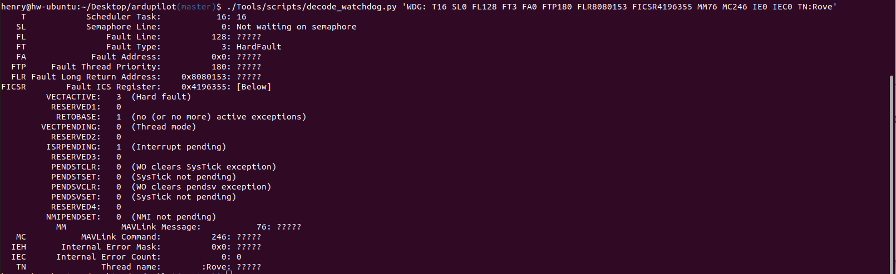

.. _common-watchdog-debugging:

===============================
Debugging Watchdog Reset Events
===============================

We attempt to provide as much information as we can about watchdog
reset events in the onboard logs and via our telemetry streams.  This
document outlines ways in which you can use that information to
root-cause the issue causing the watchdog.

The ``decode_watchdog.py`` Utility
==================================

A Python script is provided in ArduPilot's Tools directory.  A string from either a telemetry log or an onboard log can be passed in to this script and it spits human-readable information out on stdout.

.. code::

  ./Tools/scripts/decode_watchdog.py 'WDG: T16 SL0 FL128 FT3 FA0 FTP180 FLR8080153 FICSR4196355 MM76 MC246 IE0 IEC0 TN:Rove'

Understanding the T (thread) field
==================================

This is an offset into the scheduler table, which is a combination of vehicle-specific tasks and general system tasks.   It can be found in the @SYS/tasks.txt file which can be retrieved from the vehicle, and found in dataflash logs.

There are three magic tasks:

.. code::

   -1: Not currently running the scheduler
   -2: Running the fast loop function
   -3: waiting for an IMU sample

If in state -3 then the code was almost certainly in an interrupt handler when the fault occured.

Converting the LR field into a line of code
===========================================

Certain faults will fill the Function Level Reset (FLR) register with the address of an instruction which caused the processor to fault.  That address can be turned into a line of code.

  - Ensure you can identically reproduce the binary running on the board.
  - Try addr2line
  - disassemble the binary:
    arm-none-eabi-objdump --demangle --disassemble-all --full-contents --all-headers

