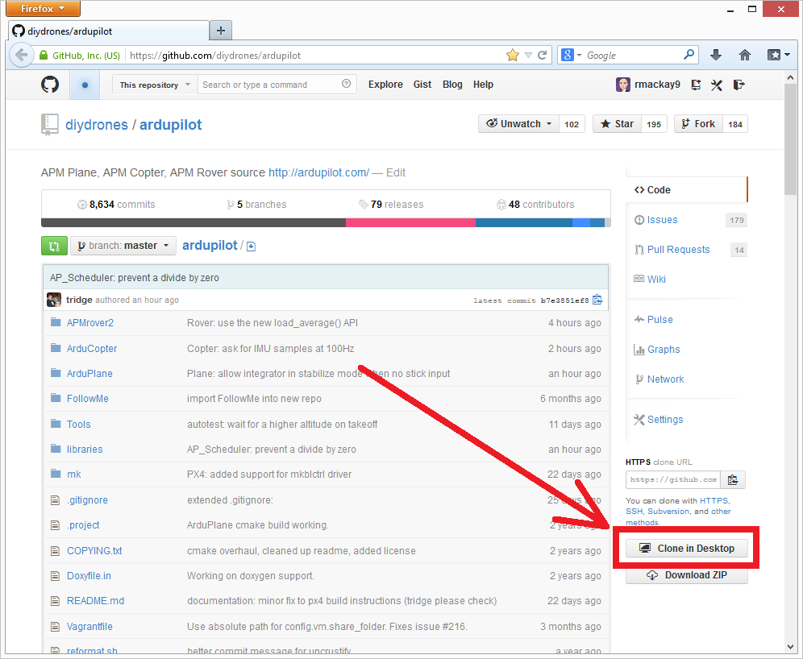

.. _where-to-get-the-code:

=======================================
Working with the ArduPilot Project Code
=======================================

This article explains where to get the ArduPilot code and how to submit
changes to the project.

Overview
========

The ArduPilot project uses `git <http://git-scm.com/>`__ for source code
management and `GitHub <https://github.com/>`__ for source code hosting.

Developers who want to contribute to ArduPilot will will fork the
project, create a branch on their fork with new features, and then raise
a pull request to get the changes merged into the "master" project.
Developers who just want to use and build the latest code can do so by
cloning and building the "master" repository.

The ArduPilot project source code for Plane, Copter, Rover and Antenna
Tracker are available on `GitHub <https://github.com/>`__ in the
https://github.com/ArduPilot/ardupilot repository. Several additional
projects are used for PX4 based platforms (ie. PX4v1 and Pixhawk):
`PX4Firmware <https://github.com/ArduPilot/PX4Firmware>`__,
`PX4NuttX <https://github.com/ArduPilot/PX4NuttX>`__,
`uavcan <https://github.com/ArduPilot/uavcan>`__ — these are imported as
:ref:`Git Submodules <git-submodules>` when
you build the project.

MissionPlanner is in the
`ardupilot/MissionPlanner <https://github.com/ArduPilot/MissionPlanner>`__
repository.

.. note::

   An older Google Code repository remains online for legacy reasons,
   but unless you specifically need older (APM 1.x) resources, you won't
   need to use it.

Prerequisites
=============

The ArduPilot project uses `git <http://git-scm.com/>`__ for source code
management.

Git is available on all major OS platforms, and a variety of tools exist
to make it easier to get started. First, you need to `download and install a client for your operating system <http://git-scm.com/downloads>`__. If you're new to source code
control systems, the `GitHub for Windows <https://windows.github.com/>`__ or `GitHub for Mac <https://mac.github.com/>`__ clients are well-documented and
integrate well with GitHub and are a good place to start. This guide
will use both the GitHub for Windows user interface as well as the
command-line interface through an OSX/Linux Terminal.

If you are working towards submitting code back to the official APM
source code repository, you'll need to `sign up for a free user account with Github <https://github.com/join>`__.

.. _where-to-get-the-code_learning_git:

Learning git
============

This guide covers the basic git commands/concepts needed to work with
the project: clone, branch, commit, push.

If you want to know more about git there are many great resources
online. Here are just a few you may find useful:

-  `Try Git <http://try.github.io/levels/1/challenges/1>`__:
   browser-based interactive tutorial for learning git
-  `Git Ready <http://gitready.com/>`__: tutorials of varying difficulty
   levels
-  `Git SCM Book <http://git-scm.com/book/en/Getting-Started>`__:
   introduction and full documentation

Forking the main repository
===========================

.. tip::

   If you just want to build and test the project source code (without
   making changes) you can skip this step and just clone the main project
   repository (next section). 

"Forking" is GitHub's term for copying a repository to your own account.
The forked repository preserves information about the original project
so you can fetch updates from it (and contribute changes back to it). If
you want to contribute changes back to the main project you will need to
first create your own fork of the main ArduPilot repository.

To fork the main repository:

-  Log into Github and go to https://github.com/ArduPilot/ardupilot.
-  At the upper right is a button, "Fork":

   .. image:: ../images/APM-Git-Github-Fork-300x64.jpg
       :target: ../_images/APM-Git-Github-Fork-300x64.jpg

   Click the **Fork** button and follow the directions.

When your are finished there will be a new repository within your
account: ``//github.com/your-github-account-name/ardupilot``

This forked repository is what you will clone and work on locally when
making changes to the code.

Cloning the repository
======================

"Cloning" is git's term for making a copy of any repository on your own
computer. You can clone either your own fork of the repository (if you
want to make changes to the source code) or the main ArduPilot
repository.

The information/tools you need for cloning the project are on the right
side of the screen on each Github repository home page.

.. figure:: ../images/APM-Git-Github-Clone.jpg
   :target: ../_images/APM-Git-Github-Clone.jpg

   Github section for cloning a repo

**OSX/Linux Terminal:**

-  Open a Terminal and navigate to the directory where you would like to
   clone the project
-  Clone your fork:

   ::

       git clone https://github.com/your-github-account-name/ardupilot
       cd ardupilot
       git submodule update --init --recursive

   or the main project:

   ::

       git clone https://github.com/ArduPilot/ardupilot
       cd ardupilot
       git submodule update --init --recursive

**Windows (GitHub GUI):**

-  Open the
   `ardupilot/ardupilot <https://github.com/ArduPilot/ardupilot>`__
   repository in your favorite web browser
-  Click on the "Clone in Desktop" button on the bottom right

-  If you have not installed GitHub before:

   -  When brought to the windows.github.com page, push the "download"
      button on the top
      right\ 
      
      .. image:: ../images/CloningTheRepository_Windows_DownloadGithub.png
          :target: ../_images/CloningTheRepository_Windows_DownloadGithub.png
      
   -  Save the **GitHubSetup.exe** somewhere on your machine and then
      run it and follow the instructions to install GitHub client

-  On GitHub client click the right arrow button to view a list of
   recent commits or right-mouse-button click on the ardupilot/ardupilot
   repository and "open in explorer".

   .. image:: ../images/CloningTheRepository_Windows_OpenGithub.png
       :target: ../_images/CloningTheRepository_Windows_OpenGithub.png
   
-  You can now also open the file in your favourite editor such as
   `NotePad++ <http://notepad-plus-plus.org/>`__, `Sublime Text <http://www.sublimetext.com/>`__ or
   `acme <http://acme.cat-v.org/>`__.

Building the code
=================

ArduPilot supports building many different build targets (vehicles and
autopilot hardware) on Linux, Windows and Mac OSX. For information about
how to build for your particular target, see :ref:`Building the code <building-the-code>`.

Making a branch and changing some code
======================================

Branches are a way to isolate different paths of development, which can
then be combined in a single (often named "master") branch. Refer to
`this short guide <http://gitready.com/beginner/2009/01/25/branching-and-merging.html>`__
for more information, in particular the resources under the :ref:`Learning Git <where-to-get-the-code_learning_git>` section. In this section of
the tutorial, you'll make a branch and change some code.

Branch names are up to you, but it can be helpful to choose short
descriptive names. The branch name used for this tutorial is
"apm_git_tutorial"

**OSX/Linux Terminal commands**

These commands assume your current working directory is the root of the
repository you cloned.

.. tip::

   These same commands can be used in Windows too if you use a command
   line git client (e.g. The "Git Shell" utility that was installed with
   GitHub for Windows.

#. Create a branch.

   ::

       git checkout -b apm_git_tutorial

#. Change some code. For this tutorial, open the
   **Tools/GIT_Test/GIT_Success.txt** in your preferred text editor,
   and put your name at the end of the file. Save the file.
#. See that you've changed some files by checking the status:

   ::

       git status

#. Commit your work to the branch to add your changes to the git
   history:

   ::

       git add Tools/GIT_Test/Git_Success.txt
       git commit -m 'Added name to GIT_Success.txt'

   Please see below for further information regarding conventions for
   committing work that you expect to be integrated into the official
   releases. When you commit, you're required to add a log message
   explaining what you did in the commit. See :ref:`Submitting Patches Back to Master <submitting-patches-back-to-master>` for more
   information on how to do this, and for the purpose of this tutorial,
   you can just use a single line stating: "Added name to
   GIT_Success.txt":

#. Push your branch to GitHub. This will copy your work on your local
   branch to a new branch on GitHub. Pushing branches is a precondition
   for collaborating with others on GitHub or for submitting patches
   back to the official releases.  It is assumed origin is the remote
   name of your fork of the github repository.

   ::

       git push origin HEAD:apm_git_tutorial

**Windows (GitHub GUI)**

In the Github GUI you used to clone the repository, you can create a
branch and commit it.

#. Create a branch. In the GitHub for Windows application, click on the
   'master' button in the upper right corner of the window.

   .. image:: ../images/APM-Git-Github-Windows-Branch.jpg
       :target: ../_images/APM-Git-Github-Windows-Branch.jpg

   Enter 'apm_git_tutorial' and click the "+ create branch:
   apm_git_tutorial" dropdown.

   .. figure:: ../images/GitHubForWindowsClient_CreateBranch.png
      :target: ../_images/GitHubForWindowsClient_CreateBranch.png

      Create a new branch in Github for Windows

#. Change some code. For this tutorial, open the
   **Tools/GIT_Test/GIT_Success.txt** in your preferred text editor,
   and put your name at the end of the file. Save the file.
#. The Git for Windows client shows the changed file and has a place
   where you can enter a summary and description of the change. For the
   purpose of this tutorial, you can just use a single line stating:
   "Added name to GIT_Success.txt"

   .. figure:: ../images/GitHubForWindowsClient_CommitingChange.png
      :target: ../_images/GitHubForWindowsClient_CommitingChange.png

      Github for windows: Commit Change

   .. note::

      Please see :ref:`Submitting Patches Back to Master <submitting-patches-back-to-master>` for further
         information regarding conventions for committing work that you expect
         to be integrated into the official releases (this will include a much
         more detailed commit message). 

#. Commit your work to the branch by pressing the **Commit to
   apm_git_tutorial** link.
#. Push your local branch to GitHub (pushing branches is a precondition
   for collaborating with others on GitHub or for submitting patches
   back to the official releases). In the client you can do this by
   pressing the **Publish** link:

   .. figure:: ../images/GitHubForWindowsClient_Publish_Push.png
      :target: ../_images/GitHubForWindowsClient_Publish_Push.png

      GitHub for Windows Client: Pushing changes

Congratulations! This is bulk of the normal process you'd follow when
working on code to submit back to the official project. The next step is
to :ref:`submit a pull request <submitting-patches-back-to-master>`
so your changes can be considered for addition to the main project.

Rebase-based workflow: keeping your code up to date
===================================================

As you develop, the (original) master branch of the ArduPilot repository
is likely to be updated, and you should `keep your fork and your local branches up to date <http://robots.thoughtbot.com/keeping-a-github-fork-updated>`__.
Rebasing allows you to re-apply your changes on top of the latest
version of the original repo, making it much easier for the project to
merge them.

The following commands can be used to rebase your fork of the project to
the "upstream master" (main project repo). You can enter these commands
direct into a Linux/OSX Terminal. If using GitHub for Windows, launch
the "Git Shell" utility that was installed with GitHub for Windows
application.

#. Navigate to your ardupilot git repository.

   ::

       cd <ardupilot-path>

#. Ensure you are looking at your master branch

   ::

       git checkout master

#. Ensure your repository is connected to the upstream repository you
   forked from.

   ::

       git remote add upstream https://github.com/ArduPilot/ardupilot.git

#. Fetch changes from the upstream master.

   ::

       git fetch upstream

#. Rebase your current branch from the upstream master.

   ::

       git rebase upstream/master

#. Ensure your repository is connected to the your repository on github.

   ::

       git remote add origin https://github.com/your-github-account-name/ardupilot.git

#. Now push the updated master to your github repository

   ::

       git push origin master

Working with git submodules
===========================

ArduPilot development for PX4 based platforms (ie. PX4v1 and Pixhawk)
uses three additional repositories:

-  `PX4Firmware <https://github.com/ArduPilot/PX4Firmware>`__
-  `PX4NuttX <https://github.com/ArduPilot/PX4NuttX>`__
-  `uavcan <https://github.com/ArduPilot/uavcan>`__

These are *Git submodules* of the ArduPilot project, and are
automatically fetched as part of a build when needed. For more
information on working with these projects see :ref:`Git Submodules <git-submodules>`.

