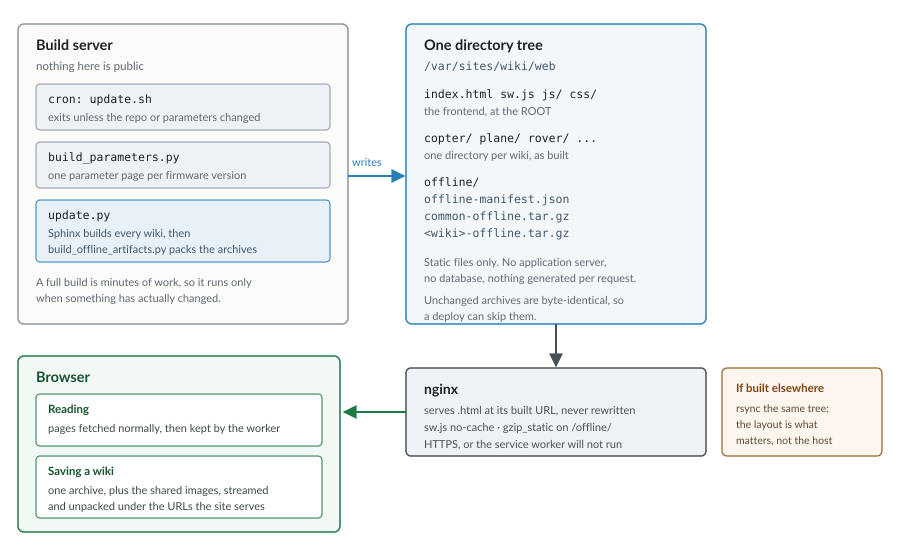

.. _wiki-offline-copies:

=======================
How Offline Copies Work
=======================

.. tip::

   To download a wiki, go to the :ref:`common-offline` page. This page explains
   how that works rather than providing the controls for it.

The wiki can be read with no internet connection, and is noticeably faster to
browse even when you have one. This page explains the feature for readers and,
later, how it is built.

While automatic updates are enabled and a wiki page is open, a saved copy can
check for updates and download only the files that have changed. You can turn
automatic updates off or check for updates manually on the
:ref:`common-offline` page.

.. note::

   **For readers:** use the :ref:`common-offline` page to save or export
   documentation. **For developers:** implementation details begin at
   :ref:`wiki-offline-copies-implementation`.

Features
========

Three distinct things are provided here. They do different jobs, and which one
you want depends on what you are trying to achieve.

**Browse faster.** Every page you visit is stored on your device and served
from there the next time it is requested. It starts when you turn offline mode
on, with the switch at the top of the Offline page or by saving a wiki, and
works from then on. This applies to ordinary browsing over a normal internet
connection.

**Save a wiki for offline use.** Saving downloads the wiki you select into your
browser, together with the shared image set used by all wikis. The shared images
are needed whichever wiki you choose and make up most of the first download:
roughly 440 MB of images, plus about 80 MB for Copter. Once saving finishes,
every page in that wiki opens without a connection.

Saving is a deliberate choice rather than something that happens automatically.
Someone reading a single page should not receive several hundred megabytes of
documentation uninvited. If you use the documentation regularly, saving the
wiki you work on is also the fastest way to read it.

**Export a portable HTML file.** Export produces one ``.html`` file containing
the pages, images, and a full-text search index. Open it by double-clicking it:
there is nothing to install, and it runs from a USB stick. Use this for a
machine where you cannot install software, or to give documentation to someone
else.

The browser builds the file from the wiki already saved on your device. If you
export a wiki that is not yet saved, the browser downloads it first; you then
have both an offline copy in the browser and the portable file. Exporting a
wiki that is already saved needs no connection.

Getting the Most Out of It
==========================

Save the wiki for the vehicle you actually work on. The shared images make up
most of the download and are required regardless, so the first save is the
large one. A second wiki after that costs only its own pages, which is tens of
megabytes rather than hundreds.

Saving needs an internet connection, so save the wiki before you need it rather
than when you arrive.

Installing the site as an app downloads nothing by itself. It gives the wiki a
separate window and launcher icon. Depending on your browser, it may also help
retain saved data when the device runs short of space.

.. note::

   A saved wiki checks for changes only while the :ref:`common-offline` page
   itself is open, since the update timer lives on that page. It fetches only
   files that have changed. You can turn the check off or run it on demand
   there.

.. warning::

   A saved wiki lives in your browser's storage for this site. Clearing site
   data removes it, and you will need to download it again.

Speed
=====

The wiki gets faster the more of it you have already read, because pages and
the assets they share are stored on the device as you go. None of this requires
saving a wiki, and it happens on its own.

The table below compares the same page as the wiki behaved before this feature
existed, on a first visit with it, and on every visit afterwards.

+----------------------------------+----------------+----------------+----------------+--------------+
|                                  | Before         | After                           | Difference   |
+                                  +                +----------------+----------------+              +
|                                  |                | New page       | Read again     |              |
+==================================+================+================+================+==============+
| Time to get the page             | about 1,000 ms | about 1,000 ms | 13 to 19 ms    | 60x faster   |
+----------------------------------+----------------+----------------+----------------+--------------+
| Bytes fetched                    | about 156 KB   | about 156 KB   | about 25 KB    | 6x less      |
+----------------------------------+----------------+----------------+----------------+--------------+
| Requests made                    | 21 to 26       | 21 to 26       | about 1        | 26x fewer    |
+----------------------------------+----------------+----------------+----------------+--------------+
| Parameter list (6.1 MB)          | about 8,300 ms | about 8,300 ms | about 2,300 ms | 3.5x faster  |
+----------------------------------+----------------+----------------+----------------+--------------+

The table assumes offline mode is on and you have opened some page of the wiki
before, which is the situation every opted-in reader is in. The service worker
is about 7 KB compressed and is fetched once, when offline mode is first
enabled; ``pwa.js``, which registers it, is another 7 KB compressed, loaded on
every page and cached like any other shared asset. Charging those to every new
page would describe a first-ever visit rather than an ordinary one. Excluded, a
page you have not read costs exactly what it cost before the feature existed.
It is free until it starts paying, which it does the second time you open
anything. A reader who never enables offline mode is not in the table at all:
their pages cost what they always did.

The request row says "about one" rather than none because a stored page is
returned immediately and the worker then asks the server whether it has
changed. You wait for nothing, but the request is real and the server sees it.

The parameter list is the one page where the saving is not mostly about the
network. It is 6.1 MB and contains roughly 210,000 elements, and the browser
spends about six of its eight seconds laying the page out rather than fetching
it. The ``content-visibility`` rule these pages carry reduces that work by
about a factor of three, which is where most of the improvement comes from. It
remains a two second page, and caching will not change that, because the cost
is the size of the document itself. Unlike the rows above it, this row is not
offline mode's doing: the rule ships in the theme and reaches every reader,
opted in or not.

The reduction in bytes is worth explaining. Of the resources a page pulls in,
twelve are shared assets totalling 131 KB and are identical on every page of
the wiki, so they are fetched only once. After that a page costs its own HTML
and its own images and nothing else, which is why the wiki gets faster as you
read rather than staying the same.

With no connection at all, pages you have already visited still open, and a
saved wiki opens completely.

.. _wiki-offline-copies-implementation:

Implementation
==============

Everything below this point describes how the feature is built, and is aimed at
anyone changing it or reviewing changes to it. It is not needed in order to use
the wiki offline.

.. figure:: ../images/wiki-offline-request-flow.svg
    :target: ../_images/wiki-offline-request-flow.svg
    :width: 100%

    How the service worker answers a request for a page.

The Service Worker
------------------

A service worker is a script the browser runs in the background, independently
of any page and persisting after the page that registered it closes. Once
active it sits between the pages in its scope and the network: every request
those pages make is passed to it, and it answers either from local storage or
by forwarding the request onward.

That interception is the whole mechanism. The pages are unmodified static HTML
as built by Sphinx; nothing is rewritten and no framework is introduced.

Implementation is in ``frontend/sw.js``, registered by ``frontend/js/pwa.js``,
which the theme (``sphinx_rtd_theme``'s ``layout.html``, together with the
manifest link and the Offline menu entry) includes on every page. Inclusion is
not registration: ``pwa.js`` registers the worker only after the reader has
opted in, with the switch at the top of the Offline page or by saving a wiki;
turning the switch off unregisters it. A reader who never opts in gets no
worker and browses the wiki
exactly as before the feature existed, which is what allows it to be deployed
dormant and tested in production without touching anyone else.

.. note::

   Service workers require a secure context: ``https://``, or
   ``http://localhost`` for development. A wiki served over plain HTTP has no
   offline support at all.

Storage
-------

Cache Storage holds complete HTTP responses keyed by request URL, in named
stores. It is separate from the browser's HTTP cache, is not cleared with
browsing history, and is scoped to the origin.

``ardupilot-pages-<version>``, ``-images-<version>``, ``-static-<version>``
   Populated while browsing. Discarded when ``CACHE_VERSION`` (declared once,
   at the top of ``sw.js``) changes.

``ardupilot-offline-<wiki>``
   A saved wiki. Excluded from version-bump deletion, since it holds content
   the reader chose to store.

``ardupilot-thirdparty-<version>``
   Cross-origin assets, so they are not re-fetched on every page.

``heldOffline()`` in ``sw.js`` decides whether a URL is held. It serves every
resource type, and tries each form a URL may have been stored under, including
the ``/_common/`` path used for images shared between wikis.

.. note::

   Stored keys are the URLs the site serves. ArduPilot serves
   ``/copter/docs/foo.html`` directly. A host that canonicalises URLs, by
   stripping ``.html`` for instance, breaks offline reading while leaving
   online browsing unaffected, which makes it a difficult fault to attribute.

Why Browsing Is Fast
--------------------

Four things account for most of it.

Content held locally is preferred over the network. A page that is stored is
returned immediately and revalidated in the background, and if the copy that
comes back differs, the page is told and offers you a reload.

Lookups are directed rather than exhaustive. Calling ``caches.match()`` without
naming a store searches every store in turn, and a reader who has saved every
wiki has fourteen of them. Since the URL identifies the single store that could
hold it, the worker looks only there, which takes 89 ms against 692 ms for the
same request. The exhaustive search is kept as a fallback.

Content found in a saved wiki is copied into the runtime store the first time
it is used, so later requests for it resolve directly. This takes 1 ms against
84 ms.

Assets carrying a fingerprint are served from storage without checking the
network. Sphinx stamps them, as in ``theme.css?v=5d32c60e``, so a stored copy
can only be the copy that the fingerprint names.

That last point is also why the wiki costs the server less to serve. Of the 21
to 26 resources a page pulls in, twelve are shared assets totalling 131 KB and
are byte-identical on every page. Once they are held they are never requested
again, so the second page and every page after it costs its own HTML plus its
own images: a median of 25 KB against about 156 KB. This applies to every
reader from their second page onwards, whether or not they ever save a wiki.

Prefetching
-----------

Once offline mode is on, ``pwa.js`` fetches a page shortly before it is likely
to be wanted, judging from the pointer's position, its velocity projected
forward, and whether it is slowing down as it approaches a link. A pointer
crossing a link at speed triggers nothing, and a reader who has not opted in
gets no speculative traffic at all.

Speculative traffic is deliberately bounded. At most five pages are fetched
per page view, at least 400 ms apart, with only one request in flight at a
time and each URL fetched at most once. Anything larger than 2 MB is abandoned,
and requests still in flight are cancelled when you navigate. Pages that are
already stored bypass the budget entirely and generate no traffic at all.

.. note::

   Nothing is fetched speculatively if you have asked your browser to reduce
   data usage. The pointer heuristics also stand down on pages carrying more
   than 250 links, where links are an index rather than a sign of where you
   intend to go; the next and previous buttons and a held hover still count,
   because those are explicit.

Saving a Wiki
-------------

Fetching the pages one at a time would be roughly 3,400 requests per reader for
Copter alone. Each wiki is packed into an archive at build time instead, and
unpacked by the browser.

The panel is split into small files that load together: ``common_offline_page.js``
is the panel itself; ``common_offline_unpack.js`` (``window.ApUnpack``) streams
an archive and unpacks each entry as it arrives rather than buffering the whole
file first; ``common_offline_update.js`` (``window.ApUpdate``) is the
differential update below. Every entry is written to Cache Storage under the URL
the site serves it at, so saved content is retrieved by exactly the same path as
content that was stored while browsing.

The chosen wiki is downloaded before the shared-image archive, not after. A
wiki's own archive holds all of its pages and the images unique to it, so it is
readable within seconds; the ~440 MB of shared images backfill afterwards, and
until they land a shared image comes from the network when online and is absent
offline.

Two constraints apply:

* The archives are served with a content coding, so the browser decompresses
  them before the script sees the body. This avoids relying on
  ``DecompressionStream``, which is missing from Safari before 16.4 and Firefox
  before 113.
* A completion marker is written last, and a saved wiki only counts as usable
  once that marker exists, so an interrupted download is never mistaken for a
  complete one.

Building and Serving
====================

    How the archives are built and served.

``scripts/build_offline_artifacts.py`` runs at the end of every full build,
writing into ``<destdir>/offline/``:

``offline-manifest.json``
   Sizes, page counts and a build id. The download page renders from this
   rather than hardcoding figures.

``common-offline.tar.gz``
   Images used by two or more wikis. The majority of the total size, kept
   separate because including them per wiki would multiply several hundred
   megabytes across eleven.

   The About wiki rides along inside it, keeping its ``/ardupilot/...`` paths.
   At 3 MB it was too small to be worth a row of its own on the download page,
   so ``FOLD_INTO_COMMON`` in ``scripts/build_offline_artifacts.py`` writes it
   here instead. The service worker has a matching list, so ``/ardupilot/``
   requests ask the common cache directly rather than falling through to the
   exhaustive search.

``<wiki>-offline.tar.gz``
   Content unique to a single wiki.

``<wiki>-files.json``
   A table mapping every path in the archive to a hash of its contents. A saved
   wiki stores this alongside its files; an update compares the stored table
   with the freshly published one and fetches only what moved, rather than
   re-downloading the whole archive to correct a typo. Every fetched file is
   verified against its hash before it is stored, and a full save is marked
   complete only once the archive's contents have been checked off against
   this table, so a build published mid-save cannot be frozen in as current.

``files/``
   The rewritten pages and generated video stills, published individually and
   gzipped. The archive holds a rewritten copy of each page (the donate button
   becomes a link, video embeds become stills), so a differential update fetches
   the changed file from here, where its bytes match the table, rather than from
   the live site, which serves the original and would fail the hash check.

Archives are reproducible: tar metadata is normalised, so unchanged content
produces byte-identical output and a deploy can skip it.

Large images in the archives can be downsized to attack the first-download size:
setting ``ARDUPILOT_OFFLINE_MAX_IMAGE_DIM`` to a pixel size (1600 is a good
default) resizes anything larger, in the archive copies only. It is off by
default because a saved image is then what a reader sees online too, which is a
quality decision rather than a silent one.

Requirements
------------

The archives are static files, and no application server or database is
involved. The host must meet these requirements:

- Pages must be served at their built URLs. ``/copter/docs/foo.html`` must
  return that page rather than redirecting to ``/copter/docs/foo``.
- The worker must not be cached. ``/sw.js`` must be served with
  ``Cache-Control: no-cache``.
- The manifest and the file tables must not be cached either. They are how a
  saved wiki learns a new build exists, so ``offline-manifest.json`` and
  ``<wiki>-files.json`` are served ``no-cache``; the archives, whose URLs carry
  the build id, are cached hard.
- Compressed files must be paired with their served name. Under nginx,
  ``gzip_static on`` in the ``/offline/`` location serves ``<name>.tar.gz`` for
  a request to ``<name>.tar``, and ``<name>.gz`` for the loose files under
  ``files/``, setting the content coding so the browser decompresses natively.
- The frontend must be served from the web root. A service worker's scope is
  its own path and everything below it, so a worker placed at
  ``/frontend/sw.js`` registers successfully and then controls no wiki page at
  all.
- A directory asked for without its slash must redirect to the slash form:
  ``/plane`` to ``/plane/``. Serving the index page at ``/plane`` makes every
  relative link on it resolve one level up. The worker does the same redirect
  when it answers offline.

Under nginx, the rules that matter look like this::

    location / {
        if (-d $request_filename) {
            rewrite ^(.*[^/])$ $1/ permanent;
        }
        try_files $uri $uri/ =404;
    }
    location = /sw.js                              { add_header Cache-Control "no-cache"; }
    location ~ ^/(js/pwa\.js|.*/_static/common_offline[^/]*\.(js|css))$ {
        add_header Cache-Control "no-cache";
    }
    location = /offline/offline-manifest.json      { add_header Cache-Control "no-cache"; }
    location ~ ^/offline/[^/]+-files\.json$         { add_header Cache-Control "no-cache"; }
    location /offline/ {
        gzip_static on;
        gzip off;
        add_header Cache-Control "public, max-age=31536000, immutable";
    }

Recovery
--------

This is a worst case, and is described because it is the one failure a reader
cannot clear themselves.

A service worker outlives the page that registered it and controls every page
in its scope, so a faulty one is not resolved by reloading, by navigating
elsewhere on the site, or usually by restarting the browser. A worker serving
wrong or stale content will keep doing so.

``frontend/sw-kill.js`` exists for that case. Deployed in place of ``sw.js``,
it is the offline page's opt-out thrown for every reader by us: on each
device that fetches it, it deletes every ``ardupilot-*`` cache, saved wikis
included, tells the open pages to clear the opt-in flag so ``pwa.js`` does not
register it again, and unregisters itself. Readers are back to a browser that
never opted in, with nothing left behind. Losing the saved wikis is the point:
the switch is for when this feature has failed, and a reader should not keep
state produced by it. It is a one-line deploy and asks nothing of readers.

This works only if the browser will collect the replacement, which is why
``/sw.js`` must be served ``no-cache``. That header is not a nicety: without
it there is no remote means of recovery.

Testing
-------

.. code-block:: bash

    npm install --no-save jsdom
    npm test

``scripts/tests/test_offline_worker.js``
   Builds a cache from real archives, requests the URLs the site serves, and
   resolves them with the worker's own code.

``scripts/tests/test_offline_page.js``
   Drives the download panel under jsdom, including the update check.

``scripts/tests/test_offline_export.js``
   Runs the exporter against build output and inspects the result.

``scripts/tests/test_offline_archives.py``
   Inspects the finished archives. Requires a full ``update.py`` first.

``scripts/tests/test_lazy_embeds.py``
   Covers the post-build pass that defers YouTube embeds.

``scripts/tests/test_image_resize.py``
   Covers the optional archive image downsizing.

Tests exercise the shipped code rather than a reimplementation of it, and each
must be shown to fail when the behaviour it covers is removed. A suite that
cannot run — jsdom missing, or the archives not built — exits with an error
rather than reporting success having checked nothing.

Limitations
===========

* The shared image set is about 440 MB and is required whichever wiki is chosen.
  The wiki itself is readable within seconds because it downloads first, but a
  shared image is missing offline until the shared set finishes behind it.
  Downsizing large images (above) reduces this considerably.
* The generated reference pages, such as the full parameter lists and the board
  feature tables, reach several megabytes and hundreds of thousands of
  elements. Their cost is in rendering rather than transfer, so caching does
  not help them.
* EPUB and PDF output are not covered by this feature.
* A saved copy is only checked for updates while a wiki page is open in the
  browser. Nothing runs in the background once every tab is closed.
