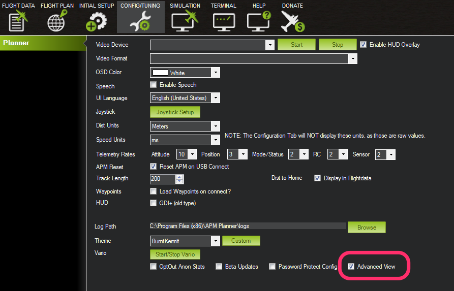
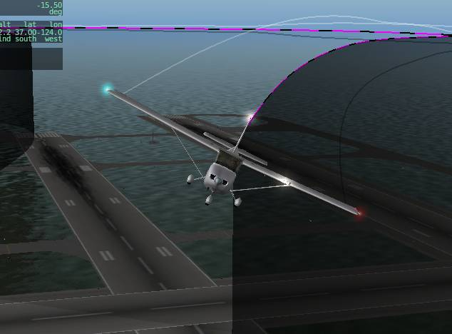
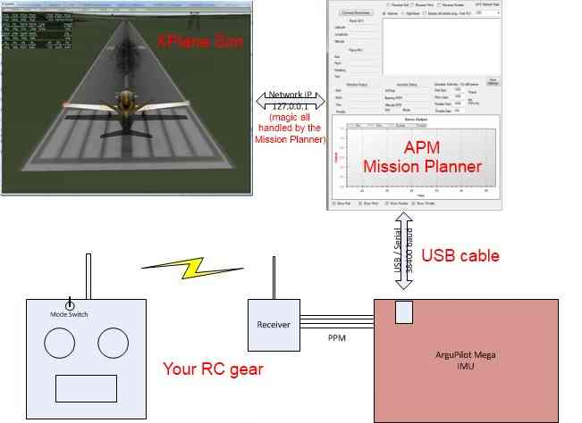
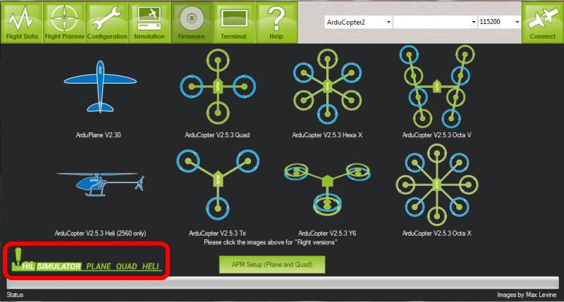
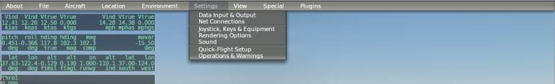
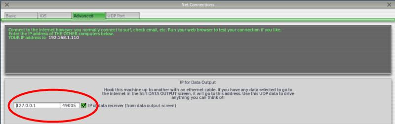
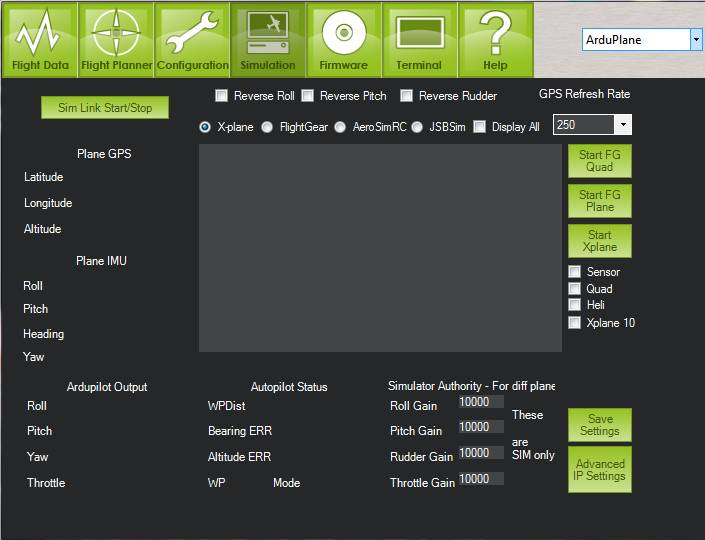
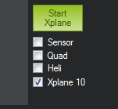

.. _x-plane-hardware-in-the-loop-simulation:

=======================================
X-Plane Hardware in the Loop Simulation
=======================================

.. note:: Archived, no longer supported

This article explains how to set up *X-Plane Hardware in the Loop
Simulation*.

.. note::

   This simulator is Plane specific.

Overview
========

The Simulation tab is visible on the top icon row when “Advanced View”
is checked in the Config tab.

How to set up a full hardware-in-the-loop simulation with X-Plane
=================================================================

It's easy to create a powerful "hardware in the loop" simulator with
APM, with a Flight Simulator "fooling" APM with sensor and GPS data like
it would experience in flight, and then APM flying the plane
accordingly.

The overall setup looks like this:

Setup
=====

#. Download the `X-Plane 10 flight simulator <http://www.x-plane.com/desktop/home/>`__, if you don't
   already have it. The demo is free but times out after ten minutes.
   It's well worth `buying the full version <http://www.x-plane.com/store/landing/>`__, which is just
   $29.99. We support the 10.x versions.
#. Load the HIL Simulations version of the APM software with the Mission
   Planner (circled in red below; pick the one for the aircraft you want
   to simulate).
#. If you haven't done a setup already, press "APM Setup" on the Mission
   Planner Firmware page, which opens another dialog. Follow the
   instructions on the "Reset", "Radio Input" and "Mode" tabs of the
   dialog. Then you're ready to sim!

Connecting APM and X-Plane
==========================

The Mission Planner will serve as your bridge to X-plane and will send
the output from your APM's serial port connection to the flight
simulator.

NOTE: If you're using a Mac, you can use a Perl-based solution (this
also works on Windows, if you prefer Perl). Here's what you need:
`X-Plane.pl <http://api.ning.com/files/xRNyASq2LjL3D2W7-D-4tvKSdm-2NifDygSAVsFxnngOUoIC4XkcPnGyPL-zeJJRNrWyuifxCVSQnyMVibddCBg-OzRzLOQ9/XPlane.pl>`__

X-Plane Settings
================

X-Plane communicates over a network interface to the Flight Planner.
Because of this you can run X-Plane and the Flight Planner on different
computers. This is helpful if X-Plane running on a slower computer.
Frame rate is very important.

You can choose any aircraft in X-Plane, but the most realistic one for
our purposes is the PT-60 RC airplane. These are the screen shots that
show the necessary settings you need to set in the Settings Menu – Data
Input and Output:

.. image:: ../images/mavlinkhil1.jpg
    :target: ../_images/mavlinkhil1.jpg

You may also want to turn on the Frame Rate to display on the screen.

On the IP screen on Xplane, change the UDP data port to 49005 as shown
below. (The Mission Planner also has an advanced IP setting dialog, but
leave it at the default of 49000. 49005 is the UDP port coming in from
Xplane, 49000 is the UDP port going out from the Mission Planner.)

If you are running X-plane on the same computer as APM Mission Planner,
then enter the loopback IP address (127.0.0.1) as shown above. If you
are running X-plane on a different computer, enter the IP address of the
other computer here(for example 192.168.1.1).

Flight planner settings
=======================

Now you're ready to run the simulation. Start the Mission Planner,
selecting the COM port APM is assigned to and 115200 baud as the speed.
Click on the Simulation tab and you will be taken to this screen:

If you are using X-Plane 10.x, you must check the "XPlane 10" checkbox
shown here:

If you are running APM Mission Planner on the same computer as X-Plane,
then the default IP settings should be fine. But if you're in doubt, you
can check the "Advanced IP Settings". The IP address should be 127.0.0.1
and the port should be 49000, as shown. If you are running X-plane on a
different computer, though, enter the IP address of the other computer
here (for example 192.168.1.2). The port should be 49000 in either case.

Once you've selected Sim Link Start/Stop, if APM is connected and Xplane
is running, you should see the Mission Planner Sim screen fill with
data.

Turn your transmitter on and check your link to your receiver. (Remember
that if you're using APM 1 you must plug an ESC and LiPo into the RC
pins of APM to power the RC receiver; this is not necessary on APM 2,
where the radio is powered by the USB). When you move the sticks you
should see the APM outputs change on the Flight Planner Simulator
window.

For first testing, set your three RC toggle switch modes to Manual,
Stabilize and RTL. You can do that via the Mission Planner's MAVLink
setup. Hit control-G in the Mission Planner once you're connect to go to
the setup screen, where you will find the Modes setup.

Flight test
===========

Now fly the plane in the sim with your RC transmitter. First, hit the
"C" key so you can see your plane up close and from the side. Try each
stick on your RC transmitter and make sure that the control surfaces go
in the right direction in manual mode. If they don't, reverse them at
your RC transmitter as you would with a normal RC airplane.

You can now try a flight. Reload the aircraft in Xplane, hit "Shift-8"
so you can see it from behind, and hit "b" to release the brakes. The
aircraft should begin moving forward. You can steer it on the ground
with your rudder stick. Once it's picked up speed, give it a little up
elevator to take off. You should be able to fly it like a RC flight
simulator.

If it's flying well, try moving your toggle switch into stabilize mode.
The aircraft should immediately start flying flat and level. If it rolls
upside down and wants to fly that way, you'll need to reverse the
ailerons on the SIM model on your transmitter. Likewise for diving.

If stabilization works well, try RTL. The aircraft should return to the
start of the runway and circle there at 100m.

Once that is working, trying entering some waypoints and flying an auto
mission. In the Mission Planner read the stored waypoints and let it
reset home to the stored position (which will now be the airport in your
Xplane simulator that you're flying from). Click to add a few waypoints
and switch into auto to watch the show!

In general, the correct order to load and run everything is as follows:

#. Use the Mission Planner to load the Simulator version of the APM code
   and perform the setup.
#. Start Xplane. After it is initialized and while the plane is sitting
   on the ground hit the "a" key for a rear view and then the "p" key to
   pause.
#. Start the Mission Planner, select the right port and baud for your
   APM board and connect to APM.
#. In the Mission Planner simulation tab, click the button in
   ArduPilotSim to connect. You should see values appear in the output
   fields. Switch your TX mode switch to the manual position and verify
   that the outputs are moving with your TX sticks.
#. Make sure your throttle stick is down.
#. Switch to Xplane. You are ready to go. Click the "p" key to unpause.
   Hit the "b" key to unlock the brakes. Advance the throttle and take
   off!

Notes
=====

-  I have been using the stock PT-60 in Xplane with good results. I
   would recommend a cruise airspeed of 15 m/s
-  One quirk of the PT-60 is that it bounces around a lot on the ground
   and if you are not careful it has prop-strikes followed by simulated
   engine failure, which is really annoying. If the engine has stopped,
   reload the plane. Hold the pitch stick for a modest climb and go to
   full throttle.
-  Remember that APM always sets its "home" location automatically at
   the field, which in this case is whichever airport you've set Xplane
   to start at. It will overwrite any home you may have set in the
   Mission Planner. If you want the flight sim to start at a different
   airport, you must select that from Xplane's "Location" menu. You can
   only select the provided airports, not just any place in the world
   you want to fly.
-  If you want to play with the code and load it via Arduino.

   , rather than the pre-compiled hex file in the Mission Planner, you
   can. You just need to change your APM_config.h file to the
   following:

::

    #define HIL_MODE            HIL_MODE_ATTITUDE

HIL_MODE_SENSORS is not currently (Jan 2012) working.
HIL_MODE_ATTITUDE informs Plane of the attitude of the plane but not
the accelerations or roll rates. HIL_MODE_SENSORS originally was going
to inject the lower level physics into the real sensor code, from which
would (hopefully) be derived the same or similar attitude figures, plus
more information from the Barometer and so on.

Software-in-the-loop (SITL) sim has taken this further, emulating
!Arduino registers and injecting the sensor information at the lowest
level possible. It is therefore the better option if you want to sim
with the most realistic inputs.

Error messages and fixes
========================

#. Can't open serial port : The com port has not been selected or the
   port is in use. Do you have a terminal open to the APM? Note that the
   mission planner loads the connection window coms port menu with every
   port it finds. If the USB driver failed to hook up and did not
   promote a port into !Windows, then this menu will be missing the
   actual port or may default to another port.
#. Socket (IP) setup problem. Do you have this open already? : You have
   another program running that is using the IP Port and conflicting
   with the data communications between Xplanes and APM Planner.
#. Xplane Data Problem - You need DATA IN/OUT 3, 18, 19, 20 : Please
   redo the setup and make sure all the boxes are ticked. You may need
   to restart X-Plane.
#. Bad Gains!!! : One of the simulator gain numbers is invalid.
#. NO SIM data : ArduPilot Mega Planner is not receiving any data from
   Xplane. Please check your Xplane settings.
#. The radio has no control--you push the sticks and nothing happens.
   Are your PID setting zero? Have you setup up your Radio inputs? The
   configuration defaults may not be appropriate for your radio. Please
   review the minimum, maximum and trim figures and if necessary use the
   radio Setup mode either from the mission planner or from the command
   line setup mode.
#. Flight controls are way off. You need to push the sticks way over to
   fly the plane. Check your Radio setup in the APM. Did you configure
   the Radio? See (7).

Debug
=====

#. The on-screen status details only update after a valid connection to
   the APM has been made.
#. Open Terminal, and verify what you see. If the text is readable go to
   the second point below, if it is not look at the first point

   #. When you click Connect you should see the APM header printed in
      the text box. If you don't you may not have the correct Comport or
      Baudrate
   #. Verify the setup by opening the Terminal in APM Planner and see
      what it prints out. it should start with the APM header and
      continually spit out AAA???? forever. If you don't see the AAA's
      then you may have uploaded the wrong firmware (not simulation
      mode) or if you're loading the code manually, not made the
      necessary changes to the **APM_Config.h** file.

#. Try re-doing the radio calibration after selecting the simulation,
   and make sure the throttle gain is set to 10,000 in the simulation
   tab.

Python Scripting with XPlane
============================

This section shows how to use Python for some basic scripted acrobatic
moves for fixed-wing airplanes (including a left roll, a right roll and
most of a loop). The instructions come from the tutorial `Scripted Fixed-Wing Acrobatics <https://diydrones.com/profiles/blogs/scripted-fixed-wing-acrobatics>`__.

#. You need a python based script. You can start with the one I've put
   together. It's attached here.
   "`simple_script.txt <http://api.ning.com/files/e86-46o09Aysi4zyyv8mnDWV0ljIXbNUV*fTsE9MwLsZ8J1em1bwUNnHadjWSmygB*jnKvZwo7Bx0A*AHE8pZVGLkN9W4n1u/simple_script.txt>`__\ "
#. With X-plane, the APM Mission Planner (MP) and the script open, get
   your plane in the air and press "p" for pause. "a" will put you in
   chase view ("w" to go back in the plane) and "-" and "=" will zoom
   your view of the plane in and out.
#. In the MP click on the "Flight Data" button, then select the
   "Actions" tab underneath the Heads-Up-Display.
#. Click on the "Script" button. This will bring up another window with
   a preloaded script (for Copter). Switch to the already open
   "simple_script.txt" and select-all then copy.
#. Go to the python script window and paste "simple_script.txt" in the
   python script window. DO NOT close it yet.
#. Go to X-plane, and press "p" again to un-pause the plane.
#. Go back to your python script window and close it. This will trigger
   the execution of the script when you click "yes" in the pop-up.
#. Watch your plane do some rolls, and most of a loop.
