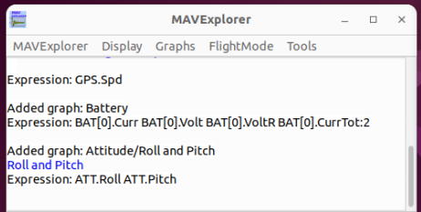
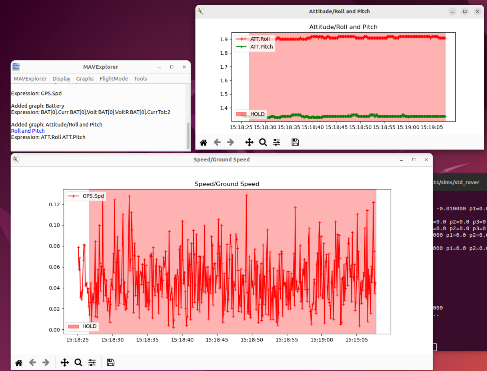

=============
MAVExplorer
=============

The MAVExplorer tool is an interactive tool for graphing APM logfiles (tlogs or dataflash logs).

Under Linux, it can be accessed by:

.. code:: bash

    MAVExplorer.py inputlog.tlog
    
Under Windows, it can be found in the Start Menu with the rest of MAVProxy.

Use the MAVExplorer->Open menu to open tlog or dataflash files to graph.

.. note::

    If there is a space in the file/folder name, MAVExplorer will not be able to open the file.
    Only use file and folder paths with no spaces in them.

The Graphs menu will automatically populate based upon the available packets in the logfile.

To narrow down the log file to a particular phase of the logfile, select the relevant mode from the FlightMode menu. Any future graphs will only cover the selected section of the flight.

The Display menu contains methods for displaying a map of the GPS points of the logfile and reloading the logfile. Additionally there are methods for creating and saving custom graphs, using the same notation as with the :ref:`graph <mavproxy-modulegraph>` module in MAVProxy.

.. note::

    Saving custom graphs is not currently available on Windows.
    
More information about this program can be found in the 
`Ardupilot documentation <http://ardupilot.org/dev/docs/using-mavexplorer-for-log-analysis.html>`_.
