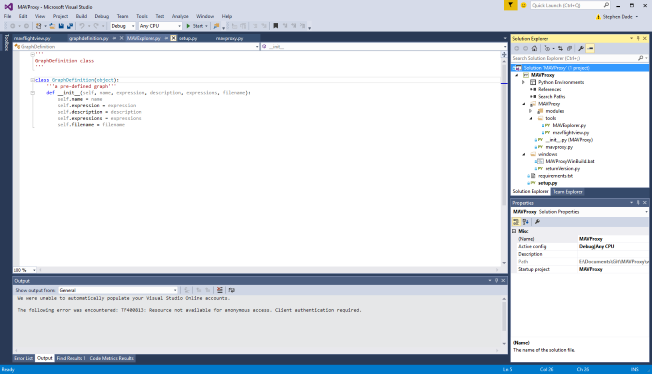
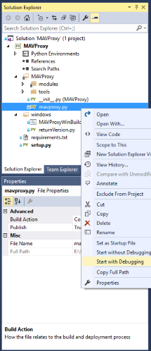

===============================
Windows Development Environment
===============================

In Windows, the process is a bit more complicated than for Linux.

You will need to have `Python
3.6 <http://www.python.org/download/releases/3.6/>`_ or higher.

Use ``pip`` to install the other packages (this assumes Python is installed to ``C:\Python36``):

.. code:: bash

    cd C:\Python36\Scripts
    pip install pip --upgrade
    pip install pywin32 lxml pymavlink numpy matplotlib pyserial opencv-python pyreadline PyYAML Pygame Pillow wxpython
    pip install pyinstaller setuptools packaging --no-use-pep517
    
Download the MAVProxy `source <https://github.com/ArduPilot/MAVProxy>`_.

After making the desired changes, MAVProxy is required to be compiled 
into the Python directory (the modules won't work otherwise).
This needs to happen after any changes to the source code. This can be
done by running the :file:`./MAVProxy/MAVProxyWinUSB.bat` or 
:file:`./MAVProxy/MAVProxyWinLAN.bat` file. This will
perform the necessary build actions and then run MAVProxy. Some of the 
details in the batch files (port numbers, etc) may need to be altered to 
match the user's system configuration.

To create a one-click windows installer for MAVProxy, run ``MAVProxyWinBuild.bat```, 
which is in the ``./windows`` directory. The installer will be created in the 
``./windows/output`` directory. The `Inno Setup <http://www.jrsoftware.org/isdl.php#stable>`_ 
program will be required for this process and is assumed to be installed in the 
``C:\Program Files (x86)\Inno Setup 5\`` folder

Visual Studio Setup
===================

Visual Studio can be used to develop MAVProxy on Windows platforms.

Within the ``windows`` subfolder in MAVProxy, there is a Visual Studio Project file. It does require the `Python Tools for Visual Studio <http://microsoft.github.io/PTVS/>`_ to be installed.



Use the build or debug commands in Visual Studio to install MAVProxy to the local Python folder. This is required in order for MAVProxy to be run correctly.

MAVProxy can then be run by right-clicking on mavproxy.py and selecting ``Start`` (with or without debugging). The mavexplorer.py can be run in the same way.




