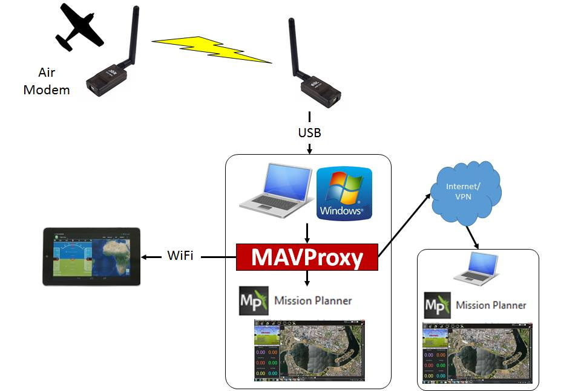

.. _mavproxy-forwarding:

====================
Telemetry Forwarding
====================

A key feature of MAVProxy is its ability to forward the messages from
your UAV over the network via UDP to multiple other ground station
software on other devices. For example: you can run a ground station on
a laptop next to your antenna and forward via wifi to a
smartphone/tablet which lets you easily relocate to launch into wind
before heading back to your fixed antenna. You can also use it to send
telemetry data to a friend acting as spotter several kilometers away
(via 4G vpn) during a longer flight so that he could monitor the entire
flight and determine where to look to find the aircraft in flight.

To forward the MAVLink data over the network including to a local program on
your PC you simply need to add some extra parameters when starting
MAVProxy via the command line.

Local Forwarding
================

To connect with a local ground station software (such as Mission Planner or QGC)
start MAVProxy under Linux with the command:

.. code:: bash
 
    mavproxy.py --master=/dev/ttyACM0 --baudrate 115200 --out 127.0.0.1:14550

an abbreviated version also works:

.. code:: bash

    mavproxy.py --out 127.0.0.1:14550

since MAVProxy will auto-connect to the autopilot on the Linux PC.

For a Windows PC, start a command prompt and enter:

.. code::

    mavproxy --master=COMx --out 127.0.0.1:14550

where COMx is the com port to which the autopilot is attached.

Then open the ground station software and select a UDP
connection on port 14550. It should then connect to your UAV.

Forwarding to Remotes
=====================

.. note:: While MAVProxy also has the capability of forwarding using TCP, it is not recommended, since network delays can cause long lags if joystick control is being used.

Finally, you can add the IP address of any computer to forward the
telemetry stream onwards to other ground stations.

#. On the local network/wifi you will need to ensure there is no
   firewall on the client PC stopping the incoming stream to your ground
   station software.
#. Add - -out *destination IP address*:14550 to the end of the MAVProxy command.
   You can add as many separate - -out parameters as you want depending
   on how many extra ground stations you are running.
#. Set each ground station to listen for UDP packets on port 14550 and, again, make sure its firewall is not blocking incoming traffic on UDP port 14550.

