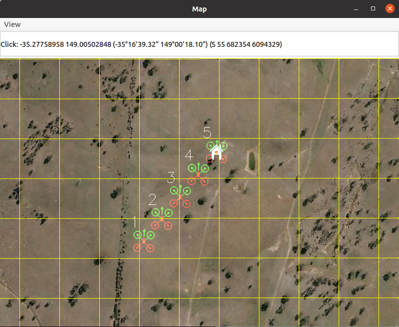

===============================
Multiple Vehicles with MAVProxy
===============================

MAVProxy is designed to control 1 vehicle per instance. Controlling multiple vehicles would require a substantial re-design of MAVProxy and is not currently on the "to-do" list.

However, there is *very* limited support for displaying (not controlling) multiple vehicles 
on the map. This should be considered an experimental feature only, as it was developed for 
a specific application (2016 UAV Challenge) where two UAV's were required to be displayed 
on a single map.

To use this feature:

#. Have two vehicles (real or SITL) with different SYSID_THISMAV parameter values. Use ``param set SYSID_THISMAV X`` to set this value in the MAVProxy console (where ``X`` is the id).

#. Start MAVProxy with both telemetry links as master and the ``--source-system=X`` commandline parameter, where ``X`` is the id of the vehicle to be controlled by MAVProxy. All other vehicles will be displayed only. For example:

.. code:: bash

    python mavproxy.py --master=0.0.0.0:14550 --master=0.0.0.0:14560 --source-system=1 --console --map

#. Type in ``output sysid Y 127.0.0.1:14750`` in the MAVProxy console, where ``Y`` is the id of the vehicle to be displayed. The port number ``14750`` should be any unused port. Repeat this command for any other vehicles to be displayed (the id and port number should be different for each vehicle.

There are several limitations to this feature:

* All displayed vehicles (except the controlled vehicle) will be displayed as a helicopter on the map

* The link status on the console GUI will be inaccurate in counting missed packets on the links to the non-controlled vehicles.

