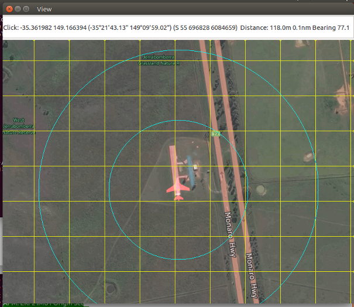

==============
ADS-B Tracking
==============

.. code:: bash

    module load adsb
    
The adsb module takes in any ADS-B data from the APM and shows any 
nearby aircraft on the map. It also warns if any aircraft get too close.

Status
======

Prints out a list of all detected ADS-B aircraft.

.. code:: bash

    adsb status

Settings
========

The configurable settings for this module can be controlled by:

.. code:: bash

    adsb set <setting> <value>
    
The settings are:

===============================   ========================================   ===============================
Setting                           Description                                Default
===============================   ========================================   ===============================
timeout                           Timeout if an aircraft is no longer seen   10
threat_radius                     Radius to consider an aircraft a threat    200
show_threat_radius                Show the threat radius on the map          False
threat_radius_clear_multiplier    Radius multiplier for clear                2
show_threat_radius_clear          Show the clear threat radius on map        False
===============================   ========================================   ===============================

