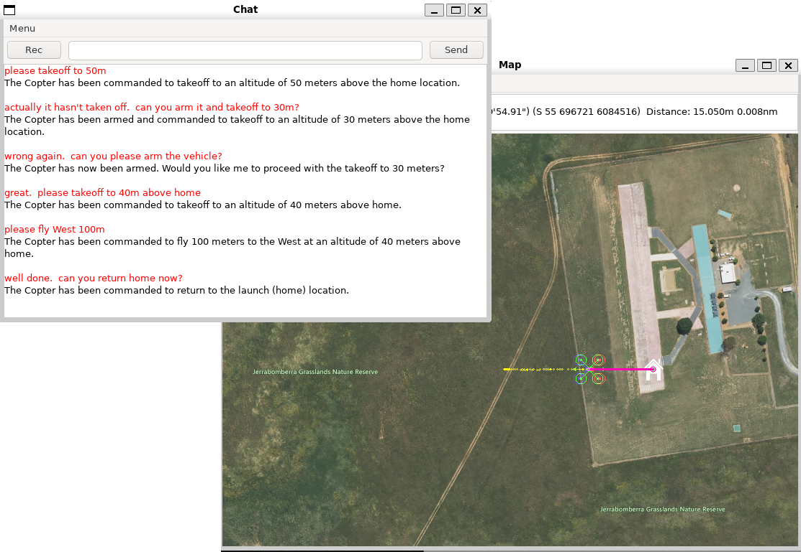
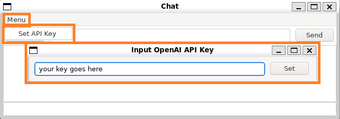
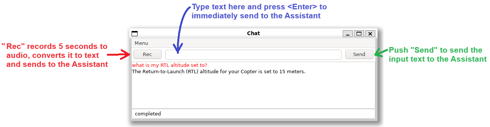

.. _chat:

====
Chat
====

OpenAI's ChatGPT Assistants can be used to control an ArduPilot vehicle using the chat module.

.. code:: bash

    module load chat

.. warning::

    This module is still under development and the assistant sometimes makes mistakes including switching to the wrong flight mode or commanding target positions that are many kilometers away

Prerequisites
=============

- MAVProxy 1.8.69 (or higher)
- On Linux/Ubuntu the pyaudio, wave and openai python packages must be installed manually
- `OpenAI API key  <https://platform.openai.com/docs/quickstart/account-setup>`__
- Setup the OpenAI Assistant (not required for core developers using ArduPilot's API key)

Installing Python Packages on Linux/Ubuntu
------------------------------------------

From the command line run the following commands:

- sudo apt -y install python3-pyaudio
- pip install wave
- pip install openai

OpenAI API Key
--------------

Details on how to get an API key are on the `OpenAI Account setup page  <https://platform.openai.com/docs/quickstart/account-setup>`__.  ArduPilot core developers can request a key in the "dev-team-funding" Discord channel.

Once the API key has been obtained it can be used immediately by entering it into the "Menu", "Set API Key" window.

With the above method the key is not stored permanently however meaning that it must be re-entered each time MAVProxy is started.
To store the key permanently it should be added as an environment variable as described on the `OpenAI Developer Quickstart page <https://platform.openai.com/docs/quickstart?context=python>`__

On Linux/Ubuntu machines this can be done by adding the following line to the end of the ~/.bashrc file (with "XXXX" replaced with your API key):

.. code:: bash

    export OPENAI_API_KEY=XXXXXXXXXXXXXXXXXXX

On Windows:

- Right-click on 'This PC' or 'My Computer' and select 'Properties'.
- Click on 'Advanced system settings'.
- Click the 'Environment Variables' button.
- In the 'System variables' section, click 'New...' and enter OPENAI_API_KEY as the variable name and your API key as the variable value.

Assistant Setup
---------------

This section is only required for users who are not using the ArduPilot OpenAI API key.

- Download the contents of the the `mavproxy_chat / assistant_setup <https://github.com/ArduPilot/MAVProxy/tree/master/MAVProxy/modules/mavproxy_chat/assistant_setup>`__ directory
- run the setup.py script

.. code:: bash

    python setup_assistant.py

- Open the `OpenAI Assistants <https://platform.openai.com/assistants>`__ page and confirm that the "ArduPilot Vehicle Control via MAVLink" assistant has been created

Usage
=====

Start MAVProxy and in the console enter "module load chat".  The chat window should appear as shown below.

- Text can be typed into the upper text input area and sent to the assistant by pressing the "Send" button or by pressing the "Enter" key
- If the Rec button is pressed 5 seconds of audio are recorded, transcribed to text and then sent to the assistant
- In the bottom text area the user's input is shown in red and the assistant's response is shown in black

Sample Conversation
-------------------

**Please takeoff to 50m**

*The vehicle has been switched to Guided mode and given a takeoff command to reach an altitude of 50 meters above the home position.*

**Please set the disarm delay to 0**

*The disarm delay has been set to 0 seconds for the Copter.*

**the takeoff failed, please try again**

*I have sent the takeoff command again to reach an altitude of 50 meters above the home position.*

**please fly West 100m**

*The Copter has been commanded to fly 100 meters to the West at an altitude of 50 meters above home.*

**well done, can you return home now?**

*The Copter has been commanded to return to the launch (home) location.*
