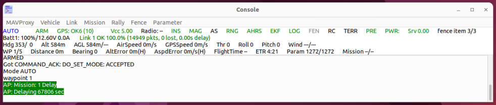
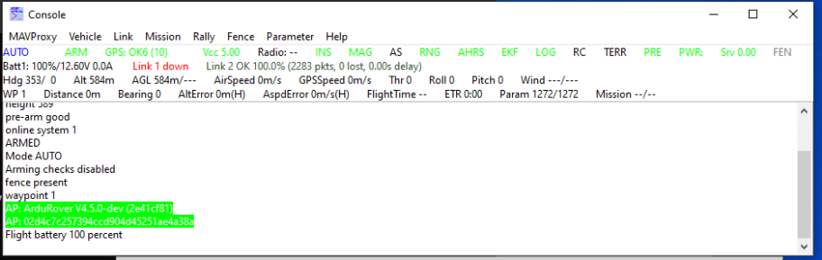

=================
Graphical Console
=================

.. code:: bash

    module load console
    
A GUI console that displays important information to the UAV's current
state. The area below the menu bar shows on the upper row (left to
right): Flight mode and arming state, GPS status, system voltage,
telemetry radio link quality, inertial system availability, magnetometer
availability, airspeed sensor availability, Sonar/Lidar availability,
Attitude control system(AHRS and EKF) state, geofence status and terrain
dataset availibility. The second row shows further details of the
telemetry link quality. The third and fourth rows show selected sensor
readings.

The menu bar allows the user to change any of the global MAVProxy
settings, as well as shortcuts to command waypoint, rally point and
geofence commands.

