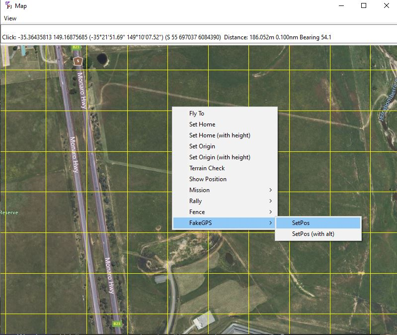
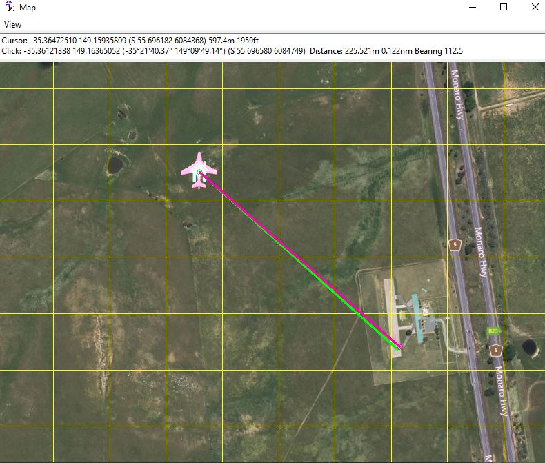

.. _fakegps:

========
Fake GPS
========

.. code:: bash

    module load fakegps

This allows MAVProxy to substitute a fakegps signal into the autopilot or simulation. This provides an easy means to simulate a given location and/or altitude to the autopilot/sim for testing features like terrain altitude, etc. while still on the bench.

In order to use it after the module is loaded, you must change :ref:`GPS_TYPE<GPS_TYPE>` to "14" (MAVLink) so that GPS data is supplied via MAVLink commands.

Then you can right click on any location and see the dropdown options for setting the new location and altitude:

resulting it the location moving (there will be a 10 second delay while EKF re-aligns):

