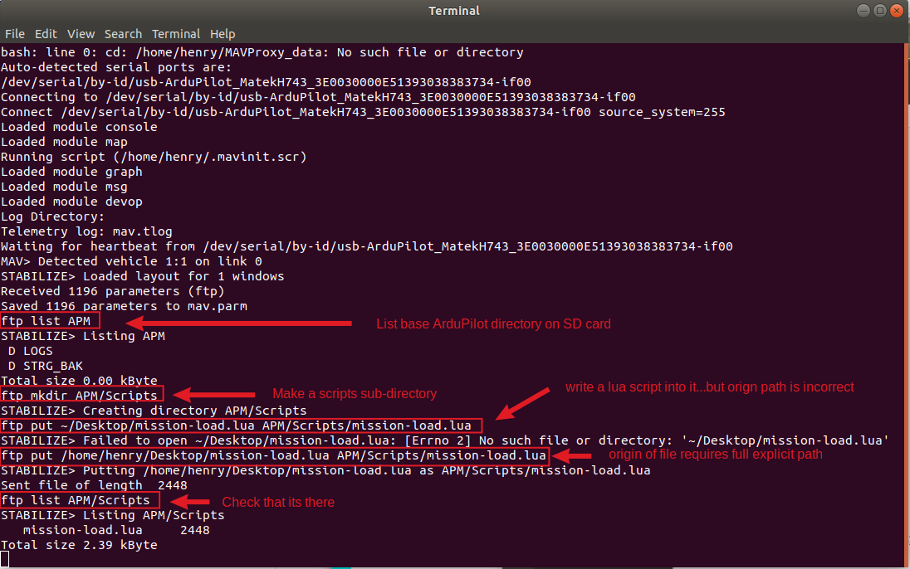

.. _mavproxy-modules-ftp:

===
FTP
===

.. code:: bash

    module load ftp

.. note:: this module is loaded by default

This allows the rapid transfer of files to/from the SD card

Usage: ftp <list|get|put|rm|rmdir|rename|mkdir|crc>

- list: list directory contents
- get: download a file
- put: write a file
- rm: remove a file
- rmdir: remove an empty directory
- rename: rename a file
- mkdir: create a directory
- crc: check a files CRC validity

