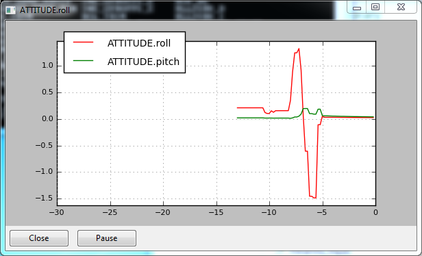

.. _mavproxy-modulegraph:

==================
Graphing Live Data
==================

.. code:: bash

    module load graph
    
A module to plot (graph) data in realtime from the UAV. It is useful for
looking for time-varying patterns in the data

After loading, new plots can be created by:

.. code:: bash

    graph dataname

Multiple items can be added at once. Use the ``:2`` to specify using the
right vertical axis.

.. code:: bash

    graph VFR_HUD.alt VFR_HUD.airspeed:2

Arbitrary mathematical functions can also be used.

.. code:: bash

    graph "(VFR_HUD.alt/1000.0)+5"

Additionally, the timespan and tick resolution of the graph window can
be changed. Use ``graph timespan X`` to change the timespace to X
seconds and ``graph tickresolution Y`` to change the tick resolution to
Y seconds.

There are two global settings for graphs: timespan and tickresolution.

To set the timespan along the horizontal axis (in seconds):

.. code:: bash

    graph timespan 20
 
 To set the tickresolution along the horizontal axis (1/<number of ticks>):

.. code:: bash

    graph timespan 0.2
       
