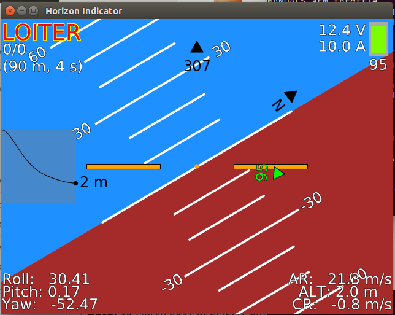

=======
Horizon
=======

.. code:: bash

    module load horizon
    
This module creates a horizon window, showing common information (such as atitude, speed and heading).

Framerate
=========

The target framerate of the window can be get or set via:

.. code:: bash

    horizon-fps set <fps>
    horizon-fps get <fps>
    
Where an fps of 0 is an unresricted framerate.
