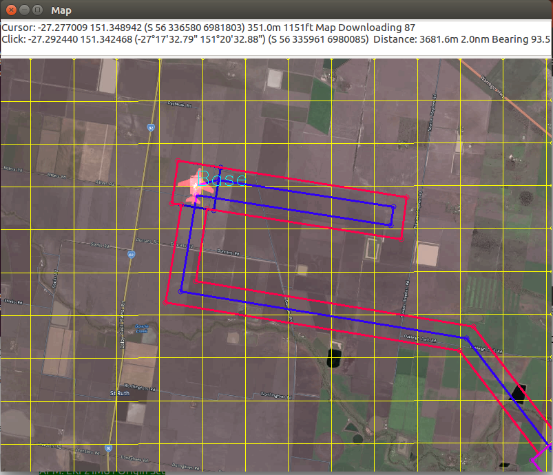

============
KML Importer
============

.. code:: bash

    module load kmlread
    
This module allows the user to import kml and kmz files to display 
on the map. Polygons can be set as the vehicle's geofence.

All of the below commands are added to the map window's right-click menu 
for ease-of-use.

Loading and Clearing
====================

Kml/kmz files can be loaded or cleared by:

.. code:: bash

    kml load <filename>
    kml clear

Layers
======

The layers in the kml can be listed by:

.. code:: bash

    kml list
    
Individual layers can be toggled on and off by:

.. code:: bash

    kml toggle <layername>
    
A polygon layer can be set as the geofence by:

.. code:: bash

    kml fence <layername>
    
    

