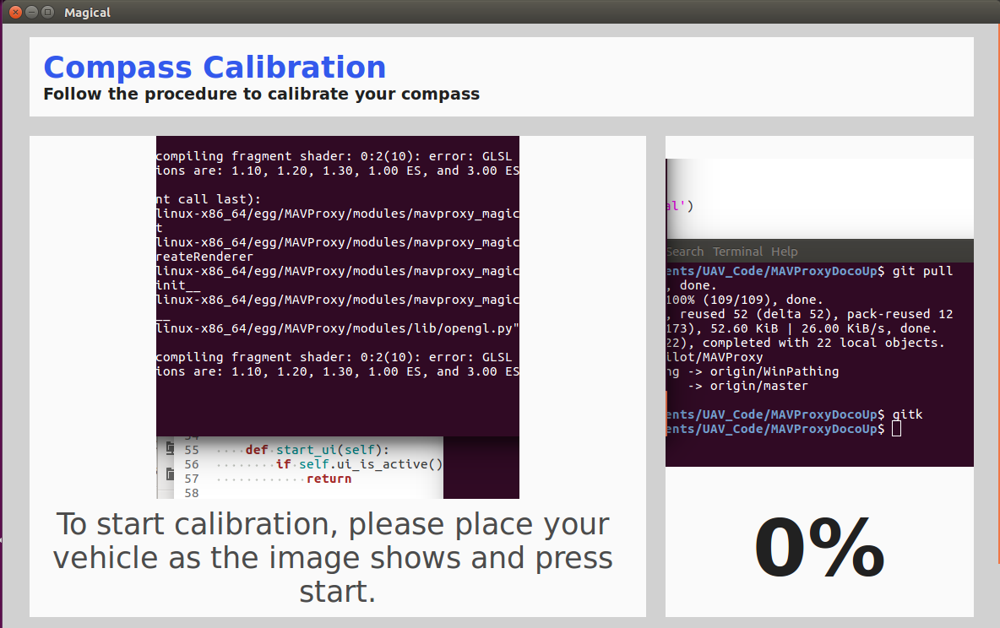

===================
Compass Calibration
===================

.. code:: bash

    module load magical
    
This module give a graphical UI for assisting with compass calibration.

All of the below commands are added to the map window's right-click menu 
for ease-of-use.

Starting
========

After the module has been loaded, the UI can be started by:

.. code:: bash

    magical_ui
    

