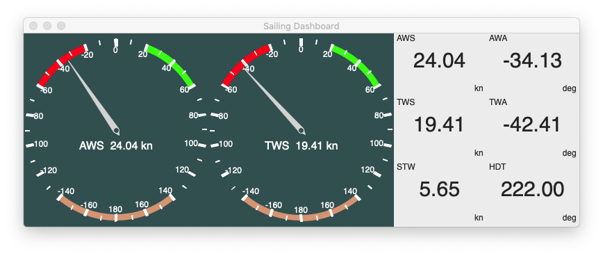

====
Sail
====

.. code:: bash

    module load sail
    
This module creates a sailing dashboard window that displays information
relevant to sailing vehicles. There are two meters on the left that
display apparent and true wind speed and angle. On the right is a panel
of instrument displays showing wind speed and angle, speed through water
and true heading.

==================   ====================================================   ===============================
Abbreviation         Description                                            Units
==================   ====================================================   ===============================
AWA                  Apparent wind angle                                    degrees
AWS                  Apparent wind speed                                    knots
TWA                  True wind angle                                        degrees
TWS                  True wind speed                                        knots
STW                  Speed through water (ground speed for land vehicles)   knots
HDT                  Heading True                                           degrees
==================   ====================================================   ===============================
 
Wind angle is relative to the front of the vehicle and is positive in a clockwise direction.
True wind speed and angle are calculated from apparent wind speed and angle accounting for the
speed through water, however in the absence of a log they are calculated with respect
to ground speed.
