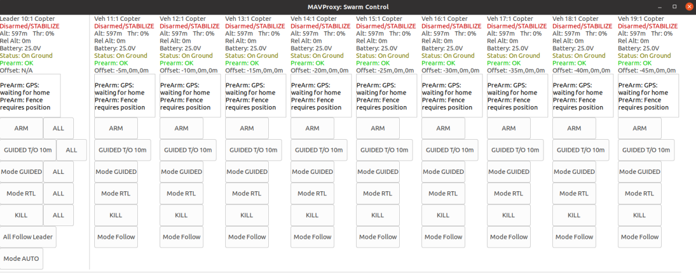

.. _mavproxy-modules-swarm:

=====
Swarm
=====

.. code:: bash

    module load swarm
    
This module is a GUI for managing swarms of vehicles (typically 2-10 vehicles).

It allows individual or group-based simultaneous control of swarm members.

The swarm parameters (:ref:`SYSID_THISMAV<SYSID_THISMAV>` and :ref:`FOLL_SYSID<FOLL_SYSID>`) should be configured beforehand.

The GUI will show each swarm as a single row, with the swarm leader being the leftmost vehicle.

Any vehicles not in a swarm will be shown in the "Unassigned vehicles" row at the bottom.

The GUI itself allows:

- Mode changes (single and swarm-based)
- High level information about each vehicle shown
- Arm and disarming
- Kill-switch to immediately disarm

