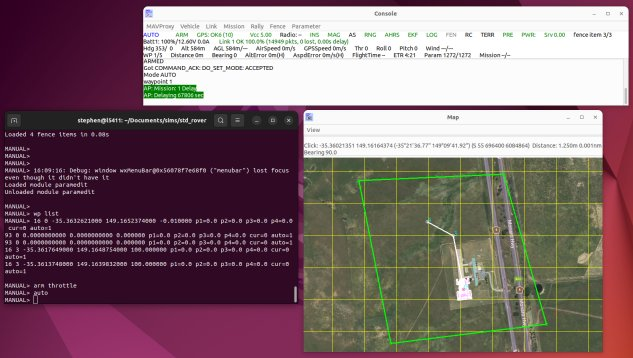
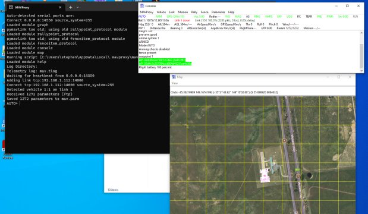

.. _home:

========
MAVProxy
========

**A UAV ground station software package for MAVLink based systems**

MAVProxy is a fully-functioning GCS for UAV's. The intent is for a
minimalist, portable and extendable GCS for any UAV supporting the
MAVLink protocol (such as one using ArduPilot).

MAVProxy was first developed by `CanberraUAV <http://www.canberrauav.org.au>`_,
to enable the use of companion computing and multiple datalinks with 
ArduPilot. It has grown to be one of the most versatile tools in the ArduPilot 
ecosystem, and many of the features users now see in other GCS tools 
can trace their origins to MAVProxy.

Features
=========

-  It is a command-line, console based app. There are plugins included
   in MAVProxy to provide a basic GUI.
-  Can be networked and run over any number of computers.
-  It's portable; it should run on any POSIX OS with python, pyserial,
   and ``select()`` function calls, which means Linux, OS X, Windows, and
   others.
-  The light-weight design means it can run on small netbooks with ease.
-  It supports loadable modules, and has modules to support console/s,
   moving maps, joysticks, antenna trackers, etc
-  Tab-completion of commands.

Screenshots
============

   MAVProxy running under Ubuntu

   MAVProxy running under Windows 7

Quick Reference Card
====================

A table of commonly used MAVProxy commands is available :ref:`here <mavproxy-cheetsheet>`.

License
=======

MAVProxy is released under the GNU General Public License v3 or later.

Core Team
=========

MAVProxy is maintained by `Andrew Tridgell <https://github.com/tridge>`_, `Peter Barker <https://github.com/peterbarker>`_ and `Stephen Dade <https://github.com/stephendade>`_

Full Table of Contents
======================

.. toctree::
   :maxdepth: 3

   docs/getting_started/index
   docs/uav_configuration/index
   docs/modules/index
   docs/analysis/index
   docs/development/index

