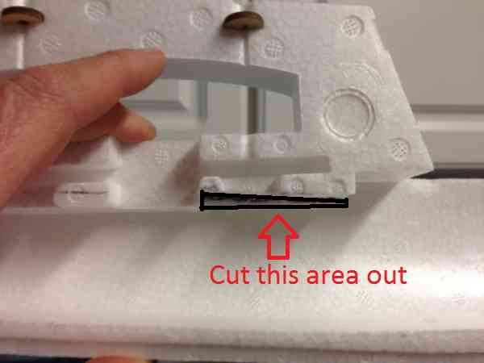
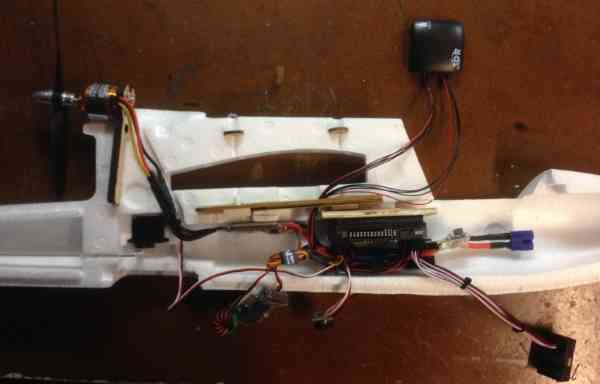
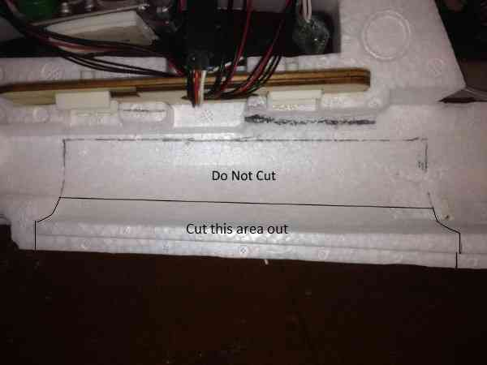
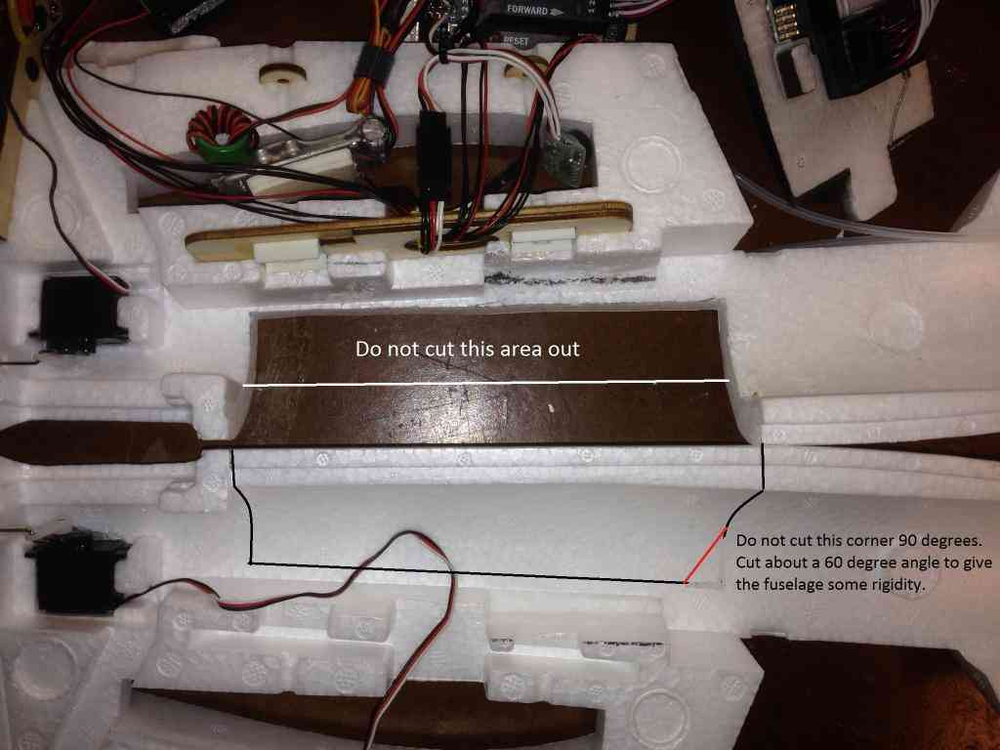
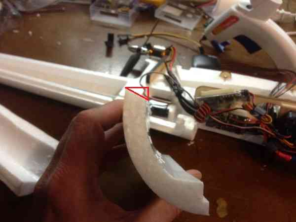
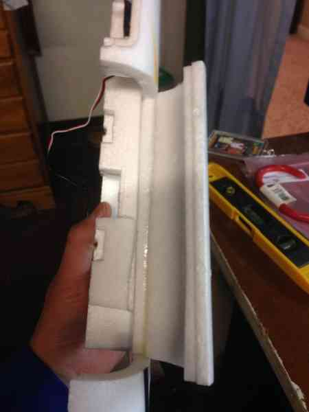
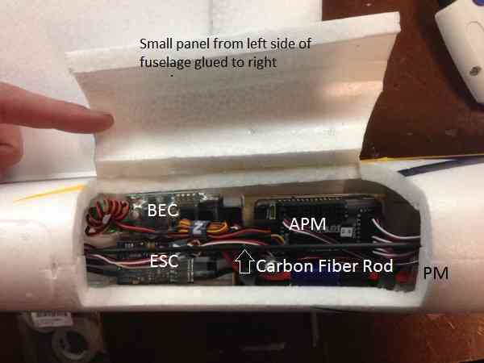
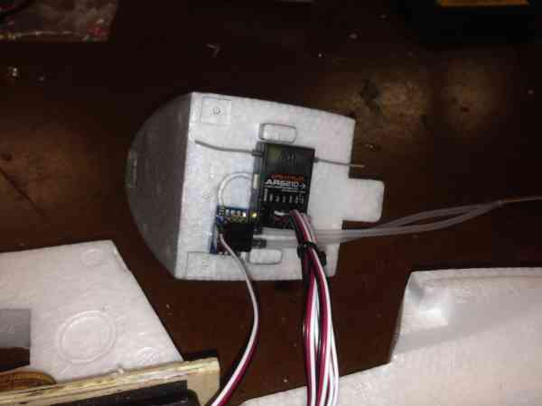
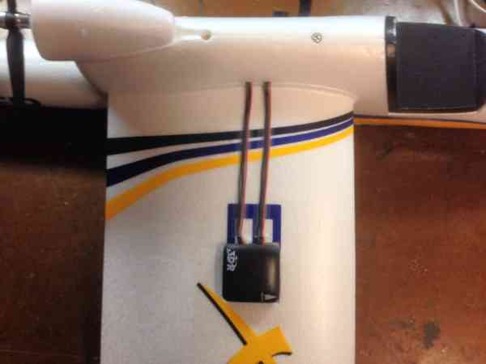

.. _a-high-quality-bixler-1-1-build:

======================================
High Quality Bixler 1.1 Build (APM2.x)
======================================

This article describes a well planned Bixler Build (by Dave Smith).

.. image:: http://api.ning.com/files/u325ipbpd7oqTtPXcbe06pO*YRgzw3pmmYp1bMm2Wg9DNb8LsLAgkd2DEDlgEKdYRKjFIMWOg1LkAG4u-fMpgy-Jp9ceEGXv/mainbix6.jpg
    :target:  http://api.ning.com/files/u325ipbpd7oqTtPXcbe06pO*YRgzw3pmmYp1bMm2Wg9DNb8LsLAgkd2DEDlgEKdYRKjFIMWOg1LkAG4u-fMpgy-Jp9ceEGXv/mainbix6.jpg

.. tip::

   This wiki page is a work in progress and will be completed as the
   information becomes available.

Overview
========

I have seen some really horrific pictures on the internet of Bixlers
with everything taped to the outside. After digging through the
internet, I found the answers I needed to build my plane, but the
learning curve was pretty steep.

Hopefully I can help somebody out and save them a lot of frustration by
logging my whole build.

The equipment list
==================

#. `Bixler 1.1 ARF <http://www.hobbyking.com/hobbyking/store/uh_viewItem.asp?idProduct=18083>`__
   (HobbyKing)
#. `Motor <http://www.hobbyking.com/hobbyking/store/uh_viewItem.asp?idProduct=34108>`__
   (HobbyKing)
#. `ESC <http://www.hobbyking.com/hobbyking/store/uh_viewItem.asp?idProduct=26497>`__
   (HobbyKing)
#. `SBEC <http://www.hobbyking.com/hobbyking/store/uh_viewItem.asp?idProduct=39470>`__
   (HobbyKing) - (Optional)
#. `ESC Programmer <http://www.hobbyking.com/hobbyking/store/__45206__HobbyKing_Programming_card_for_BlueSeries_Brushless_Speed_Controller_US_Warehouse_.html?strSearch=programming%20card>`__
   (HobbyKing)
#. `Motor mount <http://www.hobbyking.com/hobbyking/store/uh_viewItem.asp?idProduct=43929>`__
   (HobbyKing) - (for spinning bigger props)
#. APM 2.6 with separate GPS/compass
#. Radio: Spektrum DX8
#. Receiver: AR6210, no satellite
#. Prop: APC 7-5. The HK 7-5 prop came with horrible adapter collars and
   I do not recommend them!
#. `25cm 4 position cable <http://store.jdrones.com/cable_df13_4pin_25cm_p/cbldf13p4c25.htm>`__
   (store.3drobotics.com)
#. `25 cm 6 position cable <http://store.jdrones.com/cable_df13_6pin_25cm_p/cbldf13p6c25.htm>`__
   (store.3drobotics.com)
#. `5 pin housing <http://www.digikey.com/product-detail/en/DF13-5S-1.25C/H2182-ND/241752>`__
   (www.digikey.com)
#. `Female-female server extension (15cm x 7 qty) <http://store.jdrones.com/Servo_Extension_10cm_Female_Female_p/cblsrvff10.htm>`__
   (store.3drobotics.com)

Getting Started
===============

-  I am waiting on my new air-frame after an unfortunate incident with
   an electrical wire on a windy day.

   -  Part of the learning curve, which I will not elaborate upon
      thoroughly to spare you the anquish.
   -  Before I knocked the tail off, I had my plane hitting waypoints,
      loitering, RTL, and auto-landing.

-  For now, I will show you what I did with the electronics.

   -  I do not have telemetry yet, so I just used the stock PID settings
      and added some I gain. (More on that later.)

-  About using an external SBEC: I chose to do this because I am an RC
   heli guy, and I often use servos that draw ridiculous current.

   -  If you power the servos separately from the motor, there is less
      chance of either one shutting down due to over-current draw.
   -  But you also add a second electronic device that can fail.
   -  When the motor is at max throttle and servos are fully deflected,
      such as on a windy day, the separate BEC gives you some headroom.

-  I will post pics of the air-frame assembly when I receive it next
   week.

Programming the ESC
===================

**Set up the programmer card as follows:**

.. image:: http://i1302.photobucket.com/albums/ag127/davesmith111/internet%20pics/205cdb8d-fae5-47fe-99bf-fcf541a96d87_zpsba9c68f8.jpg
    :target:  http://i1302.photobucket.com/albums/ag127/davesmith111/internet%20pics/205cdb8d-fae5-47fe-99bf-fcf541a96d87_zpsba9c68f8.jpg

#. Set the low voltage cutoff to its lowest setting to allow the APM
   failsafe feature do its job.
#. Don't worry about FWD vs REV; you can just switch two of the motor
   wires if the motor spins backwards.
#. Connect the ESC to the card and the motor (no prop).
#. Plug the ESC into a battery and you should get one tone from the
   motor, letting you know that programming is complete.
#. Disconnect the programming card and then the battery.

Wiring the ESC and BEC
======================

I chose to use EC3 connectors in my build, because all of my batteries
have them. XT-60 are just fine.

#. Cut the servo power lead off of the BEC at the connector.
#. Solder the BEC power cables along with the ESC power cables into your
   connector (this can be a little tricky).

   #. Get the solder hot in a connector and insert an ESC wire.
   #. Keep the connection hot and slip the BEC power wire in next to it.

#. I chose to run my servos at 5V  from the BEC.

   #. There is a jumper on the end of it that lets you select 5 or 6 V.
   #. Before you reinstall the electronics secure the jumper on the BEC
      with a glob of hot glue or shoe goo.

#. Pull the center (red) pin and wire from the ESC receiver connector.

   #. This disconnects the built in BEC from the ESC. You don't need it
      since it is only powering the motor.
   #. Tuck the ESCs BEC wire away with heat shrink tubing over the end.
   #. You will need access to it if you need to re-program the ESC.

#. Add 100mm 14 gauge motor lead extensions with 3.5mm banana plugs to
   make it easier to wire the Bixler's motor later.

**Here it is ready to go:**

.. image:: http://i1302.photobucket.com/albums/ag127/davesmith111/internet%20pics/7db2fd9a-9ee0-40a7-92d3-6fe473d97ce1_zps37b398da.jpg
    :target:  http://i1302.photobucket.com/albums/ag127/davesmith111/internet%20pics/7db2fd9a-9ee0-40a7-92d3-6fe473d97ce1_zps37b398da.jpg

Mount the APM and install the wiring
====================================

#. Make a 45 x 100 mm mounting plate for the APM using 5mm plywood (or
   plastic or fiberglass board).
#. Use a 1" square of Kyosho Zeal Gel or Dubro foam under each corner of
   the flight controller to provide vibration suppression.
#. Zeal has high strength double sided adhesive, but if your pads do
   not, consider using "Welders Glue" available at Amazon or Lowes.

   #. Re Welder's Glue: it is contact cement. Lightly cover each surface
      you wish to bond and let them dry for about five minutes.
   #. Then carefully align and put the two surfaces together and for
      immediate bonding.
   #. I will also use Welder's Glue for assembling the foam air frame
      and building an access door in the fuselage.

**The APM mounted on the plate: (Pictured are the stock cables to the
GPS. I will actually be using the 30cm cables)**

.. image:: http://i1302.photobucket.com/albums/ag127/davesmith111/internet%20pics/13968d8e-044e-4000-9768-11eb05257832_zps129a65ba.jpg
    :target:  http://i1302.photobucket.com/albums/ag127/davesmith111/internet%20pics/13968d8e-044e-4000-9768-11eb05257832_zps129a65ba.jpg

Preparing the Fuselage
======================

#. For this build, the APM is mounted inverted and we want to get it
   level with the fuselage (level with the line of flight).
#. You can see that the wing has a positive angle of attack when the APM
   is level.
#. If you just stick the APM to the bottom or top of the fuselage it
   will not be level, which may affect performance.
#. I don't like to take chances, so, I removed some of the foam below
   the top inside of the fuselage to get the APM level:

Component Placement
===================

#. Here is the APM set in place with some of the components.
#. At this point you should mark where your access panel will be.

Trimming the Fuselage
=====================

-  I originally cut too much and the fuselage was really weak.
-  No problem; with some hot glue you can easily fix any boo-boos.
-  In the picture below you want to cut the lower portion and leave the
   area I have labeled "Do Not Cut".
-  You will have ample room to access the APM Inputs and Outputs, as
   well as the USB port and other pins.
-  Cut straight through the foam so that the panel will open easily.

-  Now match up the two halves to mark the cuts for the right side.
-  Cut a larger access panel out of the other (right) half of the
   fuselage so you can access the USB port on the APM.

-  Cut a bevel along the long axis of the large panel we already cut
   out.
-  I think that my picture is incorrect below; make this cut on the
   panel from the \ **right half of the fuselage**.
-  This is not the edge where the two halves of the fuselage join, but
   the cut near the wing.

-  Now, make a Welder's glue hinge where the bevel (that we just cut)
   meets the fuselage.
-  This creates a hinge for the panel that is invisible and super cool.
-  Don't worry, custom foamies use this type of hinge for hundreds of
   flights.
-  Here is link to a YouTube video explaining how to make a Welder's
   hinge:

..  youtube:: S-8PGFJqqMM
    :width: 100%

-  The panel should look like this when the Welder's hinge is complete:

Assemble the Fuselage
=====================

#. So now I am going to fast forward a little bit.
#. Follow the Bixler instructions and glue the halves of the fuselage
   together.
#. Again, I use Welder's glue, applying a thin bead to each half,
   letting them get tacky, and then assembling the halves.
#. Run the motor cables from the ESC to the motor before you assemble
   the two halves.
#. No worries if you don't, but it will save you the trouble of trying
   to attach the motor leads with needle nose pliers and hemostats.
#. You should also check the rotation of the motor so that you do not
   have to switch motor leads for a motor spinning in reverse.

COMPONENT Installation Details
==============================

-  Below I have the fuselage glued together and the components glued in
   place.
-  I like hot glue for this detail.
-  Notice that I glued a 3mm carbon fiber rod across the access hatch
   for added rigidity.

-  At this point, space is becoming a concern.
-  You will notice that we have put nothing in the nose so far, and all
   of our components are pretty tightly tucked under the wing.
-  I did this so that we can utilize bigger batteries in future builds.
-  This time around I am using an airspeed sensor which is recommended,
   but not necessary if you are on a first-time build budget.
-  To make space for batteries, I mounted the airspeed sensor board and
   receiver to the bottom of the canopy hatch:

Complete The Construction
=========================

#. Use a servo splitter cable for the ailerons, I got odd results
   when programming separate aileron servo on its own channel.
#. I am quite happy with this setup because you can get the CG perfect
   with Zippy 2200mAh Lipo batteries.
#. I mounted the GPS/Compass on the right wing after removing just a
   small amount of material.
#. I mounted it with hot glue and taped the cables in place with 3M
   Blenderm tape.
#. I like Blenderm because it sticks well and is flexible.
#. Having it sitting up high on the wing is not ideal, but I wanted to
   get it away from the fuselage and all of the current-carrying
   electronics.

