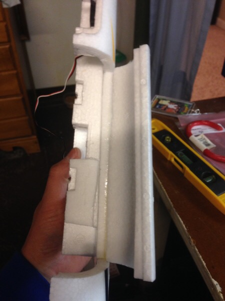

.. _a-high-quality-bixler-1-1-build:

======================================
High Quality Bixler 1.1 Build (APM2.x)
======================================

This article describes a well planned Bixler Build (by Dave Smith).

Overview
========

I have seen some really horrific pictures on the internet of Bixlers
with everything taped to the outside. After digging through the
internet, I found the answers I needed to build my plane, but the
learning curve was pretty steep.

**Hopefully I can help somebody out and save them a lot of frustration by
logging my whole build.**

The Equipment List
==================

#. `Bixler 1.1 ARF <https://hobbyking.com/en_us/h-king-bixler-1-1-epo-1400mm-glider-arf.html>`__
   (HobbyKing)
#. `Motor <https://hobbyking.com/en_us/turnigy-multistar-2216-800kv-14pole-multi-rotor-outrunner-v2.html>`_
   (HobbyKing) or other 2216 size 800-1000KV motor
#. `ESC <https://hobbyking.com/en_us/turnigy-basic-18a-v3-1-speed-controller.html>`__
   (HobbyKing) or other 18-20A ESC
#. `SBEC <https://hobbyking.com/en_us/turnigy-5a-8-26v-sbec-for-lipo.html>`__
   (HobbyKing) - (Optional) 5A BEC
#. `Motor mount <https://hobbyking.com/en_us/hobbyking-bixler-and-bixler-2-motor-mount-upgrade.html>`__   (HobbyKing) - (for spinning bigger props)
#. APM 2.6 with separate GPS/compass. (see note below)
#. Radio: Spektrum DX8 and RX or any other 5 channel or higher system.
#. Prop: APC 8x4E . Pusher or puller may be used since motor direction is easily changed just by swapping wires.
#. Y-servo-cable to connect both aileron servos together to one autopilot output.

.. note:: This autopilot is no longer supported. See the current autopilot :ref:`list<common-autopilots>` . OmnibusF4 Pro V3 is an inexpensive alternative. Any UBLOX MN-8 class GPS works well, such as a BN-220. A compass (gps/compass combo parts are available) is not necessary for ArduPilot on planes.

Getting Started
===============

About using an external SBEC: I chose to do this because I am an RC heli guy, and I often use servos that draw ridiculous current.

   -  If you power the servos separately from the BEC built into the ESC,
      there is less chance of either one shutting down due to over-current draw.
   -  But you also add a second electronic device that can fail.
   -  When the motor is at max throttle and servos are fully deflected,
      such as on a windy day, the separate BEC gives you some headroom.
   -  There are smaller, inexpensive BECs on the market that use up less space
      than what I have pictured.
   -  This is totally optional. The ESC's BEC will work well and reliably in this application.

Programming the ESC
===================

#. Using the ESC's setup instructions, set the ESC's low voltage cutoff to its lowest setting to allow   the autopilot battery level failsafe feature do its job. (be sure to enable it!)
#. Don't worry about motor direction; you can just switch two of the motor
   wires if the motor spins backwards.
#. Follow the :ref:`ESC setup guide <guide-esc-calibration>` to calibrate the ESC

Wiring the ESC and BEC
======================

I chose to use EC3 connectors in my build, because all of my batteries
have them. XT-60 are just fine.

If you do not use an external SBEC, skip to the last step.

#. Cut the center servo power lead off of the ESC's BEC at the connector.
#. Solder the SBEC power cables along with the ESC power cables into your
   connector (this can be a little tricky).
   #. Get the solder hot in a connector and insert an ESC wire.
   #. Keep the connection hot and slip the BEC power wire in next to it.
#. I chose to run my servos at 5V  from the SBEC.
   #. There is a jumper on the end of it that lets you select 5 or 6 V.
   #. Before you reinstall the electronics secure the jumper on the SBEC with a glob of hot glue or shoe goo.
#. Pull the center (red) pin and wire from the ESC receiver connector.
   #. This disconnects the built in BEC from the ESC. You don't need it since it since we are using a separate (dedicated) BEC.
   #. Tuck the ESCs BEC wire away with heat shrink tubing over the end.
   #. You will need access to it if you need to re-program the ESC.
#. Add 100mm 14 gauge motor lead extensions with 3.5mm banana plugs to make it easier to wire the Bixler's motor later.

**Here it is ready to go:**

Setting up the Autopilot, Sensors, and Optional Equipment
=========================================================

The purpose of this article is to detail the aircraft build, not the APM. There
are many documents in the wiki covering the APM, sensors, and tuning.
`Airplane walk-through <https://ardupilot.org/plane/docs/arduplane-setup.html>`_ .

Mount the autopilot and install the wiring
==================================================

#. Make a 45 x 100 mm mounting plate for the autopilot using 5mm plywood (or
   plastic or fiberglass board).
#. Use a 1" square of Kyosho Zeal Gel or Dubro foam under each corner of
   the autopilot to provide vibration suppression.
#. Zeal has high strength double sided adhesive, but if your pads do
   not, consider using "Welders Glue" available at Amazon or Lowes.
#. Re Welder's Glue: it is contact cement. Lightly cover each surface
   you wish to bond and let them dry for about five minutes.
#. Then carefully align and put the two surfaces together and for
   immediate bonding.
#. I will also use Welder's Glue for assembling the foam air frame
   and building an access door in the fuselage.

**The APM autopilot mounted on the plate: (Pictured are the stock cables to the
GPS. I actually used longer 30cm cables)**

Preparing the Fuselage
======================

#. For this build, the APM is mounted inverted and we want to get it
   level with the fuselage (level with the line of flight).
#. You can see that the wing has a positive angle of attack when the APM
   is level.
#. If you just stick the APM to the bottom or top of the fuselage it
   will not be level, but this will be compensated for if you set the "LEVEL" position to be such that the wing has a few degrees of angle of attack when doing the :ref:`Accelerometer calibration <common-accelerometer-calibration>`.
#. I removed some of the foam below
   the top inside of the fuselage to get the APM level:

Component Placement
===================

#. Here is the APM set in place with some of the components.
#. At this point you should mark where your access panel will be.

Trimming the Fuselage
=====================

-  I originally cut too much and the fuselage was really weak.
-  No problem; with some hot glue you can easily fix any boo-boos.
-  In the picture below you want to cut the lower portion and leave the
   area I have labeled "Do Not Cut".
-  You will have ample room to access the APM Inputs and Outputs, as
   well as the USB port and other pins.
-  Cut straight through the foam so that the panel will open easily.

-  Now match up the two halves to mark the cuts for the right side.
-  Cut a larger access panel out of the other (right) half of the
   fuselage so you can access the USB port on the APM.

-  Cut a bevel along the long axis of the large panel we already cut
   out.
-  I think that my picture is incorrect below; make this cut on the
   panel from the \ **right half of the fuselage**.
-  This is not the edge where the two halves of the fuselage join, but
   the cut near the wing.

-  Now, make a Welder's glue hinge where the bevel (that we just cut)
   meets the fuselage.
-  This creates a hinge for the panel that is invisible and super cool.
-  Don't worry, custom foamies use this type of hinge for hundreds of
   flights.
-  Here is a `link <http://www.youtube.com/watch?v=S-8PGFJqqMM>`_ to a YouTube video explaining how to make a Welder's hinge:
-  The panel should look like this when the Welder's hinge is complete:

Assemble the Fuselage
=====================

#. So now I am going to fast forward a little bit.
#. Follow the Bixler instructions and glue the halves of the fuselage
   together.
#. Again, I use Welder's glue, applying a thin bead to each half,
   letting them get tacky, and then assembling the halves.
#. Run the motor cables from the ESC to the motor before you assemble
   the two halves.
#. No worries if you don't, but it will save you the trouble of trying
   to attach the motor leads with needle nose pliers and hemostats.
#. You should also check the rotation of the motor so that you do not
   have to switch motor leads for a motor spinning in reverse.

COMPONENT Installation Details
==============================

-  Below I have the fuselage glued together and the components glued in
   place.
-  I like hot glue for this detail.
-  Notice that I glued a 3mm carbon fiber rod across the access hatch
   for added rigidity.

-  At this point, space is becoming a concern. Using a smaller BEC will help
   you out.
-  You will notice that we have put nothing in the nose so far, and all
   of our components are pretty tightly tucked under the wing.
-  I did this so that we can utilize bigger batteries in future builds.
-  This time around I am using an airspeed sensor which is recommended,
   but not necessary if you are on a first-time build budget.
-  To make space for batteries, I mounted the airspeed sensor board and
   receiver to the bottom of the canopy hatch:

Complete The Construction
=========================

#. Use a Y servo splitter cable for the ailerons, although using separate autopilot outputs would allow the use of :ref:`flaperons<flaperons-on-plane>`.
#. I am quite happy with this setup because you can get the CG perfect
   with Zippy 3s 2200mAh Lipo batteries. I was able to use up to 3000 mAh batts.
#. I mounted the GPS/Compass on the right wing after removing just a
   small amount of material.
#. Having it sitting up high on the wing is not ideal, but I wanted to
   get it away from the fuselage and all of the current-carrying
   electronics. I ultimately ran the cables under the wing along
   the carbon fiber rod, which is much smoother. If you do not use a compass, the gps can be mounted anywhere as long as its upper surface (antenna) faces the sky.

Tuning and Flight Performance
=============================

To get the best motor and propeller for my build, I used `eCalc <http://ecalc.ch>`__ , which is
worth the money. You can also use :ref:`Drive Calculator<drivecalculator-guide>` , which is free.

After going through the wizard in Mission Planner, you should have a compass
that points correctly, and a properly working GPS. I found that the initial
settings were quite flyable, and using the Autotune to give very good results.

At 6 m/s the aircraft becomes unstable and begins to tip stall, so keep your
cruise speed higher than this. Using a 2216-800 kV motor and and 8-4.7 prop
configuration and a 3000 mAh battery, I was able to achieve
**80 minute flights** at 12 m/s air speed!
