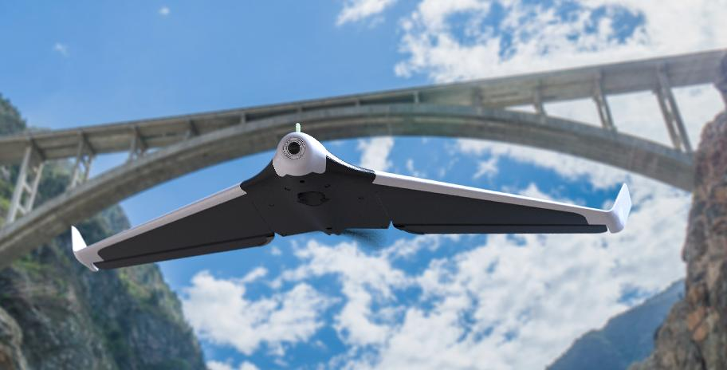

.. _airframe-disco:

============================
Setup Guide for Parrot Disco
============================

The Parrot Disco is a lightweight delta-wing with built-in camera and
good flight characteristics. This page will help you get setup with
ArduPilot running on your Disco.

Prebuilt Firmware
=================

A build of APM:Plane for Disco is automatically generated by the
ArduPilot autobuild system. You can see the builds here:

  https://firmware.ardupilot.org/Plane/

the file you need to download is 'arduplane'. 

Building Firmware
=================

To build the ArduPilot firmware yourself you should use the waf build
system, which is included as part of ArduPilot. The command to build
APM:Plane for Disco is:

* ``./waf configure --board disco``
* ``./waf plane``

this will give you a file build/disco/bin/arduplane that needs to be
installed on your Disco.

Networking
==========

The Disco has a builtin WiFi access point, which will show up on your
network as "DISCO-xxxxxx" where xxxxxx is a device specific serial
number. The WiFi has no password by default.

You can also use USB networking if your operating system supports
it. Just plug a USB cable into the left most USB port on the back of
the CHUCK module and connect with your operating systems network
manager.

Installation
============

ArduPilot is usually installed in /data/ftp/internal_000/APM. You
should use adb to create that directory and put a copy of arduplane
from the build step in the directory.

You will need some additional setup and configuration files as well. A
copy of all of the required files is available here:

  https://github.com/ArduPilot/ardupilot/tree/master/Tools/Frame_params/Parrot_Disco

You will need to modify the /etc/init.d/rcS_mode_default startup
script to start ArduPilot. An example of a modified startup script to
start ArduPilot if it is installed is available here:

  https://github.com/ArduPilot/ardupilot/blob/master/Tools/Frame_params/Parrot_Disco/rcS_mode_default

you may find the 'Raw' button useful for downloading that file.
  
That script will start ArduPilot is there is a start_ardupilot.sh
script in the APM directory.

You will also need to install the start_ardupilot.sh script. A copy of
a suitable script is here:

 https://github.com/ArduPilot/ardupilot/blob/master/Tools/Frame_params/Parrot_Disco/start_ardupilot.sh

that starts the Disco FAN and then loops running ArduPilot. The loop
is so you can restart ArduPilot with a MAVLink preflight-reboot
request from your GCS without rebooting the Disco.

The startup script assumes that your Disco appears on the
192.168.42.0/24 network for WiFi and 192.168.43.0/24 network for USB
networking. It tells ArduPilot to announce itself as a MAVLink device
on those two networks. It will pick up the first MAVLink capable
ground station that connects on UDP port 14550 on those networks.

Ground Station
==============

For configuring your Disco you will need a ground station software
package (GCS). There are several choices for use with Disco:

* MissionPlanner (windows only)
* APM Planner (cross platform)
* QGroundControl (cross platform)
* MAVProxy (cross platform, experts only)

They are all capable of controlling all aspects of the Disco setup and
flight, including autonomous missions.
  
Transmitter Setup
=================

The usual way to fly a Disco with ArduPilot is with a SBUS receiver
and matching transmitter. You can also fly without a transmitter, but
that is only recommanded for advanced users who are very familiar with
automated flight control with ArduPilot. We hope to support the Disco
WiFi based transmitter in ArduPilot in the future.

.. warning::

   The telemetry output option of many R/C receivers can interfere
   badly with the Disco WiFi. Make sure you do a R/C range check
   before flying and also check that your WiFi telemetry has
   sufficient range for your needs. Many R/C receivers with a telemetry
   option can disable the telemetry when binding. Please refer to your
   receiver documentation for details. It is recommended that you
   disable receiver telemetry if you find your WiFi telemetry link
   from the Disco is affected by your receiver.
  
Loading Parameters
==================

You will need to load a set of parameters suitable for the Disco using
your GCS. A recommended set of parameters to start with is here:

  https://github.com/ArduPilot/ardupilot/blob/master/Tools/Frame_params/Parrot_Disco/Parrot_Disco.param

you can download that file directly for loading into a GCS with this
link:

  https://raw.githubusercontent.com/ArduPilot/ardupilot/master/Tools/Frame_params/Parrot_Disco/Parrot_Disco.param
 
Compass Calibration
===================

You need to calibrate the compass in your Disco before you fly. This
must be done with the hatch in place due to the magnetic catch on the
hatch.

Each GCS choice has an option to start a compass calibration. Please
choose on-board compass calibration for your GCS and follow the
prompts.

Note that you may find you need to raise COMPASS_CAL_FIT to allow
successful calibration of the Disco, as the magnetic setup of the
Disco hardware is not ideal and won't produce a perfect fit. We
recommend setting COMPASS_CAL_FIT to 20.

Accelerometer Calibration
=========================

You also need to perform an accelerometer calibration. Please follow
the prompts in your GCS for the accelerometer calibration
procedure. This will only need to be performed once.

Airspeed Calibration
====================

Before each flight you should perform an airspeed offset calibration
as the airspeed sensor will vary in its zero value between power
cycles.

You should loosely cover the pitot tube that is built into the power
switch and choose the pre-flight airspeed calibration option in your
GCS.

Stabilisation Check
===================

Before each flight you should check the stabilization of the Disco by
changing to FBWA mode and checking the following:

* roll the Disco to the right. The right elevon should go down, the
  left elevon should go up
* roll the Disco to the left. The left elevon should go down, the
  right elevon should go up
* pitch the nose up. Both elevons should go down
* pitch the nose down. Both elevons should go up

Next you should check for correct transmitter control with the Disco
held level.

* input right roll on the transmitter. The left elevon should go down
  and the right elevon should go up
* input left roll on the transmitter. The right elevon should go down
  and the left elevon should go up
* pull back on the pitch (elevator) stick on the transmitter. Both
  elevons should go up.
* push forward on the pitch (elevator) stick on the transmitter. Both
  elevons should go down.

Takeoff
=======

The Disco has a very low stall speed which makes it easy to launch in
a wide variety of ways. Some recommended ways are:

* a side launch where you hold a wing close to the fuselage, and launch
  the aircraft forward. An example is shown here:

..  youtube:: 493782HmSqc
    :width: 100%

* a forward throw launch, as shown here:

..  youtube:: nDMZibc_CNo
    :width: 100%

Always launch into the wind, and be careful to keep your hand clear of
the propeller.

Also note that you can configure Disco for "shake to start", to start
the motor when the airframe senses a shaking motion. That is set by
the TKOFF_THR_MINACC=4 parameter in the parameter file linked above.

You can see a "shake to start" example here:

..  youtube:: d2kEPkCueYY
    :width: 100%

Flight Modes
============

For general stabilised flight FBWA mode is recommended. This is also
good for takeoffs and landings.

For longer distance FPV flying CRUISE mode is recommended as it will
hold airspeed, height above ground and ground course.

You should also setup your transmitter for easy access to RTL mode to
bring the plane home if you need to.
            
Manual Landing
==============

To land manually FBWA mode is recommended. Just point the plane in the
direction you want to land and drop the throttle. To come in more
steeply push the pitch stick away. To perform a nice flare pull back a
small amount on the pitch stick just before touchdown.

APM:Plane will automatically put the nose down a couple of degrees
when at zero throttle to keep the airspeed up. You can set how much
nose down it uses at zero throttle with the STAB_PITCH_DOWN
parameter.

Make sure you land with zero throttle or you risk breaking the
propeller.

AUTO Landing
============

When using an AUTO mission you can place a NAV_LAND waypoint where you
want to land, with a target altitude of zero meters. You also need to
place an approach waypoint about 200 meters before the NAV_LAND point,
about 30 meters above the ground. The Disco will automatically flare
and cut the motor as it approaches the landing point.

Note that the Sonar used on the Disco for landing flare detection does
have a tendency to sometimes produce false positives. That can cause
the Disco to flare early in the landing as it thinks it is close to
the ground. Because the Disco has such good glide characteristics this
doesn't result in a crash, but it does cause it to land well short of
the target position.
            
Log Files
=========

There are two types of log files for the Disco with ArduPilot. The
first is a "tlog" which is stored by your GCS software on your ground
station. The second is a "DF" log, which is stored on board the Disco.

The log directory is /data/ftp/internal_000/APM/logs and can be
accessed by ftp. Just enter a URL like ftp://192.168.42.1/ in Windows
Explorer if using Windows to view the storage on the Disco and access
log files. These files have a ".bin" extension (for binary log file).

The C.H.U.C.K Autopilot
=======================

The heart of the Disco is the C.H.U.C.K autopilot, an orange box
which is a general purpose autopilot. It is perfectly possible to use
the C.H.U.C.K in a different airframe.

For more information on using C.H.U.C.K with ArduPilot please see
the :ref:`C.H.U.C.K AutoPilot <common-CHUCK-overview>`
