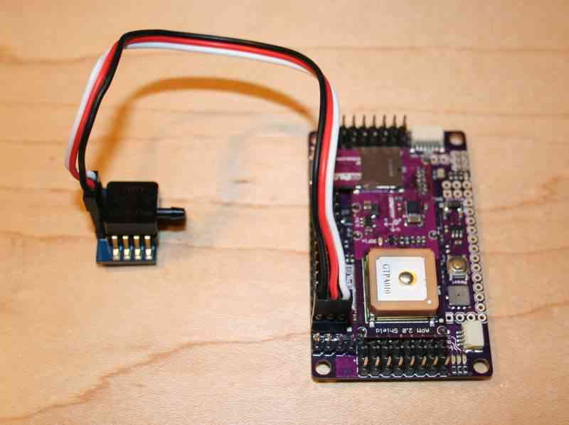

.. _airspeed:

========================
Using an Airspeed Sensor
========================

Plane supports the use of an airspeed sensor, which can help in windy
conditions, slow flight and autonomous landings. It is not recommended
for most new users, however, as it does require additional tuning and
adds one more layer of control to set up.

The following sections explain how to wire sensors to the flight
controller. After you install an airspeed sensor don't forget to
:ref:`calibrate it <calibrating-an-airspeed-sensor>`!

Pixhawk Digital Airspeed Pin
============================

Pixhawk can use this `digital airspeed sensor <http://store.jdrones.com/digital_airspeed_sensor_p/senair02kit.htm>`__.
Connect the airspeed sensor to Pixhawk's I2C port (or I2C splitter
module). Using the rubber tubing, connect the longer extension on the
pitot tube to the cone that protrudes from the top of the airspeed
sensor board (off the off-white, square section protruding off the top
of the board), and connect the shorter extension on the pitot tube to
the cone protruding from the base of the board.

.. image:: ../images/airspeed_full_assembly_800px.jpg
    :target: ../_images/airspeed_full_assembly_800px.jpg

Pixhawk can also use this `digital airspeed sensor with compass <http://store.jdrones.com/digital_airspeed_sensor_with_compass_p/senairmag03kit.htm>`__ 
module.  This may allow you to incorporate an external compass well
away from sources of ElectroMagnmetic Interference (EMI) without
additional cabling.

To enable the digital airspeed sensor, connect Pixhawk to Mission
Planner (or APM Planner for OS X), and select the **Advanced Parameter
List** under the Configuration tab. Locate the
:ref:`ARSPD_PIN <ARSPD_PIN>` parameter
and set to **65**. Select **Write Params** to apply. Ensure that you
have also enabled the airspeed sensor in the setup section (**Mission
Planner \| Hardware \| Optional Hardware \| Airspeed**) as discussed
below.

Analog Airspeed sensor
======================

The way this `airspeed sensor <http://store.jdrones.com/AirSpeed_sensor_MPXV7002_p/senair01kit.htm>`__
works is that the top tube is "active" (measures air pressure from the
pitot tube that is open at the front and has air driven into it by
airspeed) and the bottom one is "static" (measures ambient air pressure
from tube with intakes on the side).

Connect the active sensor port using silicon tube to the straight tube
exiting from the rear of the pitot tube. The angled tube is the static
part connecting to the static port of the sensor (the port on the sensor
closest to the PCB)

PX4/Pixhawk Analog Airspeed Pin and Wiring
------------------------------------------

For the PX4

-  Hardware PIN 11 is available on the PX4 for airspeed use.
-  The "airspeed" pin 11 is located on a 3 pin DF13 connector on the
   PX4IO board but is directly connected to the ADC on the PX4FMU.
-  This pin can take voltages up to 6.6V (it has an internal voltage
   divider).
-  The FMU-Pres (air pressure) 3 pin connector is on the end of the
   PX4IO board opposite the power in connector.

   -  Wire the airspeed sensor's signal wire to pin 2 (the center pin)
      of the FMU-PRES connector.
   -  Wire pin 1 (towards the center of the board) to the sensors VCC (5
      volts) input.
   -  Wire pin 3 (nearest the edge of the board) to the airspeed
      sensors ground.

-  Assign the airspeed sensor to an appropriate "PIN" in Mission Planner
   - Configuration - Advanced Params - Adv Parameter List.

   -  Set the ``ARSPD_PIN`` parameter to 11 in the Advanced Parameter
      List and select "Write Parameters".

For the Pixhawk

-  The "airspeed" pin 15 is located on a 3 pin DF13 connector on the
   Pixhawk board.
-  This pin can take voltages up to 6.6V (it has an internal voltage
   divider).
-  The air pressure connector (labeled ADC 6.6V) is a 3 pin connector
   on the top right of the Pixhawk.

   -  Wire the airspeed sensor's signal wire to pin 2 (the center pin)
      of the connector.
   -  Wire pin 1 (towards the center of the board) to the sensor's VCC (5
      volts) input.
   -  Wire pin 3 (nearest the edge of the board) to the airspeed
      sensor's ground.

-  Assign the airspeed sensor to an appropriate "PIN" in Mission Planner
   - Configuration - Advanced Params - Adv Parameter List.

   -  Set the ``ARSPD_PIN`` parameter to 15 in the Advanced Parameter
      List and select "Write Parameters".

APM 2
-----

Plug it into the pins on the "A0" port, as shown:

Software configuration
======================

You need to enable the airspeed sensor in **Mission Planner \| Hardware
\| Optional Hardware \| Airspeed**.

.. note::

   Oscillation between zero and small values (2-3) is normal. The
   airspeed varies with the square root of the pressure, so for
   differential pressures near zero it varies quite a bit with very small
   pressure changes, while at flying speeds it takes much greater pressure
   changes to produce a similar change in speed. If you see mostly 0, 1, 2,
   with an occasional bounce to 3 or 4, consider it normal. You will not
   see that sort of variability at flying speeds. As a check, you can take
   the fleshy part of your fingertip and press it against the pitot tube to
   raise the airspeed reading up to say 15 m/s. It is easy to see that
   holding a significant constant differential pressure like this the
   reading does not bounce around (if you keep constant pressure).

Once you have the airspeed sensor connected, you can use it to control
aircraft speed in auto modes. Change the "Cruise" setting in the Tuning
screen of either APM Planner (shown) or Mission Planner:

Installing the Pitot Tubes
==========================

When you place the airspeed sensor in your aircraft, use the pitot tube
set in the kit (the kit comes with a single tube to measure both static
and total pressure). In the case of the *EasyStar*, you'll need to push
it through the foam in the cockpit so it points straight into the
airstream (drill or cut a small hole in the foam first).
Make sure the holes in the side of the tube are not covered.
They should be at least 1 centimeter out past the nose. First connect
the two tubes coming out the back to the airspeed sensor. The tube
coming straight out the back should go into the top port and the tube
exiting at an angle should connect to the bottom port on the airspeed
sensor.

If you are using Plane in an aircraft with the propeller in the nose,
the pitot tube must be mounted out on one wing, at least a foot from the
fuselage to be outside the prop flow.

Checking operation
==================

You can check the airspeed reading with Mission Planner or another
ground station. Just blow on the pitot tube and observe the response. In
still air oscillation between zero and small values (2-3) is normal. The
airspeed varies with the square root of the pressure, so for
differential pressures near zero it varies quite a bit with very small
pressure changes, while at flying speeds it takes much greater pressure
changes to produce a similar change in speed. If you see mostly 0, 1, 2,
with an occasional bounce to 3 or 4, consider it normal. You will not
see that sort of variability at flying speeds.

Calibration
===========

The airspeed sensor reading is automatically zeroed by the APM during
initialisation, so it is good practice during windy conditions to place
a loose fitting cover over the pitot tube that shields the front hole
and the four small side holes from the wind. This cover should be fitted
prior to power on and removed before flight. If you forget to do this,
you can always place the cover and repeat the airspeed auto-zero using
the Mission Planner's PREFLIGHT_CALIBRATE => Do Action.

The airspeed reading scale factor is adjusted using the ARSPD_RATIO
parameter. Plane has an automatic calibration function that will adjust
the value of ARSPD_RATIO automatically provided the plane is flown with
frequent direction changes. A normal model flying field circuit pattern
or loiter will achieve the required direction changes, cross-country
flying will not. To enable automatic airspeed sensor calibration, set
the value of ARSPD_AUTOCAL to 1.

Using a different pin for the airspeed sensor
=============================================

-  To assign the airspeed sensor to a specific pin, hook up your flight
   controller to your PC via USB. Start Mission Planner and select the
   **Connect** button on the upper right of the page.
-  Select the *Configuration* tab then **Advanced Params** and then the
   **Adv Parameter List**. Scroll down the list to the ``ARSPD_PIN``
   parameter and select the pin you wish to use.

   -  Set this to 0..9 for the APM2 analog pins.
   -  Set to 64 on an APM1 for the dedicated airspeed port on the end of
      the board.
   -  Set to 11 on PX4 for the analog airspeed port.
   -  Set to 65 on the PX4 for an I2C airspeed sensor.

- After you have selected the pin, select the "Update Parameters" tab and
      close *Mission Planner*.

-  Additional information on setting the airspeed sensor pin can be
   :ref:`found here <ARSPD_PIN>`.

.. toctree::
    :maxdepth: 1

    Calibrating an Airspeed Sensor <calibrating-an-airspeed-sensor>
    Mocking an Airspeed Sensor for Bench Testing <mocking-an-airspeed-sensor-for-bench-testing>
