.. _archived-apm2x-wiring-quickstart:

=================================
Archived:APM2.x Wiring QuickStart
=================================

.. warning::

    **ARCHIVED**
    
    The APM2.x is end of life for use with ArduPilot. 
    This article is made available for existing users.

This article explains how to write up Plane's essential components when
using the :ref:`APM2.x Flight Controller <common-apm25-and-26-overview>`.
The instructions for adding other hardware are covered in :ref:`Optional Hardware <common-optional-hardware>`.

Overview
========

Turning a RC plane into a UAV is essentially just a matter of putting an
autopilot between the RC receiver and the aircraft's servos, so the
autopilot can take over control.

The way we do that is to plug female-to-female cables from the RC
receiver into APM2's inputs, and plug the servos (and motor controller
for electric aircraft) into APM2's outputs.

What you'll need:

-  At least a 5-channel RC unit. 7 channels or more is highly
   recommended
-  Female-to female cables for each channel you'll be using.
   `These <http://store.jdrones.com/Servo_Extension_10cm_FF_p/cblsrvff10.htm>`__
   are fine.
-  For APM2.0 you will need a power source. For electric aircraft, this
   is usually the ESC. For gas/nitro powered planes, your radio will
   need its own battery/BEC. ArduPilot Mega normally gets its power from
   the RC system.
-  For APM2.5 you can use the supplied APM Power Module for the power

   .. warning::

      You still need an ESC or BEC to power the servos

.

.. note::

   You can also power APM 2 from the USB cable. However, this will
   not power the RC output pins, so if you want to see servos move while
   testing APM 2 on the bench, you'll need to connect a battery (through an
   ESC) to one of the output channels. It's fine to have both an ESC and
   the USB cable connected at the same time.

Example Wiring Diagram
======================

Example Wiring Diagram for a Bixler plane with APM

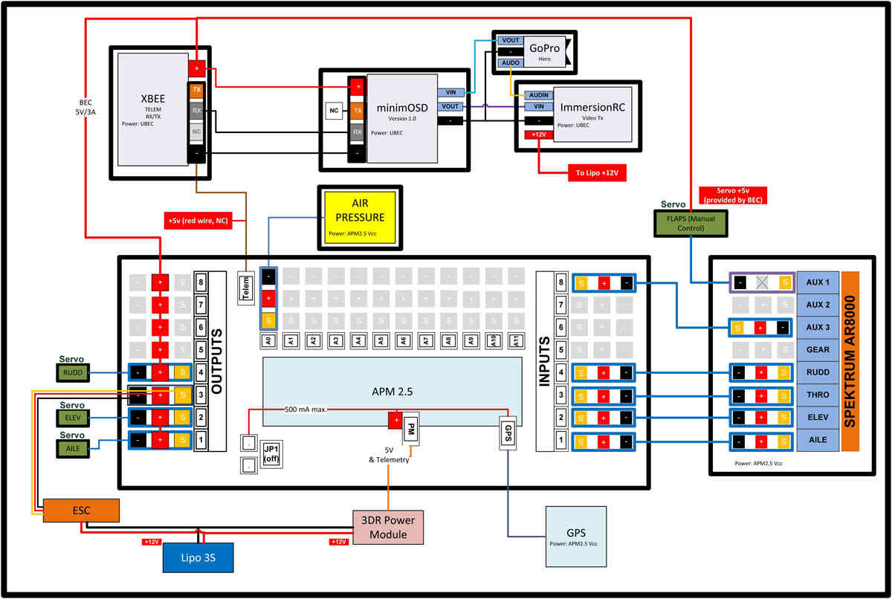

   Example Wiring Diagram for aBixler plane with APM

Inputs
======

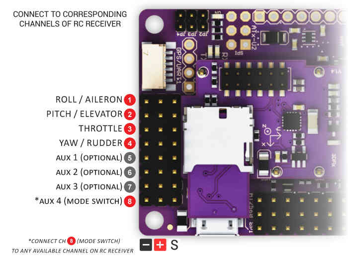

Connect your RC receiver to APM2's Inputs with female-to-female cables
in the order shown above. Each channel that you want APM to control
should be connected to an Input on the APM board. Typically, the Mode
Switch (APM Input 8 for !Plane) is connected to any RC receiver channel
that you have assigned to a three-position toggle switch on your RC
transmitter (for most people, that's channel 5).

.. note::

   These instructions are for Plane. Copter's mode switch goes to APM
   input 5, not input 8

The ground (black) side of each connector should be on the outside,
closest to the edge of the board, as shown here with either straight or
right-angle connectors:

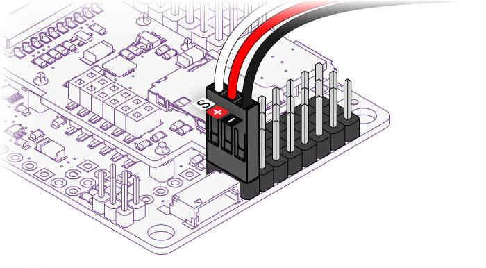

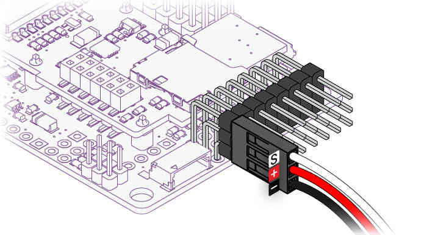

See also :ref:`Connecting the Radio Receiver <common-connecting-the-radio-receiver-apm2>`.

.. note::

   Elevons (combined ailerons/elevator, as used in flying wings) are
   also supported' just connect them to the first two channels as you would
   to your RC receiver. You'll :ref:`tell APM to do elevon mixing <reversing-servos-and-setting-normalelevon-mode>`
   in the Mission Planner setup process.

If you're flying a V-tail, please see the
``VTAIL_OUTPUT``.
option in the :ref:`servo setup documentation <reversing-servos-and-setting-normalelevon-mode>`.

Reassigning your RC transmitter stick channels:
===============================================

-  Although the default normal transmitter stick configuration is
   generally the best, Plane does allow you to reconfigure them.
-  To reassign the RC transmitter sticks to other than the default
   channels:

   -  Connect your APM's USB port to your computer and start Mission
      Planner and Select the "Connect" button on the upper right..
   -  Select the "Configuration" tab then select "Advanced Params" and
      the Adv Parameter List".
   -  Scroll down to the "RCMAP_ROLL, RCMAP_PITCH, RCMAP_THROTTLE and
      RCMAP_YAW" parameters.
   -  These allow you to directly assign which radio channel (1-8) is
      assigned to each of the major flight functions.

-  This is useful when you have a flight transmitter with unusual
   channel assignments.

   -  Or which does not allow easy channel reassignment at the transmitter

-  Additional information on these parameters may be found :ref:`in the RCMAP parameters section <RCMAP_ROLL>`.

Outputs
=======

Plug your servos and other devices you want APM to control into the
matching Output connectors as shown below.

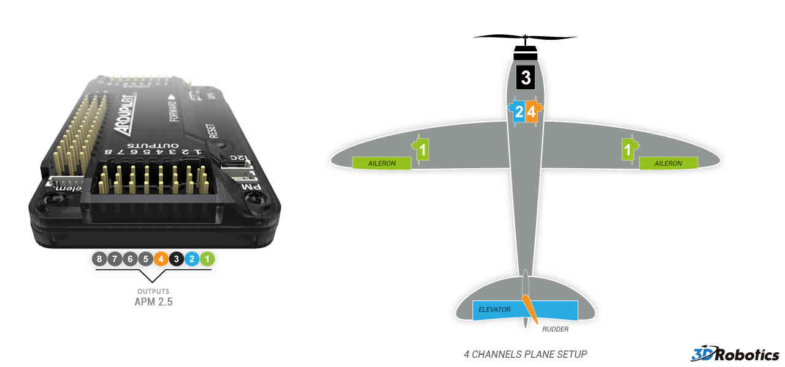

Four channel setup:

#. Aileron
#. Elevator
#. Throttle
#. Rudder

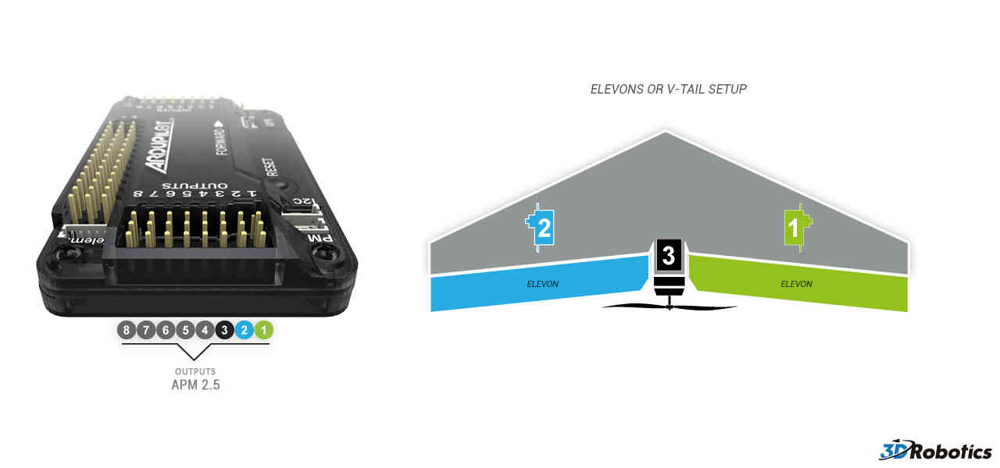

Elevon setup.  At this stage it's not critical which channel is plugged
into which elevon.  They can be swapped around later if needs be:

#. Starboard (right) elevon
#. Port (left) elevon
#. Throttle

Powering the plane
==================

The easiest way to power the APM2.x is using a :ref:`3DR Power Module <common-3dr-power-module>` with
a LiPo battery.

The Power Module will not power servos and other peripherals. For more
information/alternatives see :ref:`Powering the APM2 <common-powering-the-apm2>`.

Power Input
-----------

**Single Supply**

+---------------------------------+---------------+-----------+-----------------+
| Power Options                   | Nominal       | Abs MAX   | JP1 status      |
+---------------------------------+---------------+-----------+-----------------+
| Power on Output PWM connector   | 5.37V +-0.5   | 6V        | JP1 connected   |
+---------------------------------+---------------+-----------+-----------------+

Dual Supply

+---------------------------------+----------------+-----------+--------------+
| Power Options                   | Nominal        | Abs MAX   | JP1 status   |
+---------------------------------+----------------+-----------+--------------+
| Power on Output PWM connector   | 5.00V +-0.5    | 6V        | JP1 open     |
+---------------------------------+----------------+-----------+--------------+
| Power on Input PWM connector    | 5.00V +-0.25   | 5.5V      | JP1 open     |
+---------------------------------+----------------+-----------+--------------+

.. note::

   If JP1 open, separate power is required on both Input PWM and
   Output PWM.

.. warning::

   Do not exceed Abs MAX input voltages when connecting power
   supply or you will damage your board.

.. warning::

   Connecting USB when you have input voltages at the high end of
   the range (near Abs Max) can damage the board. Disconnect battery before
   connecting USB or test input voltages so they are within the normal
   specified range.

Installing it in your plane
===========================

When you place APM in your aircraft, it is very important that it face
the right way. The GPS connector should face forward, and the servo
cables face back. The board must also be right side up, with the IMU
shield at the top. Like this (note: there's a little arrow on the bottom
of the shield that point to the front, too, in case you need a reminder
at the field):

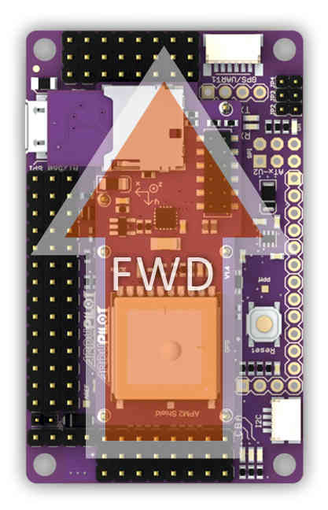

When putting APM in your plane, it's important to ensure that it's
solidly mounted and doesn't move around in flight. It should also be as
close as possible to level when the plane is in its flying orientation.
Ideally, you'll want to have it as close to the center of gravity as you
can (that's where vibration is the least) and mounted on foam tape onto
a solid platform.

Connecting GPS Module
=====================

A GPS module provides enhanced positioning for autonomous flight.
Connecting your GPS to your autopilot by following these steps.

3DR GPS uBlox with Onboard Compass
----------------------------------

3DR GPS uBlox with Onboard Compass is intended for use with APM 2.5 (for
external compass). It provides enhanced compass performance because of
the freedom to situate the GPS unit in an optimal position independent
of the location of the APM. Place your GPS on the outside of your plane
with a clear view of the sky, as far as possible from the motor and ESC,
with the arrow facing forward.

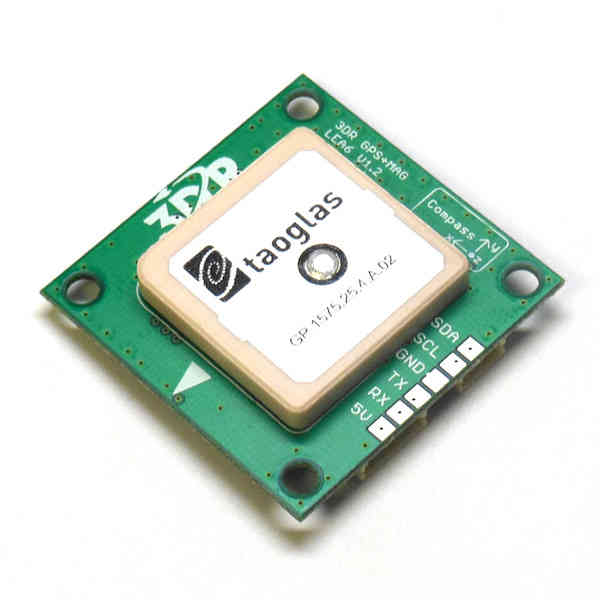

Connect the GPS module to the APM 2.6 using the two cables included with
the GPS as shown below.

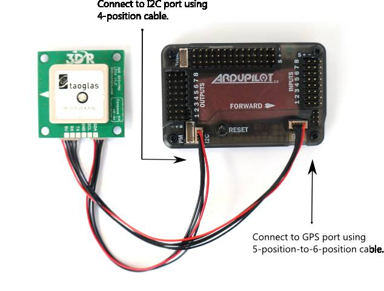

3DR GPS uBlox with Onboard Compass includes two connector cables: one
4-position cable and one 5-position-to-6-position cable. To connect the
GPS module to APM 2.6, connect the GPS to the APM GPS port using the
5-position-to-6-position cable; connect the GPS to the APM I2C port
using the 4-position cable.

3DR GPS uBlox without Onboard Compass
-------------------------------------

3DR GPS uBlox without Onboard Compass is intended for use with APM 2.5.
To install your GPS module without compass, mount to the outside of your
plane with a clear view of the sky and connect to the APM 2.5 GPS port
using the 5-position-to-6-position connector cable.

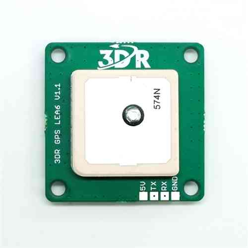

Tips on mounting the GPS module
-------------------------------

-  It doesn't matter which way the GPS module is oriented, as long as
   the square antenna side is facing up
-  It's best to mount the GPS as far away from radio transmission
   equipment (like your telemetry or video transmitters) as possible.
-  Ideally, the GPS module will have a clear view of the sky. On top of
   your plane is a good choice.

Here's an example of one way to mount APM (and the GPS module) in an
EasyStar using the `3D Robotics Electronics Chassis <http://www.amazon.co.uk/Electronics-Chassis-Kit-Bixler-SkySurfer/dp/B00FNPACBO#>`__ for
the `HobbyKing Bixler <http://www.hobbyking.com/hobbyking/store/__16544__Hobbyking_Bixler_EPO_1400mm_ARF_.html>`__.

**Chassis:**

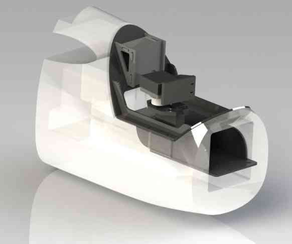

**With equipment mounted:**

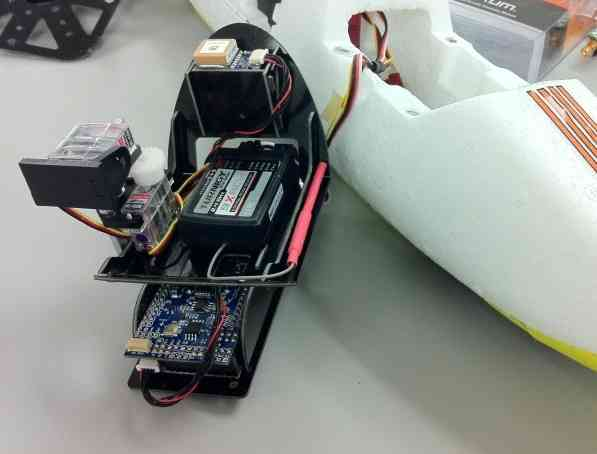
