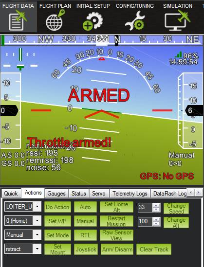

.. _arming-throttle:

========================
Throttle Arming in Plane
========================

A software safety feature that requires the throttle to be explicitly
armed by a pilot is available for Plane. It was first introduced in version
2.77 and since 3.3.0 it is enabled by default. This is especially applicable 
to electric planes. The idea is to prevent an unexpected throttle up when 
someone's hand is near a propeller.

.. warning::

   This feature in no way removes the need to respect the
   prop! When the plane is powered, ALWAYS avoid placing hands in
   the vicinity of the propellor, even when the throttle is
   disarmed. If all is not well with the autopilot electronics or software
   there is always a slight possibility that signal could unintentionally
   reach the motor. Even though this is unlikely (and made even less likely
   by safety features such as this) it only takes one time to chew up a
   finger or hand!

Parameters governing throttle arming are introduced in the
:ref:`ARMING <parameters_ARMING_>` section of the
parameters wiki page. This page discusses throttle arming in greater
detail and walks through the typical procedures for using this safety
feature.

A Safety Note About Arming
==========================

A safety feature of PX4 / Pixhawk is that all servo output is kept at at
minimum values until the safety button is pushed. This has the nice
effect of (usually) disabling electric motors and it is quite possible
to use only this safety feature for propeller safety. However:

#. This feature is not available for the APM.
#. Generally during pre-flight checks it is desirable to verify servo
   operation (e.g., to check ailerons are deflecting in the expected
   direction). This can more safely be done with the throttle disabled.
   When the button is pushed **all** servos are enabled, including the
   motor -- unless this additional software throttle safety is used.

A note about APM1 and channel 8
===============================

The APM1 has a hardware multiplexor on channel 8 which forces pass-thru
of the first 4 channels if channel 8 is above 1750. This means the
arming code is bypassed if you use channel 8 for your flight mode
switch. So if you want to use arming on an APM1 then you should change
FLTMODE_CH to another channel (say channel 5) and setup your
transmitter/receiver to put the mode switch on that other channel.

IMPORTANT: RC Transmitter Calibration
=====================================

It is essential that your RC radio transmitter be calibrated correctly
before continuing. Please see the :ref:`Calibrate your RC input <common-radio-control-calibration>` wiki page if you don't know
how to calibrate your radio.

.. warning::

   During RC calibration throttle ups are possible, even with
   safeties enabled and you should therefore remove the propeller or move
   the plane to a safe area and secure it.

Depending on the ground control software you use, the RC3_MIN value may
be continuously changing during calibration. Also, if the RC3_MIN value
is inadvertently set incorrectly the plane may throttle up after a bad
calibration (e.g., if the low stick setting was not captured).

Note that if you have RCMAP_THROTTLE set to something other than 3,
then the RCn_MIN value used will be the one for the channel you have
selected as the throttle channel.

When calibrating your RC input you should also be careful to set the
minimum value of the throttle (usually RC3_MIN) to the minimum value
when in normal flight control. Don't set it to the value used by your
transmitter when in throttle failsafe or you won't be able to arm using
the rudder as the APM will think you are at a non-zero throttle level.

Simplest Solution: Use Only ARMING_REQUIRE
==========================================

The simplest way to use the throttle arming feature is to require the
user to request the throttle to arm. ARMING_REQUIRE has three possible
values, 0, 1 and 2 (the default value is 1, enabled). They have the 
following effect:

-  ARMING_REQUIRE=0: No effect. Throttle arming safety is not employed.
-  ARMING_REQUIRE=1: Before the user arms throttle, send minimum PWM to
   the throttle channel (which is usually channel 3). Therefore the
   RC3_MIN PWM value is sent on the servo output rail.
-  ARMING_REQUIRE=2: Before the user arms throttle, send no PWM signal
   to the throttle channel (usually channel 3). Some ESCs are not happy
   with this and will continuously beep, some will not. Some users may
   prefer this setting as it ensures no signal is sent to the ESC when
   disarmed.

When the ARMING_REQUIRE parameter is set to 1 or 2 (enabled) and 
ARMING_RUDDER is not to 0 (disabled), all that is required to arm the
throttle is to either:

#. Arm the throttle via the ground control software.

   OR
#. Arm the throttle by applying full right rudder input for several
   seconds.

To arm throttle in Mission Planner, use the Flight Data screen, then
select the Actions tab. This provides an "Arm/Disarm" button that can be
used to arm and disarm the throttle.

.. figure:: ../../../images/armingButtonMissPlan.jpg
   :target: ../_images/armingButtonMissPlan.jpg

   Location of the Arm/Disarm buttonin Mission Planner (button circled in red near the bottom of theimage).

Alternatively, apply full right rudder to your RC transmitter for
several seconds to arm the throttle. Whichever method you choose should
result in a message from your ground control software stating that
throttle arming was successful. Mission planner displays a message in
the artificial horizon on the Flight Data screen:

   Message on the artificial horizon inMission Planner stating that arming was successful.

Increased Safety: Perform System Checks Before Arming Throttle
==============================================================

By default the ARMING_CHECK parameter is set to 1 so the flight controller
performs system health checks before arming throttle when a user attempts
to arm. You can enable/disable any check with a bitmask. See wiki documentation on 
the :ref:`ARMING_CHECK parameter <ARMING_CHECK>` for more information.

One thing to be aware of if you typically do not fly with a ground
control station: **it will be difficult to determine why your autopilot
is not arming if you are not connected to a ground control station when
arming.** The ARMING_CHECK parameter should probably be left at 0 when
at the an airfield without a ground control station.

The following are possible system health messages that may return if
ARMING_CHECK is enabled and the autopilot rejects a request to arm the
throttle:

-  Message: "Hardware Safety Switch." Solution: push the hardware safety
   switch on the PX4 or Pixhawk (does not apply to APM).
-  Message: "Battery failsafe on." Solution: Ensure your battery is
   charged. If it is, ensure your battery failsafe values are set
   correctly. For more information on failsafes, see the :ref:`Failsafe Functions <apms-failsafe-function>` wiki page.
-  Message: "Radio failsafe on." Solution: Ensure that the RC
   transmitter is able to communicate with the RC receiver. For more
   information on this failsafe, see the documentation on the :ref:`Throttle Failsafe <apms-failsafe-function_throttle_failsafe>`.
-  Message: "Bad GPS Pos." Solution: Need to get a 3D fix with the GPS
   receiver. After ensuring your GPS receiver is functioning properly,
   ensure nothing aboard the plane or in the immediate environment is
   interfering with GPS satellite signals.
-  Message: "No GPS detected. Solution: ensure your GPS receiver is
   functioning.
-  Message: "No compass detected." Solution: If you do not intend to use
   a compass, then change the COMPASS_USE parameter to 0. If you do,
   then you'll need to ensure your compass is installed and healthy.
-  Message: "Compass not calibrated." Solution: Calibrate compass. In
   Mission Planner this is accomplished in the Initial Setup screen,
   menu item Manadtory Hardware > Compass.
-  Message: "Compass not healthy." Solution: Ensure you do not have the
   compass installed near something that can induce a magnetic field,
   such as the motor. You also may try re-calibrating the compass.
-  Message: "Baro not healthy." Solution: Try rebooting the autopilot.
   If this fails you will have to diagnose what the problem is with the
   barometer.

Disabling Rudder Arming
=======================

Some pilots will not want to use the rudder arming capability. To only
allow throttle arming via the ground control software set the
ARMING_RUDDER parameter to 0. The autopilot will no longer arm
throttle when full right rudder is applied on the RC transmitter.
