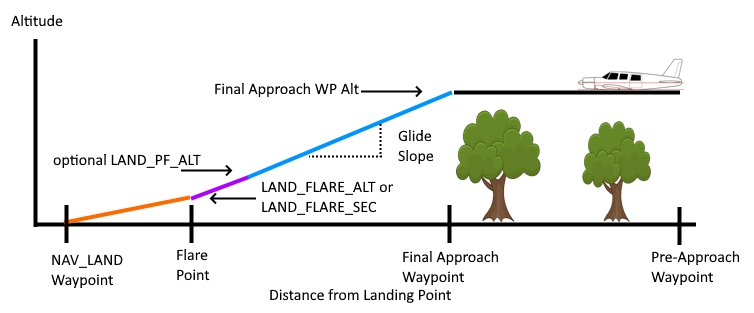
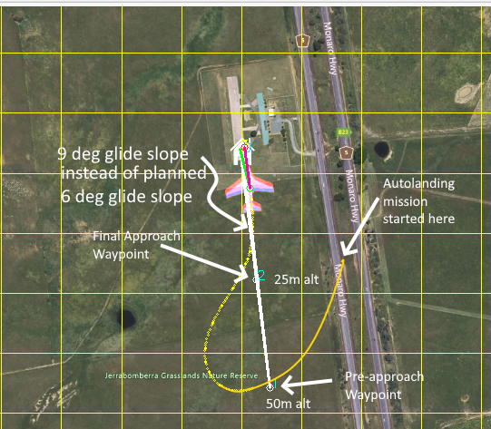
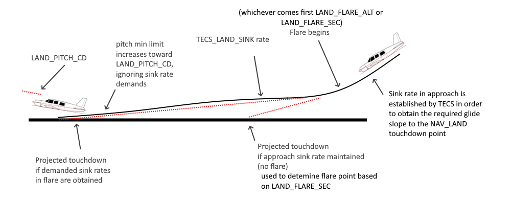

.. _automatic-landing:

=================
Automatic Landing
=================

This article explains how to autonomously land Plane as part of a mission plan and includes information about how a landing can be safely aborted. Switching to AUTO mode and executing an autolanding can also be done as an RTL action using the ``DO_LAND_START`` mission command.

Configuring for Automatic Landing
=================================

To autoland the plane you need to add a :ref:`NAV_LAND <mav_cmd_nav_land>` command to the end of your mission indicating the latitude, longitude and altitude of your desired touchdown point and if aborting the autoland is allowed. When the preceeding waypoint is reached, it will descend and navigate to the touchdown point.

In most cases, the altitude should be set to 0. During the final flare portion of the landing, the autopilot will shut down the throttle and hold the current heading, controlled by the parameters described below.

For many vehicles, most of the parameters associated with autolanding can be left at their defaults. The basic parameters are covered below in the Basic Autolanding Section for vehicles not using an airspeed sensor and/or rangefinder. For more advanced configuration, see the sections listed below:

.. toctree::
   :maxdepth: 1

    Aborting an Autolanding <aborting-autolanding>
    Precision Autolanding <precision-autolanding>
    RangeFinder Autolanding <rangefinder-autolanding>
    Using Reverse Thrust in Autolanding <reverse-thrust-autolanding>
    Using DO_LAND_START <do-land-start>

Basic Autolanding
=================

The phases of an autolanding are:

- Passing final approach waypoint
- Navigating to the flare point on a "glide-slope" (ie controlled descent)
- Flare and touchdown

Setting Up the Approach Waypoint
--------------------------------

The autolanding begins after reaching the last navigation waypoint before the NAV_LAND waypoint (where you want to touchdown and land). This waypoint must be far enough from the touchdown point and at an altitude that a reasonable glide slope can be obtained. Without an airspeed sensor, the speed will be that of normal waypoint navigation, which without an airspeed sensor is primarily controlled by :ref:`TRIM_THROTTLE<TRIM_THROTTLE>`. It is important to have a glide slope that is obtainable with the :ref:`TECS_SINK_MAX<TECS_SINK_MAX>` rate of the vehicle and preferably, well below that rate. You can lower the approach airspeed in order to reduce the time in the flare, and possible overshoot of landing point, by adjusting the :ref:`TECS_LAND_THR<TECS_LAND_THR>` to a lower value than :ref:`TRIM_THROTTLE<TRIM_THROTTLE>`. Be careful, not to lower it so much as to cause a stall on approach.

In addition, the last navigation waypoint before NAV_LAND must be far enough away that any turns made by the mission to that waypoint will have already be completed and the vehicle back on track in a line to the landing point. Usually, two waypoints are used. The first to allow any mission item (including aborted go-arounds for an autoland reattempt) to get aligned to another waypoint setup closer to the touchdown point but still providing a nice glide slope. We will designate the last waypoint before the NAV_LAND as the "final approach" waypoint and the one before it the "pre-approach" waypoint, as shown above. The next figure shows these waypoints **incorrectly** placed, without sufficient spacing:

The above shows a planned approach with the pre-approach waypoint 440m away from touchdown at 50m altitude, the final approach waypoint at 220m away and 25m altitude, giving a supposedly gentle glide slope of 6 degrees (which is a 1.7m/s descent at 15m/s airspeed). However, the actual result is 9 deg glide path since the switch to AUTO mode and the landing sequence was begun at the point shown at beginning of the yellow path, and the resulting overshoots at the two waypoints result in a steeper glide slope (9 degrees) between the final approach waypoint and the touchdown point. Spacing the waypoints a little further away would have allowed the approach to have settled by the final approach waypoint, and with the desired final glide slope. The faster the vehicle is flying, the wider the turn radii are, and the wider the waypoints should be spaced.

.. note:: You can use QGroundControl to automatically setup your approach and landing waypoints, but it will use a slightly different approach. Using the "LAND" button on the Plan screen, QGroundControl will add a "LOITER_TO_ALT" waypoint (NAV_LOITER_TO_ALT) at a distance determined by its wizard's glide slope parameter to bring the vehicle down (or up) to approach altitude, add a DO_LAND_START (See :ref:`aborting-autolanding`) marker, and a NAV_LAND. 

.. _automatic-landing_key_parameters:

The key parameters that control automatic landing are:

-  :ref:`LAND_FLARE_ALT <LAND_FLARE_ALT>`
-  :ref:`LAND_FLARE_SEC <LAND_FLARE_SEC>`
-  :ref:`LAND_PITCH_DEG <LAND_PITCH_DEG>`
-  :ref:`TECS_LAND_SINK <TECS_LAND_SINK>`
-  :ref:`TECS_SINK_MAX<TECS_SINK_MAX>`
-  :ref:`TECS_SINK_MIN<TECS_SINK_MIN>`
-  :ref:`TECS_LAND_THR<TECS_LAND_THR>`

.. note:: The TECS parameters are related to the glide slope and final flare sink control. As such, the :ref:`TECS speed/height controller<tecs-total-energy-control-system-for-speed-height-tuning-guide>` must be tuned correctly, and the vehicle must have good pitch tuning for TECS to operate properly (see :ref:`common-tuning`)

The meaning and recommended value of each of these parameters is described below.

Setting the Flare Point
-----------------------

The "flare" is the final stage of the landing when the autopilot cuts the throttle and raises the pitch, increasing drag and slowing the aircraft to sink onto the ground. The appropriate time to flare depends on the type of aircraft, and is controlled by the :ref:`LAND_FLARE_ALT <LAND_FLARE_ALT>` and :ref:`LAND_FLARE_SEC <LAND_FLARE_SEC>` parameters.

The first control of the flare is the :ref:`LAND_FLARE_SEC <LAND_FLARE_SEC>` parameter.
This is the time in seconds before the aircraft would hit the ground if it continued with its current descent rate. 

So if the plane is descending at 2 meters/second and you set the :ref:`LAND_FLARE_SEC <LAND_FLARE_SEC>` to 3 then the aircraft would flare at an altitude of 6 meters above the ground. 
By using a time to impact to control the flare the aircraft is able to flare at a higher altitude if it is descending quickly, and at a lower altitude if it is descending slowly. That helps ensure the flare is able to produce a smooth touchdown.

The second control is :ref:`LAND_FLARE_ALT <LAND_FLARE_ALT>`. That is an altitude above the ground in meters at which the aircraft will flare, regardless of its descent rate. It is important that this value be close to the altitude that will usually result from the :ref:`LAND_FLARE_SEC <LAND_FLARE_SEC>`, since it is used in later calculations. Changing the descent rate required from the last waypoint before the landing will impact the height at which :ref:`LAND_FLARE_SEC <LAND_FLARE_SEC>` would become active and should be adjusted accordingly.

Whichever is reached first will force the beginning of the flare.The appropriate values for these two parameters depends on how the autopilot is estimating its altitude above the ground. 

If you are relying solely on a barometer for landing altitude then you will probably need higher values, to account for barometric errors (see :ref:`improving-autolanding` below). The defaults are usually appropriate as a starting point for 1-1.5 meter wingspan vehicles.

With a very well tuned vehicle (both Attitude and TECS) and using a rangefinder, lower altitudes can be attempted to start the flare.

Controlling the glide slope
---------------------------

Another important factor in setting up the flare point is the glide slope. The glide slope is the ratio of the distance from the last waypoint to the landing point, and the height difference between the last waypoint and the landing point. For example, if the landing point is 300 meters from the last waypoint, and the last waypoint is 30 meters above the ground then the glide slope is 10%.

If the glide slope is too steep then the aircraft will not be able to flare in time to avoid crashing, plus the autopilot may not be able to keep the plane on the approach slope accurately. It is recommended that you start with a glide slope of at most 10%. What glide slope your plane can handle will depend on how good your pitch controller tuning is, how good your TECS tuning is, and the landing speed you ask for.

If you find your aircraft is not following the desired glide slope
accurately then you should first check your pitch tuning in your logs,
and ensure that the demanded and achieved pitch match within a couple of
degrees during landing. If they don't then look at the documentation on
pitch tuning (or possibly re-run AUTOTUNE). If the demanded and achieved
pitch do match then you should check your TECS logs to ensure that the
demanded and achieved airspeed are matching during landing. Have a look
at the :ref:`TECS tuning page <tecs-total-energy-control-system-for-speed-height-tuning-guide>` for more information.

You should also be aware that many model aircraft can glide for long
distances, and it may be that your requested glide slope and airspeed
combination just isn't achievable.

.. _automatic-landing_controlling_the_flare:

Controlling the flare
---------------------

The final stage of the landing is called the "flare". During the flare
the aircraft tries to retain a course along the line between the last
waypoint and the landing waypoint, and it controls its height solely
using a target descent rate. Once the flare is started the throttle is
"disabled" - set to some value between :ref:`THR_MIN <THR_MIN>` and
zero.

The main job of the autopilot in the flare is to try to achieve
the descent rate specified in the :ref:`TECS_LAND_SINK <TECS_LAND_SINK>` parameter. That defaults to 0.25 meters/second, which is a reasonable
touchdown vertical speed for most models. To achieve that speed the TECS controller uses pitch control only as the motor has been forced to zero.

The primary parameters which affect the ability of the aircraft to
achieve the desired descent rate are
:ref:`LAND_PITCH_DEG <LAND_PITCH_DEG>`, 
:ref:`TECS_LAND_DAMP <TECS_LAND_DAMP>`
and the main pitch tuning parameters.

.. note:: If the vehicle does not have good pitch tuning, the vehicle's CG is significantly "nose heavy", or the elevator is being increased by propeller slip-stream, then the ability of the vehicle to actually attain the desired sink rates and attitudes can be severely impacted. Symptoms are landing short, and/or with the nose/nose wheel touching down first.

The landing controller sets a point before the touchdown as the expected flare start point. This "flare_aim" point is calculated from the :ref:`LAND_FLARE_ALT<LAND_FLARE_ALT>` and :ref:`TECS_LAND_SINK<TECS_LAND_SINK>` for the expected duration of the flare before the actual touchdown. If consistently landing long or short, this point can be adjusted using the :ref:`LAND_FLARE_AIM<LAND_FLARE_AIM>` parameter. If landing too short, decrease the percentage from its default of 50%, conversely, increasing it if landing too long.

The transition from the glide-slope sink rate to the flare sink rate is controlled by the :ref:`TECS_FLARE_HGT<TECS_FLARE_HGT>` parameter and should normally be set below :ref:`LAND_FLARE_ALT<LAND_FLARE_ALT>`. The start of the flare will occur at :ref:`LAND_FLARE_ALT<LAND_FLARE_ALT>` and the sink rate will be gradually adjusted to :ref:`TECS_LAND_SINK<TECS_LAND_SINK>` at the :ref:`TECS_FLARE_HGT<TECS_FLARE_HGT>` to avoid a rapid pitch change at the beginning of the flare, which would tend to create a "ballooning" effect at the start of the flare. See note at the end of this section for a possible exception to having :ref:`TECS_FLARE_HGT<TECS_FLARE_HGT>` set lower than :ref:`LAND_FLARE_ALT<LAND_FLARE_ALT>`.

The :ref:`LAND_PITCH_DEG <LAND_PITCH_DEG>` parameter sets the minimum pitch target at the very end of the
flare (in centi-degrees). This parameter is very airframe specific and
is designed to prevent the nose of the aircraft being too far down on
touchdown causing issues with damaging the landing gear or breaking a
propeller.  For most aircraft this should be a small positive number
(such as 300, meaning 3 degrees), but for some belly landing aircraft a
small negative number can be good, to allow the nose to be kept down a
small amount to reduce the chance of stall if the flare happens too far
off the ground.

Note that the actual pitch of the aircraft can be quite a bit above :ref:`LAND_PITCH_DEG <LAND_PITCH_DEG>` as the TECS controller tries to control the descent rate. The maximum pitch is controlled by the :ref:`TECS_PITCH_MAX <TECS_PITCH_MAX>`
parameter if it is non-zero, otherwise by the :ref:`PTCH_LIM_MAX_DEG <PTCH_LIM_MAX_DEG>` parameter.

However, if the vehicle cannot maintain the demanded pitch attitude in the later stages of the flare due to CG, tuning, etc. :ref:`LAND_PITCH_DEG <LAND_PITCH_DEG>` may never be reached resulting in nose/nose wheel first touchdowns. In that case, set the :ref:`TECS_FLARE_HGT<TECS_FLARE_HGT>` ABOVE the :ref:`LAND_FLARE_ALT<LAND_FLARE_ALT>` parameter, effectively allowing the :ref:`LAND_PITCH_DEG <LAND_PITCH_DEG>` limit to take effect immediately, increasing the rate at which its demanded (i.e. at the beginning of the flare as opposed to the end)

The :ref:`TECS_LAND_DAMP<TECS_LAND_DAMP>` parameter is a damping constant for the pitch
control during flare. A larger number will cause the pitch demand to change
more slowly. This parameter can be used to reduce issues with sudden
pitch changes when the flare happens.

.. note:: you can use :ref:`STICK_MIXING<STICK_MIXING>` to allow manual adjustments during the flare, if needed, while tuning the above parameters.

.. note:: For most well tuned vehicles the default values for all the landing parameters should result in safe landings. Iteratively adjusting the altitude limits and the aim point parameter will usually lead to almost perfect, repeatable landings. Analyzing the logs for TECS.dh vs TECS.dhdem and ATT.Pitch vs ATT.DesPitch will show how well the vehicle is attaining the desired attitude and sink rates in the flare.

After the Flare
---------------

After the plane flares it continues to navigate, but with zero throttle.
The navigation direction is a line extrapolated forward through the
landing point from the last waypoint. Note that the navigation roll will
be limited to :ref:`LEVEL_ROLL_LIMIT <LEVEL_ROLL_LIMIT>`
(which defaults to 5 degrees) to prevent wing strike, so if there is a
significant cross-wind then it is likely that the aircraft will not be
able to maintain the exact path.

If your aircraft is consistently landing long (which can happen for a
variety of reasons) then you can adjust
:ref:`TECS_LAND_SRC <TECS_LAND_SRC>` to
either force a stall (negative) or bring it down (positive). This value
will adjust your :ref:`TECS_LAND_SRC <TECS_LAND_SRC>` proportional to the distance from
the LAND point. This helps ensure you land in a reasonable distance from
the LAND point.

.. note::

   Possible causes of landing long include ground effect giving the
   aircraft more lift as it is close to the ground or simply the aircraft
   traveling very fast.

When the plane has stopped moving for :ref:`LAND_DISARMDELAY <LAND_DISARMDELAY>`
seconds (default 20 seconds) it will disarm the motor. Optionally, you
can disable servo movement once LAND_DISARMDELAY has triggered by
setting :ref:`LAND_THEN_NEUTRL <LAND_THEN_NEUTRL>`.

Rudder Control during Flare and Rollout
---------------------------------------

If enabled, the ground steering controller will take over below :ref:`GROUND_STEER_ALT<GROUND_STEER_ALT>` to maintain vehicle compass heading below this altitude and during roll out. See :ref:`tuning-ground-steering-for-a-plane` for details.

.. _improving-autolanding:

Improving the landing
=====================

The key to a good landing is the autopilot knowing how far off the
ground it is. With the default setup the only sensor available to detect
altitude is the barometer. Unfortunately barometers suffer from three
main types of error:

-  barometric drift due to changes in atmospheric pressure
-  barometric drift due to changes in the temperature of the autopilot
   electronics
-  barometric error due to local pressure changes from airflow around
   the barometer

The ideal setup for good automatic landing is to have a
:ref:`Lidar <common-rangefinder-landingpage>`. A Lidar can measure
the distance to the ground very accurately, and doesn't suffer from
drift. If you have a Lidar installed you can enable its use for landing
with :ref:`RNGFND_LANDING<RNGFND_LANDING>` = 1.

If a Lidar isn't fitted then there are a few things you can do to minimize barometric error problems with auto-land

-  perform a barometer calibration after the electronics have warmed up.
   The easiest way to do this is to disarm the plane with rudder-disarming, arm/disarm switch, or
   the safety switch. When the plane is disarmed it assumes it is on the
   ground and will zero the barometer to the current pressure. It will also reset the HOME position and altitude.
-  try to prevent direct airflow over the autopilot that could cause
   speed related pressure changes
-  fly shorter flights, allowing for less time for air pressure changes.
   Check your logs and see if the landing is happening at zero altitude
   consistently

Alternatively, you can use a high precision GPS as the altitude source instead of the barometer. See

With planes that belly land it can also work well to setup the landing
with a shallow pitch (in :ref:`LAND_PITCH_DEG<LAND_PITCH_DEG>`) and set a slightly higher
altitude to flare at. That will only work if your stall speed is low
enough that gliding for a while will work reliably.

