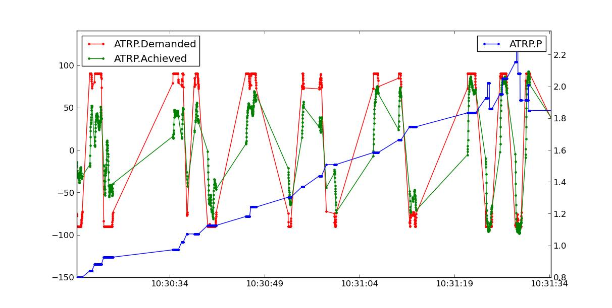

.. _automatic-tuning-with-autotune:

==============================
Automatic Tuning with AUTOTUNE
==============================

Getting a good set of roll/pitch tuning parameters for your aircraft is
essential for stable, accurate flight. To help with this it is highly
recommended that you use the AUTOTUNE system described below.

What AUTOTUNE does
~~~~~~~~~~~~~~~~~~

The AUTOTUNE mode is a flight mode that flies in the same way as FBWA,
but uses changes in flight attitude input by the pilot to learn the key
values for roll and pitch tuning. So the pilot uses their transmitter
mode switch to switch to AUTOTUNE mode and then flies the plane for a
few minutes. While flying the pilot needs to input as many sharp
attitude changes as possible so that the autotune code can learn how the
aircraft responds.

Setting up for AUTOTUNE
~~~~~~~~~~~~~~~~~~~~~~~

To setup your aircraft for AUTOTUNE you need to select AUTOTUNE mode as
one of the flight modes selectable with the flight mode switch on your
transmitter.

You also should choose a tuning level by setting the :ref:`AUTOTUNE_LEVEL<AUTOTUNE_LEVEL>`
parameter in the advanced parameter screen of your ground station. The
:ref:`AUTOTUNE_LEVEL<AUTOTUNE_LEVEL>` parameter controls how aggressive you want the tune to
be. The default is level 6, which produces a medium tune, suitable for
beginner to intermediate pilots. If you are a more experienced pilot
then you could choose level 7, which will result in a bit sharper tune
(faster attitude changes). Levels above 7 are not recommended until you
have done an initial tune with a lower level. Levels above 8 should only
be used by very experienced pilots.

You also need to make sure that all of the basic settings for your
airframe are correct. In particular, ensure that all surface reversals
are correct and that you have a reasonable value set for the minimum
airspeed. Autotune won't do anything until you are above the minimum
airspeed you have set in the :ref:`ARSPD_FBW_MIN<ARSPD_FBW_MIN>` parameter. If you don't
have an airspeed sensor then that value is still used, along with an
airspeed estimate from other sensors. Also make sure you have done RC
calibration, as AUTOTUNE will only work if you have full control
movements with your transmitter sticks.

Other things to check:

-  if you have an airspeed sensor fitted then make sure it is working
   and you have calibrated it. See the section on :ref:`airspeed calibration <calibrating-an-airspeed-sensor>`.
-  check your center of gravity, making sure it is correct according to
   the manual for your aircraft. In general it is safer to be a bit more
   nose heavy than tail heavy.
-  check your surface trims. You may wish to use the :ref:`TRIM_AUTO option <TRIM_AUTO>`
   after reading the documentation for that option.
-  make sure your failsafe settings are setup correctly. Try turning off
   your transmitter with your plane on the ground (and propeller removed
   or made safe) and check how the plane reacts
-  setup a rally point for a safe place to RTL if needed

Flying in AUTOTUNE
~~~~~~~~~~~~~~~~~~

Once you are all setup you can start flying in AUTOTUNE mode. You can
either takeoff in AUTOTUNE mode, or takeoff in another mode and switch
to AUTOTUNE once you have gained altitude.

When you engage AUTOTUNE mode a few things will happen:

-  the autotune system will immediately setup some values for
   your roll and pitch I and D gains, and your roll and pitch maximum
   rates. These values depend on the :ref:`AUTOTUNE_LEVEL<AUTOTUNE_LEVEL>` and current P value, from which it will start tuning.
-  the autotune system will monitor your demanded roll and pitch rates
   (as determined by your transmitter stick movements). When the
   demanded roll or pitch rate exceeds 80% of the maximum rate the
   autotune system will use the response of the aircraft to learn roll
   or pitch tuning values.
-  every 10 seconds the autotune system will save the parameters you had
   10 seconds ago. This means that if autotune causes your aircraft to
   become unstable you have 10 seconds to switch to another mode and
   recover. When you switch out of AUTOTUNE mode the last saved
   parameters are restored.
-  If you are starting with the default parameters for roll and pitch
   you may find the plane is quite sluggish when you first enter
   AUTOTUNE. You will find that as the tune progresses this will get
   better. Make sure your flight area has plenty of room for long slow
   turns.

The key to a successful autotune is to input rapid roll or pitch
movements with the transmitter sticks. You should only do one of either
roll or pitch at a time, and you should move the stick rapidly to the
maximum deflection.

So in the roll direction you should first command a hard right turn with
the aileron stick, then shortly afterwards push the aileron stick hard
the other way to command a hard left turn. Note that you do not need to
wait for the plane to bank over all the way after each stick movement.
After about 2 seconds of stick movement in one direction you can reverse
the stick quickly.The plane will steer hard right, then hard left as you
move the aileron stick. With each sudden reversal it will improve the
tuning values by about 5%. So you need at least 20 full stick movements
to learn a reasonable tuning value.

For pitch tuning you need to use the pitch transmitter stick to take the
aircraft on a roller-coaster ride. Pull back hard on the stick to pitch
up, then shortly afterwards push down to pitch down. Continue doing this
for at least 20 iterations.

If your initial tuning values were too low then you should notice the
aircraft becomes progressively more responsive as you fly in AUTOTUNE
mode. 

.. note:: If the aircraft ever becomes unstable enough that you think it is dangerous to keep flying then you should change out of AUTOTUNE mode. That will restore the parameters you had from 10 seconds ago.

Don't stop too early
~~~~~~~~~~~~~~~~~~~~

It is recommended that you do at least 20 rapid roll movements and at
least 20 rapid pitch movements, preferably far more. Some people stop
too early end up up with poor values that result in their aircraft not
coping well with wind, or not holding altitude well. Keep flying in
AUTOTUNE mode well past the point where you think the plane is flying
well.

Completing the tune
~~~~~~~~~~~~~~~~~~~

Once you have learned reasonable roll and pitch tuning parameters with
autotune you should complete the tune by manually tuning some other key
parameters.

The parameters that are needed for most airframes are:

NAVL1_PERIOD: This defaults to 25, which is a very conservative value
designed to cope with badly tuned airframes. It controls how sharply the
aircraft will turn in automatic modes (such as AUTO, RTL and LOITER).
Most aircraft should use a significantly lower value. Once you have
completed a successful autotune of roll and pitch values you should drop
:ref:`NAVL1_PERIOD<NAVL1_PERIOD>` to 18 if you have not tuned it yet. To tune beyond that
level you should fly a rectangular mission in AUTO mode and adjust
:ref:`NAVL1_PERIOD<NAVL1_PERIOD>` down by 1 at a time until the aircraft turns at a rate you
are happy with, and does not "wag its tail" in flight.

PTCH2SRV_RLL: This parameter controls how much elevator to add in turns
to keep the nose level. Many aircraft require a small change to this
parameter from the default of 1.0. To see if you need to tune this value
you should hold a tight circle in FBWA mode by holding the aileron stick
hard over while not giving any elevator input. If the plane gains
altitude then you should lower :ref:`PTCH2SRV_RLL<PTCH2SRV_RLL>` by a small amount (try
lowering to 0.95 initially). If the plane loses altitude while circling
then try raising :ref:`PTCH2SRV_RLL<PTCH2SRV_RLL>` by a small amount (try 1.05 initially).
If you need to go above 1.3 or below 0.8 then there is probably a
problem with your setup (such as incorrect center of gravity, poor
thrust line, poor airspeed calibration, too soft a tune on the pitch
loop, or bad compass errors). You should try and fix the setup.

There are many other parameters which can improve the performance of
your aircraft, but these are the ones that most people need. Please read
the normal manual tuning documentation for more information.

AUTOTUNE Logging
~~~~~~~~~~~~~~~~

The progress of the autotune is recorded in the dataflash log. If you
are trying to debug autotune or are posting about autotune on the forums
then please include the dataflash log.

Here is a typical log file from an autotune session:

The ATRP message has a "Type" field that shows what type of autotune is
being recorded. A Type value of 0 is for roll tuning, and a value of 1
is for pitch tuning. When graphing ATRP results you should choose data
with a Type of either 0 or 1 (not both).

The ATRP.Demanded field is the demanded rate of attitude change (roll
rate or pitch rate) in degrees per second. The ATRP.Achieved field is
what the aircraft actually achieved in attitude change rate. As you can
see in the above graph, at the start of the autotune the demanded values
were much higher than the achieved, because the tuning gains were too
low. As the tune progressed the demanded and achieved started to
converge. The blue line in the above graph is the ATRP.P value, which is
the P gain for the controller. You can see it rose from 0.8 up to a high
of 2.2, then dropped back slightly to around 1.85.

You will also notice that the graph has gaps in it. This is for periods
where the pilot was not demanding a high rate of attitude change. The
autotune system only works while the pilot is demanding a rapid attitude
change (above 80% of the maximum rate).

Manual tuning versus AUTOTUNE
~~~~~~~~~~~~~~~~~~~~~~~~~~~~~

For the very best performance with Plane you should perform a manual
tune, perhaps starting with the values from autotune. The autotune
system is designed as a conservative system to get reasonable values for
most aircraft, it is not a "perfect tuner", and manual tuning can result
in better performance if you put the time and effort in. Autotune tunes
the P gain directly, but sets the D and I gain conservatively based on
the  :ref:`AUTOTUNE_LEVEL<AUTOTUNE_LEVEL>` and value of the P gain.

It is still recommended that everyone start out with AUTOTUNE however.
Correctly tuning an aircraft is not easy, and AUTOTUNE does better than
the vast majority of users can do. So start with an AUTOTUNE and then
explore the manual tuning guide starting from what AUTOTUNE produces if
you want to push things further.

Manually increasing the D gain can improve the accuracy of the roll and
pitch response and make the plane less affected by gusts and turbulence.
The optimum value for D gain for a high performance tune can be found by
increasing the gain in small increments until the aircraft starts to
oscillate. The gain should then be halved from the value that caused it
to oscillate. The oscillations that are generated using this method can
be large, so do not perform this step unless you are prepared to take
manual control. It is recommended that D gain tuning is performed at
lower throttle settings and airspeeds.

If you adjust the I gain manually, then this also changes the value for
P that is required to maintain the correct response, so adjusting the I
gain is only recommended for advanced users.
