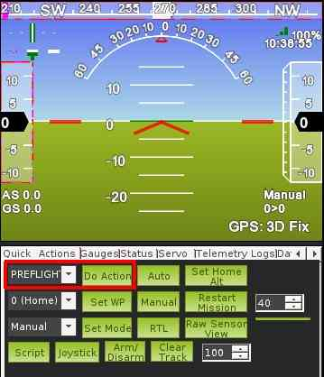
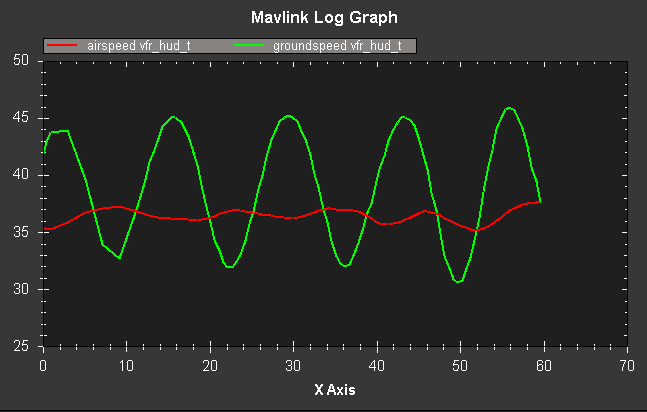

.. _calibrating-an-airspeed-sensor:

==============================
Calibrating an Airspeed Sensor
==============================

A properly configured :ref:`airspeed sensor <airspeed>` can greatly improve
the ability of Plane to maintain altitude in :ref:`auto-throttle modes <flight-modes>` (such as AUTO, CRUISE and FBWB),
as well as greatly improve automatic landing. It can also reduce the
chance of a stall.

At the same time, an incorrectly configured airspeed sensor can cause
your aircraft to crash, so correctly configuring it is critical!

Pre-flight checks
=================

If you have an airspeed sensor installed then it is critical that you do
pre-flight checks to ensure that it is working correctly, and ensure
that it is correctly zeroed.

After you start up APM on your aircraft you should wait at least 1
minute for your electronics to warm up, preferably longer, and then do a
pre-flight calibration of your airspeed sensor. Your ground station
software should have a menu for doing this, usually called "Preflight
Calibration". You need to loosely cover your airspeed sensor to stop
wind from affecting the result, then press the button. The calibration
will take a couple of seconds.

Choosing that action will re-calibrate both your ground barometric
pressure and your airspeed sensor.

Next you should check that your airspeed sensor is working correctly
before takeoff. To do that you should blow into the airspeed sensor and
make sure that the "AS" airspeed sensor value in your HUD rises as you
blow into it.

Calibrating the airspeed sensor
===============================

The :ref:`ARSPD_RATIO <ARSPD_RATIO>` parameter
determines how ArduPilot maps the differential pressure from your airspeed
sensor into an airspeed value. The default value is around 2.0, and
should give good results for most people. The correct value does depend
on you having your airspeed sensor well placed on your aircraft, and
some users may find they need to calibrate their airspeed sensor by
changing :ref:`ARSPD_RATIO <ARSPD_RATIO>`.
You will find an "Airspeed ratio" setting in the configuration page of
the APM in your ground station.

Adjusting
:ref:`ARSPD_RATIO <ARSPD_RATIO>` can be done automatically using the automatic calibration feature available
from release 2.76 onwards, or manually. The procedures for both methods
are presented below.

Automatic calibration
=====================

1. Ensure you have Plane 2.76 or later loaded
2. Go to Mission Planner => CONFIG/TUNING => Full Parameter List, change ARSPD_AUTOCAL to 1 and click 'Write Params' to send the value to the flight controller.
3. Take-off and fly a repeated circuit or circular loiter for 5 minutes. This can be done in any mode, but if the autopilot is already tuned
   sufficiently well, this can be achieved by leaving it in loiter or RTL
   for 5 minutes. The change in ARSPD_RATIO value can be checked in-flight
   by going to Mission Planner => CONFIG/TUNING => Full Parameter List, and
   clicking 'Refresh Params'. Note that when the calibration is active, an
   updated ARSPD_RATIO value is only saved in the APM's non-volatile
   memory every two minutes, and only if the value has changed by more than
   5% from the last saved value.
4. Land,  go to Mission Planner => CONFIG/TUNING => Full Parameter List
   and change ARSPD_AUTOCAL back to 0 to prevent further changes.
5. In Mission Planner => CONFIG/TUNING => Full Parameter List, click
   'Refresh Params' and check the value of ARSPD_RATIO. Normally it will
   be in the range between 1.5 and 3.0. If it is outside this range and you
   have checked for leaks, then if practical, you should consider
   relocating the pitot tube to reduce the aerodynamic interference from
   adjacent fuselage, wings, etc.

Note: The calculation automatically compensates for the effects of
altitude on air density.

Note: It is recommend that you disable ARSPD_AUTOCAL after calibration
is complete. Some users have reported leaving ARSPD_AUTOCAL on all the
time. While this may work it may lead to significant variation is
calibration if wind speed varies over a flight.

Note: For those users chasing increased accuracy, between steps 2) and
3), the value of GND_TEMP can be set to the current air temperature at
the take-off location. By default the calibration algorithm uses the
board temperature at power on as an approximation to the ambient air
temperature, but due to solar and electrical heating, this nearly always
reads high. This step may be worthwhile if operating in extreme
temperature conditions.

Note2: You do not have to have ARSPD_USE enabled to do automatic
airspeed calibration. You do have to have ARSPD_ENABLE=1, but you can
set ARSPD_USE=0 if you would prefer not to use the sensor until it is
calibrated.

Manual calibration
==================

To determine the right airspeed ratio manually you should do a test
flight in FBWA mode, with the following procedure:

-  takeoff and get to a safe altitude. Around 100 meters is good for
   most models
-  start a steady turn by holding your aileron stick over to one side
-  let your aircraft do 2 or 3 full turns
-  land and look at your telemetry logs

Ask your ground station software to graph the airspeed and ground speed
values for your flight, zooming in on the part of your flight where you
were circling. You will get a graph like this:

In this case you can see that while circling the ground speed varied
quite a lot. That is because in this flight there was quite a strong
constant wind (in this case about 7 meters/second).

Now look at where the average of the airspeed value lies in relation to
the average of the ground speed. In the above graph you can see that the
average airspeed is below the average ground speed by a small amount -
in the above graph the difference between the two averages is about 2
meters/second.

Calculating a new airspeed ratio
================================

Given the above graph you can calculate a new airspeed ratio using this
formula:

::

    NEW_RATIO = OLD_RATIO*((AVERAGE_AIRSPEED + AIRSPEED_INCREASE)/AVERAGE_AIRSPEED)2

where:

-  OLD_RATIO = the old value of ARSPD_RATIO
-  NEW_RATIO = the new value of ARSPD_RATIO
-  AVERAGE_AIRSPEED = the average airspeed you got during the test
-  AIRSPEED_INCREASE = the amount you want to increase the average
   airspeed by

For example, in the above graph we see an average airspeed of 36.5, and
we would like to increase that by 2 to 38.5. The old ratio was 2.0. So
we can calculate the new ratio as:

::

    NEW_RATIO = 2.0 * ((36.5 + 2) / 36.5)2 = 2.23

After adjusting the ARSPD_RATIO do another flight and check that the
airspeed is now well calibrated. Don't forget the pre-flight checks!

Note about higher altitudes
===========================

At higher altitudes you expect the true airspeed and apparent airspeed
to start to diverge. The above calibration procedure assumes true and
apparent airspeed are the same. If you are flying at altitudes of 2000
meters or more above sea level then you should take account of the
difference, and aim for your apparent airspeed to be below the average
ground speed by the ratio of true airspeed to apparent airspeed.

At an altitude of 2000 meters above sea level the difference between
apparent and true airspeed is around 10%, so you would expect your
average airspeed to be below the average ground speed by about 10%. At
4000 meters above sea level this rises to around 20%. At 5000 meters it
is around 30%. Beyond that please consult an aircraft navigation table.
