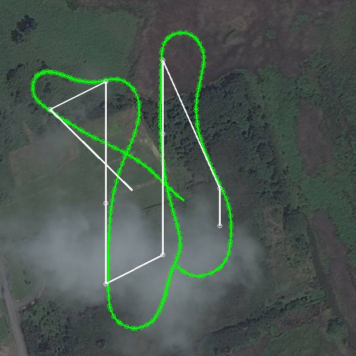
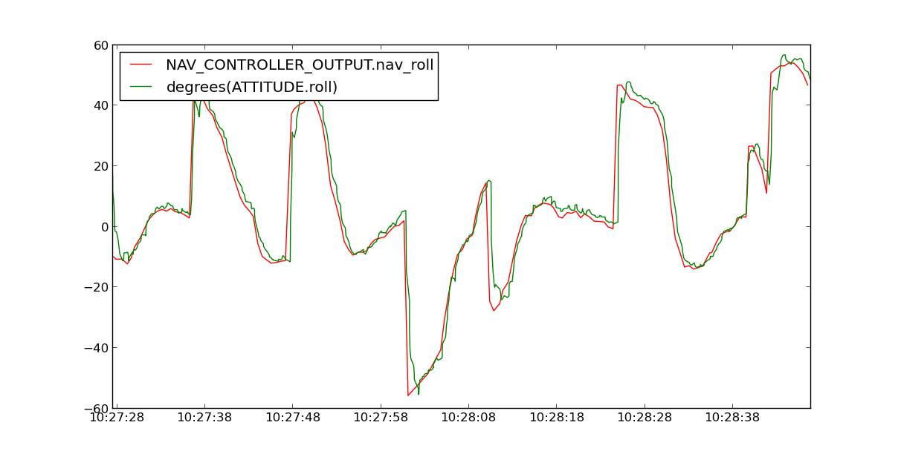
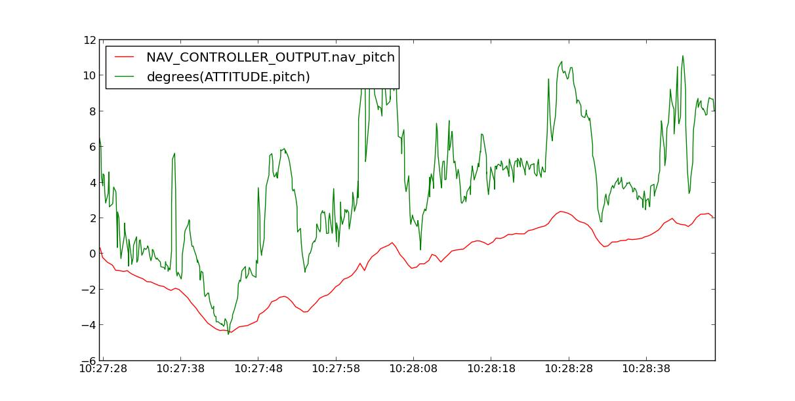
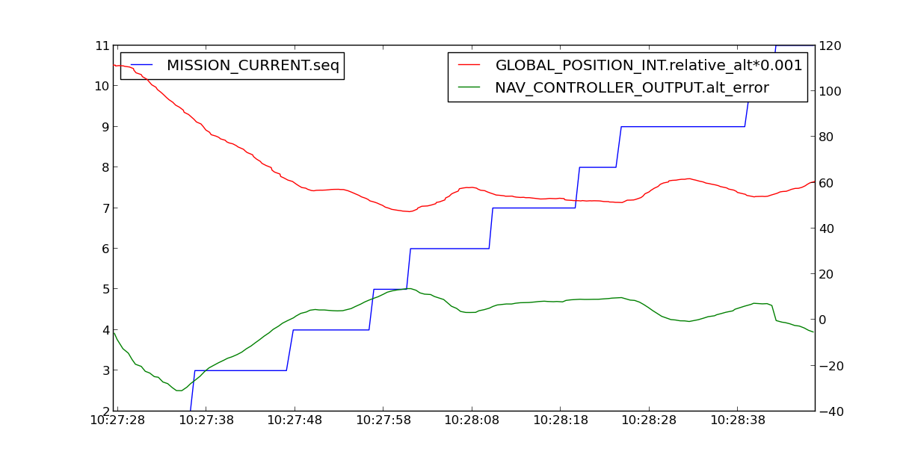
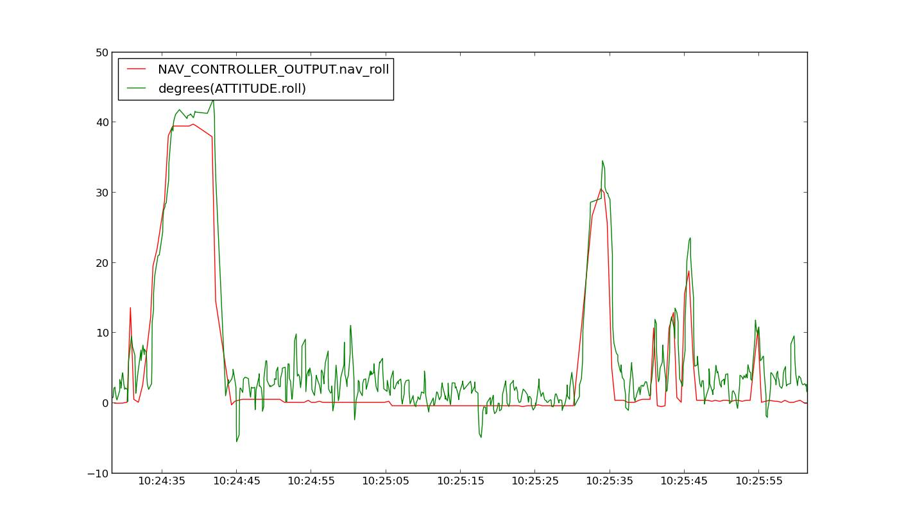
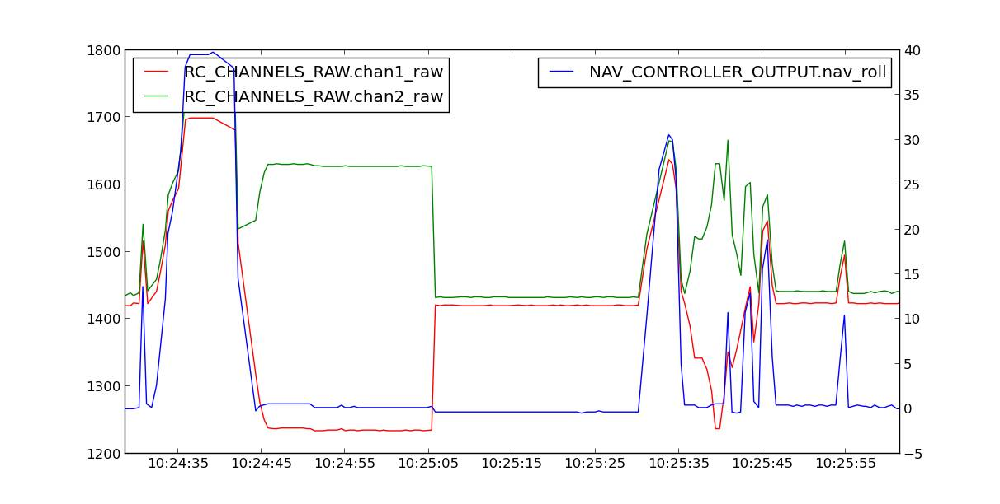
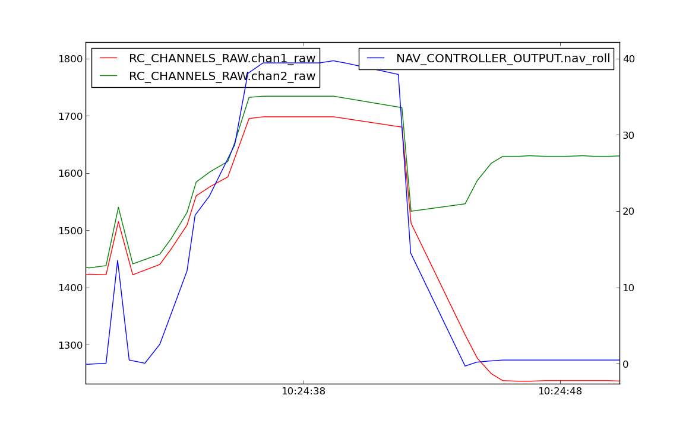

.. _case-study-fly-by-wire:

====================================
Log Analysis Case Study: Fly-by-Wire
====================================

Analyzing flight logs can help you diagnose problems with your missions.
This case study brings you an example of a flight where, by analyzing
the log data, our resident expert, Andrew Tridgell, suggested increasing
the waypoint radius to correct the plane's failure to complete a neat
navigation path. The original forum posts can be
found \ `**here** <https://diydrones.com/forum/topics/arduplane-2-73-released?commentId=705844%3AComment%3A1265467>`__.

DIY Drones member Iskess posted these logs of his X8 plane using APM
code 2.73. He described an issue with auto take off where his plane
wasn't achieving enough bank angle in FBW (only about 30 degrees) but
used the full 60 degrees perfectly in the auto modes. Iskess notes that
the flight starts off with a couple laps around a course of tightly set
waypoints, and FBW-B doesn't start until 77.2% through the log.

-  5/23/2013 tlog file (1.9 MB) - Download from original blog
   post \ `**here** <https://diydrones.com/forum/topics/arduplane-2-73-released?commentId=705844%3AComment%3A1265467>`__. - `X8 Parameters spreadsheet file download (14 KB) <https://download.ardupilot.org/downloads/wiki/other_files/X8Parameters.xlsx>`__

By analyzing this data
using \ **`Mavgraph <http://qgroundcontrol.org/mavlink/mavproxy_startpage#mavgraphpy>`__**,
Tridge was able to provide the following insight.

***May 29, 2013 DIYDrones; posted to Plane 2.x Software forum:***

"Let's look at the 2nd auto mission first:

It clearly could do with some improvement. Let's see if we can find out
what's wrong.

First off, let's graph the demanded roll versus the actual roll:

That looks good! The plane is achieving the desired roll quickly and
accurately. Now let's check the pitch:

That's not as good, though its only off by a few degrees. The
PTCH2SRV\_\* parameters could do with some improvement. I'd add a bit of
I term to that (increase PTCH2SRV_I to 0.1), and also increase
PTCH2SRV_IMAX to around 1000.

That isn't the cause of the navigation problems though. Let's look more
carefully at the the key nav parameters you have:

-  WP_RADIUS: 8
-  NAVL1_PERIOD: 18
-  NAVL1_DAMPING: 0.8
-  LIM_ROLL_CD: 6000

The one that is furthest off for this sort of track is WP_RADIUS. You
are flying at about 18 m/s on average, and your uBlox GPS will have a
lag of around 0.6 seconds which is about 11 m of flight distance, which
means you are not turning until you are past the waypoint. If that is
what you want then that's fine, but if you want the plane to turn neatly
onto the next track then you'll need to turn earlier.

Your LIM_ROLL_CD of 60 degrees at 18 m/s corresponds to a turn radius
of 19.1 m. The plane also takes a second or two to change attitude. (The
X8 is not a fast response plane! It's more like flying a manta ray). If
we add 1 second of flight time for the attitude change plus the GPS lag
plus the turn radius, then you'd need to turn about 48 m before a 90
degree turn to end up neatly on track. (That is very rough of course,
but won't be too far off). So WP_RADIUS of 48 or so will produce a much
neater track.

I also think you could lower NAVL1_PERIOD a bit more. I don't see any
weaving there, just xtrack changes, so I'd try 15 and see if it weaves.
You may even find 13 works well. You'll need to experiment as the right
value is very airframe dependent (and even depends on the type of servo
you have!). You may also like to increase LIM_ROLL_CD to 6500 for a
bit faster turns.

Finally let's look at your altitude handling:

The most noticeable thing is that you started the mission well above the
mission altitude of 61 m. It took it four waypoints just to get down to
the target altitude. That makes using the log for nav tuning harder, as
the plane was trying to descend while navigating. Once it reached the
target altitude it held it OK, varying by about 10 m. That isn't
fantastic, but tuning the X8 for good altitude handling in turns is very
hard with the current controller in APM. You'll need the new TECS
controller Paul is working on to get really good results. So for now I
wouldn't suggest changing anything there.

Regarding FWB-B, that can be a little tricky to analyze, and is one of
the reasons I added ELEVON_OUTPUT, as it makes analyzing demanded roll
a lot easier! As you'll see below, working out the demanded roll for
elevons is somewhat tricky.

First we should grab the demanded and achieved roll when in FBW-B:

You can see that the X8 is achieving the roll that is being asked for
fairly well. The roll is a bit jittery in level flight (maybe elevons a
bit too loose? or wind effects? hard to say), but it does generally do
what is being asked of it.

Now let's look at what your RC input was against the demanded roll. The
demanded roll is in blue, and your RC inputs are in green and red.

The RC limits you had set were:

-  RC1_MAX         1936
-  RC1_MIN         1012
-  RC2_MAX         1927
-  RC2_MIN         986
-  LIM_ROLL_CD  6000

We can also see from this graph that you had a bit of transmitter trim.
The part of the graph where the nav_roll is zero shows your RC input
was around 1420 for each channel. That is important.

Let's zoom in a bit on the part of the FBWB flight where you were trying
to turn hard right:

You can see that your transmitter was not outputting values anywhere
near the limits that had been setup in radio calibration. The average of
the two channels was a bit above 1700, which is 320 above trim, and 227
below the RC1_MAX.

So now we know its output is 320 PWM above trim, the full range above
trim is 1420 to 1927, and the roll limit is 60 degrees. It is a simple
linear proportion to get demanded roll, so that corresponds to
320/(1927-1420)\*60 degrees of demanded roll, which is 37.8 degrees.
That matches the nav_roll the plane got and what it ended up flying.

Note that I've done a few shortcuts in the above. The full calculation
for demanded roll with elevons is a bit messier. See the code
in \ `radio.cpp <https://github.com/tridge/ardupilot/blob/master/ArduPlane/radio.cpp#L129>`__ in
the ``read_radio()`` function.

(If you read that code you may understand why I don't like the
ELEVON_MIXING option and much prefer the simpler ELEVON_OUTPUT code!)

To answer your question, your transmitter is giving RC outputs which are
much less than the RC1_MAX and RC1_MIN values you have in APM
(presumably from when you did radio calibration). That is why it isn't
rolling over as much as you want.

Cheers, Tridge"
