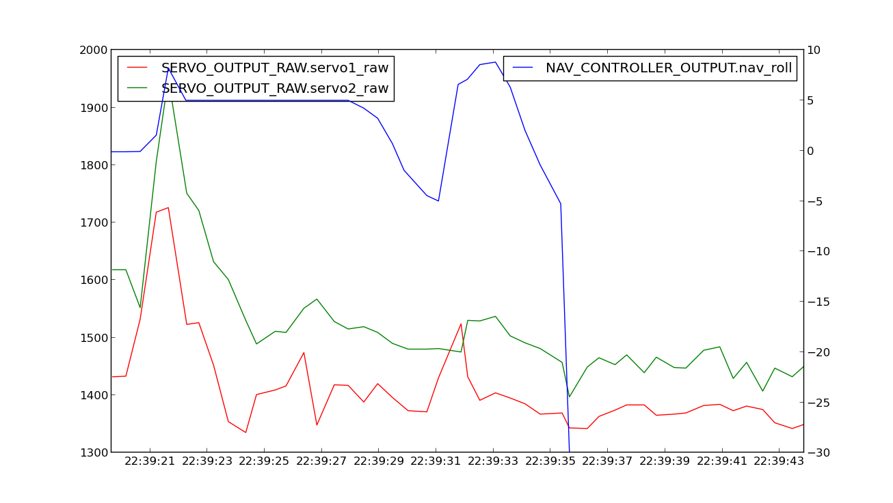

.. _case-study-turn-rate:

=============================================
Log Analysis Case Study: Turn Rate Adjustment
=============================================

Analyzing flight logs can help you diagnose problems with your missions.
This case study brings you an example of a flight where, by analyzing
the log data, our resident expert, Andrew Tridgell, suggested adjusting
the turn rate and increasing the maximum roll angle to correct the
plane's failure to reach a waypoint as a result of turning too slowly.
The original forum posts can be found
`**here** <https://diydrones.com/forum/topics/arduplane-2-73-released?commentId=705844%3AComment%3A1264198>`__.

DIY Drones member Vishnu posted these logs of his X8 plane using APM
code 2.73. He described an issue with auto take off where his throttle
was maintaining 100% despite being set to 75%.

-  5/26/2013 tlog file (803 KB) - Downloaded from original blog
   post \ `**here** <https://diydrones.com/forum/topics/arduplane-2-73-released?commentId=705844%3AComment%3A1264198>`__. - `x8 throttle slew rate 100 param file <https://download.ardupilot.org/downloads/wiki/other_files/x8throttleslewrate100.param>`__
-  `Jakkur Auto take off and land text file <https://download.ardupilot.org/downloads/wiki/other_files/Jakkur-Auto-take-off-and-land.txt>`__

By analyzing this data using :ref:`Mavgraph <mavproxy:mavproxy-mavgraph>`,
Tridge was able to provide the following insight.

***May 29, 2013 DIYDrones; posted to Plane 2.x Software forum:***

"I've taken a look at your logs, and the biggest problem is that the
RLL2SRV_P is not large enough and you have not given Plane enough
authority over the turn rate.

This is what your flight looked like:

You can see it did make the first waypoint, but then was turning much
too slowly for the second waypoint.

Let's look at a graph of the nav_roll (the roll the plane wants to
achieve) and the actual roll. The red line represents the mission
sequence number.

In the takeoff nav_roll is small, as its flight is straight ahead. It
then goes to -30 degrees, as that is the LIM_ROLL_CD you have
specified. The problem is that the actual roll only goes to around -10
degrees. So the plane is not achieving the roll that APM is asking for.

The reason for this is the RLL2SRV\_\* parameters you have chosen:

::

    RLL2SRV_D       0.000000
    RLL2SRV_I       0.000000
    RLL2SRV_IMAX    500.000000
    RLL2SRV_P       0.400000

You have specified zero I term and a quite small P term for an aircraft
like the X8. Let's have a look at the servo values that APM ended up
using with those settings:

You can see that the APM was moving the first elevon only a small
amount, and the second elevon by about 150. Now let's compare that to
what happened when you switched to manual flight:

When you took manual control you rolled the plane left by 65 degrees.
That compares to a maximum roll angle that you have allowed the APM to
use of 30 degrees.

You also used a lot more aileron movement than you have allowed the APM
to use. To roll the plane over you used almost full left aileron,
whereas the RLL2SRV_P gain of 0.4 with a 20 degree roll error only
allowed the APM to move the aileron by 0.4\*(20/45)\*500 which is 89. So
you moved the aileron more than 3 times as much as the APM did.

The X8 has quite a lot of natural stability, which also means it needs
quite a lot of elevon movement to get it to roll. If you only move the
elevons a small way it will not be able to overcome its natural
stability, and also won't overcome any wind, or slight trim errors.

To fix it you need to make the following changes:

-  Double your RLL2SRV_P to 0.8, perhaps higher based on testing
-  Change RLL2SRV_I to 0.1
-  Change RLL2SRV_IMAX to 1500
-  You also have a value for NAVL1_PERIOD which is too high for an X8.
   Change it to 18.

Your airspeed also doesn't look well calibrated:

Have you checked your sensor for leaks? It is aligned correctly and
clear of the airframe? The airspeed and ground speed should match on
average when you loiter. You may need to adjust ARSPD_RATIO to be a bit
larger.
