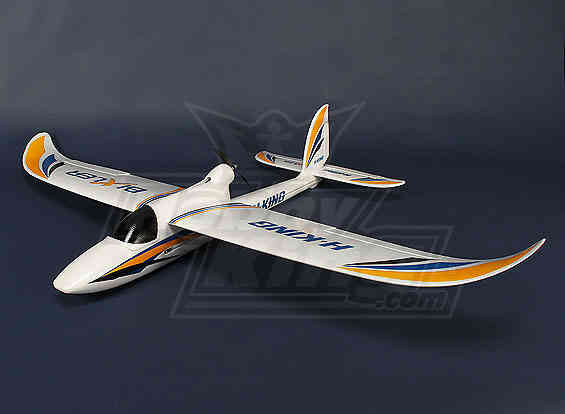
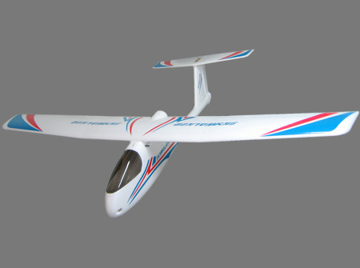
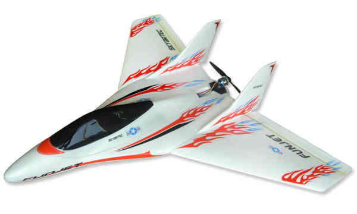
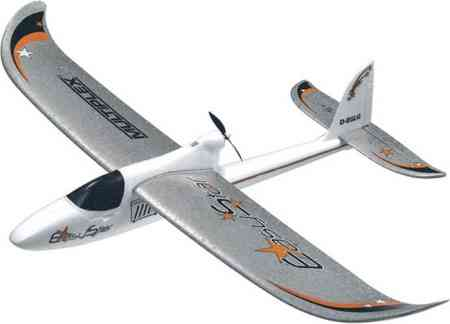
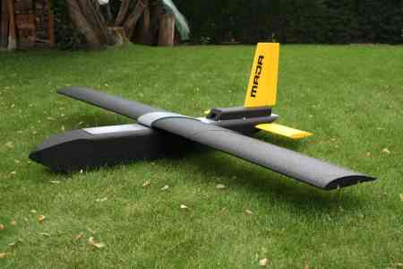
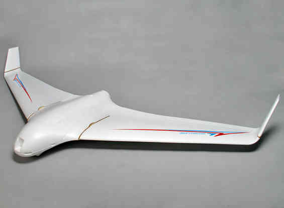
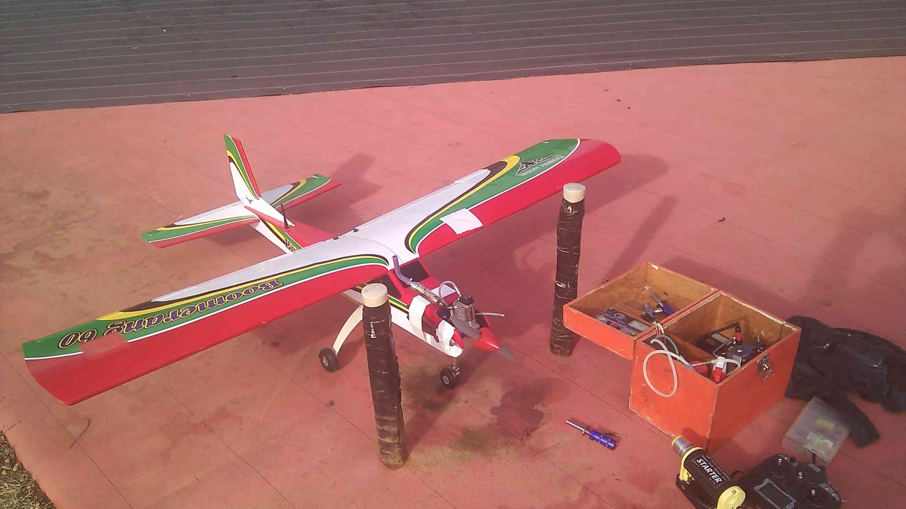
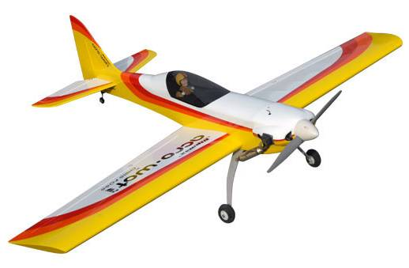
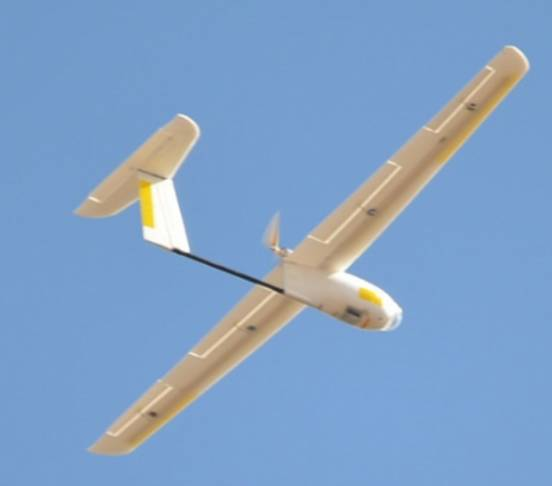

.. _configuration-files-for-common-airframes:

=========================================
Configuration Values for Common Airframes
=========================================

This page provides some approximate configuration values for common
airframes.

.. note::

   These values are good enough to “get you off the ground”. For
   optimum performance you will still need to tune these parameters for
   your aircraft.

Configuration values - not complete files
=========================================

We do not not provide complete configuration files because we do not
want to encourage sharing complete configuration files between APM
users.

Sharing configuration files is often a bad idea because the correct
settings for a specific plane are dependent on a lot more factors than
just what base airframe type is being used:

-  the right tuning values depends on what type of servos you have
   installed (different servos respond at different speeds), and which
   hole in the servo horns you connect the control arms to
-  the right values also depend on your RC transmitter setup, especially
   the range of movement of each control axis
-  the right tuning values also depend on what motor and battery you
   have installed, and depends a lot on the total takeoff weight of your
   aircraft. If one user has a camera installed and another user doesn't
   then they will probably need different tuning values.
-  manufacturers often make changes to airframes, servos and motors
   without re-branding the airframe as a new model. Sometimes they even
   change the direction that servos move
-  different users have different optional sensors, which changes what
   configuration options are needed. For example, some users install an
   airspeed sensor or an external compass.
-  new APM firmware releases frequently change the defaults for some
   critical parameters to avoid problems found by users. If you load a
   config file from a user of an older firmware then that will revert
   those changes

For all of these reasons you should not just download a configuration
file from another user and expect it to work.

So what can you do?
===================

If another user has tuned a similar aircraft, then you can look in their
configuration file to find the key tuning parameter they used, and
manually put those values into your APM as a starting point for tuning.
The key parameters you should look for are:

-  :ref:`RLL2SRV_P <RLL2SRV_P>`
-  :ref:`PTCH2SRV_P <PTCH2SRV_P>`
-  :ref:`NAVL1_PERIOD <NAVL1_PERIOD>`

Setting those to an approximately correct value will give you a
reasonable starting point for tuning your airframe. After that you
should follow the :ref:`tuning guide <roll-pitch-controller-tuning>`.

Also note that the Plane parameters default to zero 'I' values. The
reason for this is that you need to tune the P value first, then tune
the I value. If you put in a non-zero I value when the P value is a long
way off the aircraft may oscillate badly and could crash.

Once you have good P values then you should raise the I values a bit, as
described in the tuning guide. That will allow APM to cope better with
wind. For example, once the P values are setup correctly then setting
the following will help with most aircraft:

-  :ref:`RLL2SRV_I<RLL2SRV_I>` : 0.05
-  :ref:`PTCH2SRV_I<PTCH2SRV_I>` : 0.05

HobbyKing Bixler v1 or v2
=========================

Bixler v2 has a slightly bigger wing and sturdier fuselage.

   HobbyKing Bixler

-  Bixler 1: In ARF form from HobbyKing's \ `USA warehouse <http://www.hobbyking.com/hobbyking/store/uh_viewItem.asp?idProduct=18083>`__ or `rest of world <http://www.hobbyking.com/hobbyking/store/uh_viewItem.asp?idProduct=16544>`__
-  Bixler 2 kit: \ `USA Warehouse <http://www.hobbyking.com/hobbyking/store/__31048__Hobbyking_Bixler_2_EPO_1500mm_w_Optional_Flaps_KIT_US_Warehouse_.html>`__ and `rest of world <http://www.hobbyking.com/hobbyking/store/__27169__Hobbyking_Bixler_2_EPO_1500mm_w_Optional_Flaps_KIT_.html>`__

Key parameters
--------------

-  :ref:`RLL2SRV_P<RLL2SRV_P>` : 0.9
-  :ref:`PTCH2SRV_P<PTCH2SRV_P>` : 1.0
-  :ref:`NAVL1_PERIOD<NAVL1_PERIOD>` : 18

Bixler Tips
-----------

See `this posting <https://diydrones.com/profiles/blogs/mounting-an-apm-on-a-bixler2-upside-down-using-ahrs-orientation>`__
for how to fit an APM to a Bixler2. Also see :ref:`High Quality Bixler 1.1 Build (APM2.x) <a-high-quality-bixler-1-1-build>`.

#. Heavy Bixler's fly much faster and are prone to tip stalling if
   slowed up too much, so keep things as light as possible! A stall in
   FBWA can be tricky to get out of. Autopilots do not handle stalls
   well.
#. Set manual level with a little bit of positive pitch - take your time
   to set this, fly and repeat as many times as it takes to get a super
   stable cruising speed with the lowest throttle setting possible. It
   takes a little while to work out what pitch and throttle combination
   give the most stable cruising flight. Set closer to 50% throttle for
   cruise (but obviously depends on your set up).
#. Perform some test flights in FBWA mode and figure out minimum
   throttle setting /speed that is still stable. You can "feel" a tip
   stall coming with enough practice. To recover from the stall, change
   quickly to Manual mode and then: wings level and pull out slowly.
   Test with enough height to see how fast the plane needs to be going
   in each mode. Also be sure to always add sufficient throttle when
   heading downwind to keep airspeed up.
#. If you prefer to keep the airframe flat you can, in FBWA mode, use
   only rudder for turning. APM does a great job of keeping the the
   plane level in turns (with proper speed of course).
#. Make sure that target throttle in full autopilot mode is 10% above
   throttle settings that were figured out using methods above for
   mission cruising.
#. If setting a target speed in auto make sure it's fast enough for the
   plane and its payload.

Skywalker
=========

   Skywalker

Available
in \ `foam <http://www.fpvflying.com/products/Skywalker-platform-for-UAV-FPV.html>`__ or `fibreglass <http://www.hobbyking.com/hobbyking/store/uh_viewItem.asp?idProduct=15236>`__.
Current versions have longer wings (1.9m instead of 1.68m).

The skywalker has relatively small ailerons for the size of the
aircraft, so you will probably need quite high gains. The following
parameters will be a good starting point for most users:

-  :ref:`RLL2SRV_P<RLL2SRV_P>` : 1.8
-  :ref:`PTCH2SRV_P<PTCH2SRV_P>` : 1.5
-  :ref:`NAVL1_PERIOD<NAVL1_PERIOD>` : 20

HobbyKing Skyfun
================

   Skyfun

Available \ `here <http://www.hobbyking.com/hobbyking/store/uh_viewItem.asp?idProduct=9614>`__

The SkyFun and FunJet are similar, and are quite "twitchy" planes. A
small amount of elevon movement goes a long way! The following values
should be a good starting point:

-  RLL2SRV_P: 0.4
-  PTCH2SRV_P: 0.45
-  NAVL1_PERIOD: 17

Multiplex EasyStar
==================

   Easystar

Available \ `here <http://www3.towerhobbies.com/cgi-bin/wti0001p?&I=LXFRU7&P=ML>`__

The easystar is unusual in not having ailerons. If you are buying a new
plane it would be better to get a bixler2, which is a similar size and
cost, but flies a lot better.

If you do want to fly an easystar then you will need to set a
:ref:`KFF_RDDRMIX<KFF_RDDRMIX>` , along with the other key parameters. For example:

-  :ref:`RLL2SRV_P<RLL2SRV_P>` : 0.55
-  :ref:`PTCH2SRV_P<PTCH2SRV_P>` : 0.6
-  :ref:`KFF_RDDRMIX<KFF_RDDRMIX>` : 0.5
-  :ref:`NAVL1_PERIOD<NAVL1_PERIOD>` : 20

Borojet Maja
============

   Borojet Maja

Available \ `here <http://bormatec.com/index.php/prod-engl-men/blog-2-columns>`__.

The following parameters should be a good starting point:

-  :ref:`RLL2SRV_P<RLL2SRV_P>` : 1.4
-  :ref:`PTCH2SRV_P<PTCH2SRV_P>` : 1.3
-  :ref:`NAVL1_PERIOD<NAVL1_PERIOD>` : 16

TELINK Toro900 flying wing
==========================

The following values should be a good starting point:

-  :ref:`RLL2SRV_P<RLL2SRV_P>` : 1.2
-  :ref:`PTCH2SRV_P<PTCH2SRV_P>` : 2
-  :ref:`NAVL1_PERIOD<NAVL1_PERIOD>` : 18

SkyWalker X8
============

The X8 varies a lot in how people set it up, but you usually need
parameters around this range:

-  :ref:`RLL2SRV_P<RLL2SRV_P>` : 0.8
-  :ref:`PTCH2SRV_P<PTCH2SRV_P>` : 0.5
-  :ref:`NAVL1_PERIOD<NAVL1_PERIOD>` : 19

Phoenix Tiger60
===============

.. image:: http://photos.tridgell.net/d/55232-2/PHOTO_20130319_100703.jpg
    :target: ../_images/PHOTO_20130319_100703.jpg

The Tiger60 is usually flown as a nitro plane, plus it has relatively
small ailerons and elevator surfaces. A good starting point will be the
following parameters:

-  RLL2SRV_P: 1.2
-  PTCH2SRV_P: 1.2
-  NAVL1_PERIOD: 15
-  THR_PASS_STAB: 1
-  THR_SUPP_MAN: 1
-  THR_SLEWRATE: 30

HotDog
======

.. image:: http://photos.tridgell.net/d/54579-2/IMG_20121126_080740.jpg
    :target: ../_images/IMG_20121126_080740.jpg

The HotDog is a fun sports plane that flies like it is "on rails". The
one in the picture has an OS25 Nitro engine. It flies well with the
following parameters:

-  :ref:`RLL2SRV_P<RLL2SRV_P>` : 0.35
-  :ref:`PTCH2SRV_P<PTCH2SRV_P>` : 0.6
-  :ref:`NAVL1_PERIOD<NAVL1_PERIOD>` : 14
-  THR_PASS_STAB:  1
-  :ref:`THR_SUPP_MAN<THR_SUPP_MAN>` : 1
-  :ref:`THR_SLEWRATE<THR_SLEWRATE>` : 30

Boomerang 60
============

The Boomerang is a classic high wing trainer aircraft, and like the
Tiger60 has relatively small control surfaces. The following parameters
will be a good starting point:

-  :ref:`RLL2SRV_P<RLL2SRV_P>` : 1.1
-  :ref:`PTCH2SRV_P<PTCH2SRV_P>` : 1.2
-  :ref:`NAVL1_PERIOD<NAVL1_PERIOD>` : 20
-  :ref:`THR_PASS_STAB<THR_PASS_STAB>` : 1
-  :ref:`THR_SUPP_MAN<THR_SUPP_MAN>` : 1
-  :ref:`THR_SLEWRATE<THR_SLEWRATE>` : 30

Mugin
=====

.. image:: https://c5.staticflickr.com/9/8036/7930561924_7392ff0913_z.jpg
    :target:  https://c5.staticflickr.com/9/8036/7930561924_7392ff0913_z.jpg

The Mugin is a large, fast aircraft. Make sure you have a long enough
runway for landing!

The following parameters should be a good starting point:

-  :ref:`RLL2SRV_P<RLL2SRV_P>` : 1.0
-  :ref:`PTCH2SRV_P<PTCH2SRV_P>` : 1.3
-  :ref:`NAVL1_PERIOD<NAVL1_PERIOD>` : 19
-  :ref:`THR_PASS_STAB<THR_PASS_STAB>` : 1
-  :ref:`THR_SUPP_MAN<THR_SUPP_MAN>` : 1
-  :ref:`THR_SLEWRATE<THR_SLEWRATE>` : 30

PA Addiction
============

.. image:: http://photos.tridgell.net/d/55220-2/PHOTO_20130309_212952.jpg
    :target:  http://photos.tridgell.net/d/55220-2/PHOTO_20130309_212952.jpg

The Precision Aerobatics AddictionX is a fun 3D aircraft. It flies quite
slowly, but can do extremely rapid rolls and loops due to its huge
control surfaces. The APM flies it fine with the right parameters. The
following parameters will be a good start:

-  :ref:`RLL2SRV_P<RLL2SRV_P>` : 0.35
-  :ref:`PTCH2SRV_P<PTCH2SRV_P>` : 0.6
-  :ref:`PTCH2SRV_D<PTCH2SRV_D>` : 0.04
-  :ref:`NAVL1_PERIOD<NAVL1_PERIOD>` : 13

RipMax AcroWot
==============

The AcroWot is an intermediate nitro sports plane, and a lot of fun to
fly! With an OS55AX motor it flies well with the following parameters:

-  :ref:`RLL2SRV_P<RLL2SRV_P>` : 1.0
-  :ref:`PTCH2SRV_P<PTCH2SRV_P>` : 0.9
-  :ref:`NAVL1_PERIOD<NAVL1_PERIOD>` : 13
-  :ref:`TRIM_THROTTLE<TRIM_THROTTLE>` : 35

TechPod
=======

The TechPod is a long endurance electric glider, ideal for longer
distance photography.

It flies well with the following parameters:

-  :ref:`RLL2SRV_P<RLL2SRV_P>` : 1.5
-  :ref:`PTCH2SRV_P<PTCH2SRV_P>` : 1.5
-  :ref:`NAVL1_PERIOD<NAVL1_PERIOD>` : 17
-  :ref:`ARSPD_FBW_MIN<ARSPD_FBW_MIN>` : 9
-  :ref:`ARSPD_FBW_MAX<ARSPD_FBW_MAX>` : 20
-  :ref:`TRIM_ARSPD_CM<TRIM_ARSPD_CM>` : 1200

For a more complete guide `see this review <https://diydrones.com/profiles/blogs/tuning-the-techpod>`__.
