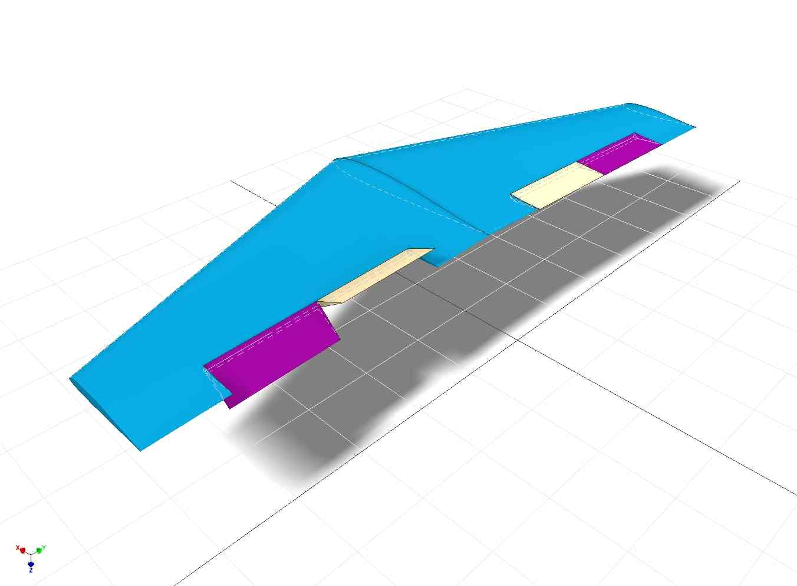

.. _differential-spoilers:

=========================================
Differential Spoilers & Full House Wing
=========================================

Usage
=====

Normal Flying-wing aircraft uses two control surfaces as Elevons to
control pitch and roll. In some cases, rudders are added to the winglets
to control yaw. Differential spoiler takes advantage of splitting
elevons to 4 independent control surfaces: normal elevon functions are
reserved for pitch and roll control, but yaw control is done by using
two surfaces on one side of the wing to create drag force thus
controlling yaw motion, emulating rudder control. If calibrated correctly, it will ensure pilot
has smooth yaw control via rudder input during take-off and landing as well as allowing the pilot to compensate for slip/skid compensation during turning (similar to differential aileron).

+-----------------------------------------------+-------------------------------------------------+
| **Left Yaw by inducing drag on left wing:**   | **Right Yaw by inducing drag on right wing:**   |
+-----------------------------------------------+-------------------------------------------------+
| |4surfLeftYaw|                                | |4surfRightYaw|                                 |
+-----------------------------------------------+-------------------------------------------------+

The amount of rudder input into the differential spoilers is controlled by :ref:`DSPOILR_RUD_RATE<DSPOILR_RUD_RATE>`. A value of 0, totally disables this feature. The default is 100(%). Conventional planes and gliders will probably want to change this.

Preparation
===========

To use differential spoiler function, the airframe is required to use
have 4 control surfaces (2 on each wing). 

Setup
=====

Now setup your 4 channels using the SERVOn_FUNCTION parameters:

+-------------------------------+-----------------------+-----------------------------------------------+
| **Function Name**             | **Function Number**   | **Description**                               |
+-------------------------------+-----------------------+-----------------------------------------------+
| Differential Spoiler Left 1   | 16                    | This should be set to the outer left servo    |
+-------------------------------+-----------------------+-----------------------------------------------+
| Differential Spoiler Right 1  | 17                    | This should be set to the outer right servo   |
+-------------------------------+-----------------------+-----------------------------------------------+
| Differential Spoiler Left 2   | 86                    | This should be set to the inner left servo    |
+-------------------------------+-----------------------+-----------------------------------------------+
| Differential Spoiler Right 2  | 87                    | This should be set to the inner right servo   |
+-------------------------------+-----------------------+-----------------------------------------------+

You can adjust the direction of each servo using the SERVOn_REVERSED
parameters, and swap channels to get the right movement direction for
elevons and rudder. Flap operation is also possible. The weighting of flap input to the movement of the outer and inner control surfaces can be set
using :ref:`DSPOILER_CROW_W1 <DSPOILER_CROW_W1>` and :ref:`DSPOILER_CROW_W2 <DSPOILER_CROW_W2>` respectively.

Differential Spoiler options
============================
:ref:`DSPOILER_OPTS <DSPOILER_OPTS>` parameter gives several options that can be used to tailor the dspoiler 
functionality to your aircraft. They can be used to setup a 'full house' wing on a glider. :ref:`DSPOILER_OPTS<DSPOILER_OPTS>` is 
a bit-mask each, bit enables different functionality.

+-------+-----------------------------------------------------------------------------------------------+
|**Bit**|                                    **Description**                                            |
+-------+-----------------------------------------------------------------------------------------------+
|   0   | Pitch control, this bit enables or disables pitch control output using the differential       |
|       | spoilers. 1 uses elevons as source for use with a flying wing, 0 uses ailerons as source for  |
|       | use with a traditional plane                                                                  |
+-------+-----------------------------------------------------------------------------------------------+
|   1   | Full span ailerons, 1 uses both the inner and outer control surfaces for roll control         |
|       | 0 just used the outer control surfaces                                                        |
+-------+-----------------------------------------------------------------------------------------------+
|   2   | Progressive crow, 0 gives crow brakes - the inner control surfaces are moved down and the     |
|       | outer surfaces moved up at the same time 1, for 0 to 50% flap only the inner surfaces are     |
|       | moved down then from 50% to 100% flap the outer surfaces are moved up, this gives traditional |
|       | flaps first then crow brakes                                                                  |
+-------+-----------------------------------------------------------------------------------------------+

Defaults are bit 0 and bit 1 set to 1. Conventional planes and gliders will probably want to change bit 0 to "0".

:ref:`DSPOILER_AILMTCH <DSPOILER_AILMTCH>` allows the downwards travel of the inner surfaces to be limited 
to a percentage of their full downwards travel. This only affects the travel when the control surfaces are used 
as full span ailerons or for differential yaw. Using this parameter a flap control surface with lots of downwards 
travel can still be utilized for full span ailerons. Upwards travel of the control surfaces is unaffected.

.. |4surfRightYaw| image:: ../images/4surfRightYaw.jpg
    :target: ../_images/4surfRightYaw.jpg
