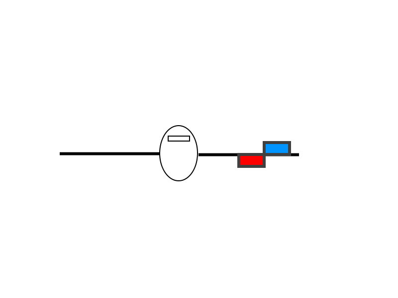
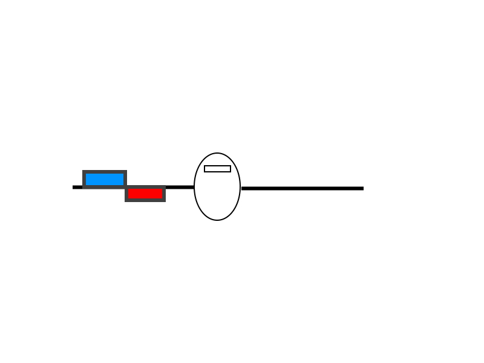

.. _differential-spoilers:

=====================
Differential Spoilers
=====================

Usage
=====

Normal Flying-wing aircraft uses two control surfaces as Elevons to
control pitch and roll. In some cases, rudders are added to the winglets
to control yaw. Differential spoiler takes advantage of splitting
elevons to 4 independent control surfaces: normal elevon functions are
reserved for pitch and roll control, but yaw control is done by using
two surfaces on one side of the wing to create drag force thus
controlling yaw motion. If calibrated correctly, it will ensure pilot
has smooth yaw control during take-off and landing as well as
compensation during turning (similar to differential aileron).

+-----------------------------------------------+-------------------------------------------------+
| **Left Yaw by inducing drag on left wing:**   | **Right Yaw by inducing drag on right wing:**   |
+-----------------------------------------------+-------------------------------------------------+
| |4surfLeftYaw|                                | |4surfRightYaw|                                 |
+-----------------------------------------------+-------------------------------------------------+

Preparation
===========

To use differential spoiler function, the airframe is required to use
have 4 control surfaces (2 on each wing). 

Setup
=====

Now setup your 4 channels using the SERVOn_FUNCTION parameters:

+-------------------------------+-----------------------+-----------------------------------------------+
| **Function Name**             | **Function Number**   | **Description**                               |
+-------------------------------+-----------------------+-----------------------------------------------+
| Differential Spoiler Left 1   | 16                    | This should be set to the outer left servo    |
+-------------------------------+-----------------------+-----------------------------------------------+
| Differential Spoiler Right 1  | 17                    | This should be set to the outer right servo   |
+-------------------------------+-----------------------+-----------------------------------------------+
| Differential Spoiler Left 2   | 86                    | This should be set to the inner left servo    |
+-------------------------------+-----------------------+-----------------------------------------------+
| Differential Spoiler Right 2  | 87                    | This should be set to the outer right servo   |
+-------------------------------+-----------------------+-----------------------------------------------+

You can adjust the direction of each servo using the SERVOn_REVERSED
parameters, and swap channels to get the right movement direction for
elevons and rudder.

