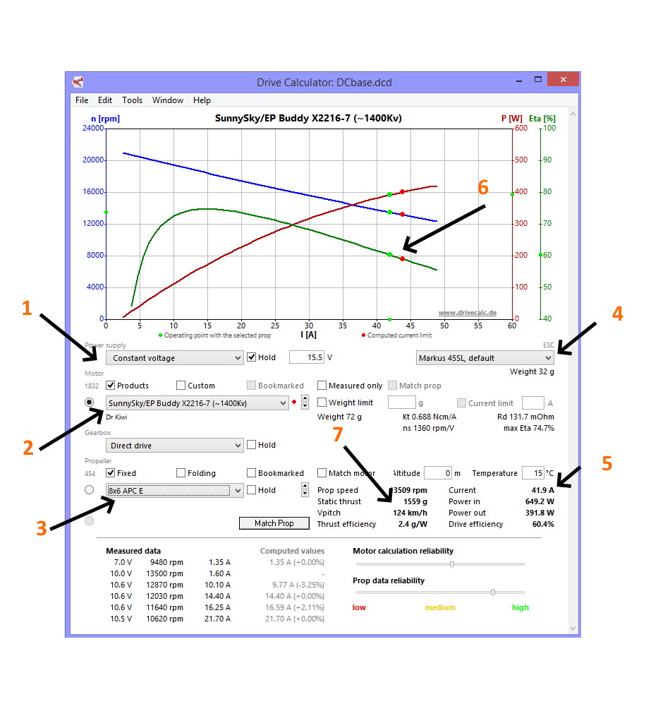

.. _drivecalculator-guide:

===============================================
DriveCalculator Motor and Prop Efficiency Guide
===============================================

`Drive Calculator <http://www.drivecalc.de>`__ is a free tool for brushless motor power system analysis and prop/motor selection. It has a large and growing database of motors, propellers, escs, and batteries. You can test combinations to get an estimate of maximum current, efficiency, prop speed, etc. It is available for Windows, MAC, and Linux.

The screenshot below illustrates its interface and use. In this example, it shows an analysis of one of the motors used in the :ref:`MiniTalon Build example<miniTalon-build>`.

     

Entering the information
------------------------

After opening the application, you can select {1} the exact battery to be used,or the voltage to run the analysis, {2} the motor from a large database of motors/test data, and {3} the propeller to be used, again from a large database included. You can also change the ESC used {4}, although it will only make a minor difference in the analysis. It is shown, since that ESC was used to gather the motor test data entered into the database. 

Results
-------

Instantly, the full throttle analysis will appear. {5} is the current at full throttle, {6} shows curves of efficiency versus throttle for the motor with that voltage source/battery. Static thrust and static propeller speed are shown in {7}. By scrolling through propellers in the list, you can instantly see the effects on the results. Likewise, you can choose and "HOLD" a voltage/battery, and/or propeller, and see the results as you scroll through motors in the database. You can also search for a motor's KV, weight, etc. and restrict the motors list to scroll through to only match those criteria.

While not exact, due to component variations, etc. the results are very close to actual.