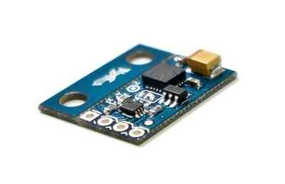

.. _externalmagentometer-apm2x:

======================================
Using an External Compass with APM 2.x
======================================

.. warning::

    **ARCHIVED**

    The APM2.x is end of life for use with ArduPilot.
    This article is made available for existing users.

If you're having trouble with magnetic noise affecting your compass
onboard the APM 2.5 board, you may want to switch to an external compass
that you can mount further away from noise sources such as motors. This
article explains how.

Step-by-step instructions
=========================

#. Purchase a `HMC5883L magnetometer breakout board <http://store.jdrones.com/APM2_6_Compass_HMC5883_p/jdmagnet001.htm>`__.
   Make sure the 3DR board is set to use 3.3volts (the APM 2.5’s I2C
   port uses 3.3 volts, not 5 volts). You will have to modify the 3DR
   board because it is shipped from 3DR with the 5 volt jumper set, as
   shown below.

   .. image:: ../images/Mag_HMC5843_jumper1.jpg
       :target: ../_images/Mag_HMC5843_jumper1.jpg
    
#. Looking at the below picture, cut the jumper trace in the middle of
   the APM 2.5 board. This disables the SDA line to the board’s internal
   compass, rendering it inert.

   .. image:: ../images/APMCompassModification1.jpg
       :target: ../_images/APMCompassModification1.jpg
   
#. The APM 2.5 I2C connector needs a 4 pin DF13 connector (like `this one <http://store.jdrones.com/cable_df13_4pin_15cm_p/cbldf13p4c15.htm>`__).
   Cut off one and and strip and tin the four wires.
#. Connect the DF13’s 4 wires to the compass breakout board. Note that
   the wires will not be one to one. Pin 1 on the DF13 connector will
   not go to pin 1 of the compass board. The standard 3DR cable has one
   red wire and three black wires. Substitute your wire colors
   accordingly. Solder the wires as follows:

   -  Red wire on end of connector (+3.3v) goes to the VCC (or +3.3v)
      pad on the compass board (see labels on board for location). This
      is the wire closest to the interior on the APM 2.5 board.
   -  Wire next to red wire (SCL) goes to the SCL pad on the compass
      board.
   -  Wire next to wire next to red wire (SDA) goes to the SDA pad on
      compass board.
   -  Black wire on end of connector (ground) goes to ground pad on
      compass board. This is the wire closest to the edge of the APM 2.5
      board.

#. Mount the compass board on the top plate of your quad. Double-sided
   foam tape works well for this. The orientation of the board matters.
   In the picture below, we've mounted the board “components up with
   pins forward”. Note which direction you mount the board – you will
   need to modify the software with this orientation, as explained in
   the next step.

   .. image:: ../images/Quad_Top_View1.jpg
       :target: ../_images/Quad_Top_View1.jpg
   
#. Modify, compile and load the software for your compass board
   orientation. You must be able to load software from the Arduino IDE
   to complete this step. In “APM_Config.h”, you will find a commented
   out statement like:

   .. code-block:: cpp

        //#define MAG_ORIENTATION     AP_COMPASS_COMPOENTS_DOWN_PINS_FORWARD

   For the orientation shown in the picture above, for example, you
   would add the following statement just below the commented out
   statement above as follows:

   .. code-block:: cpp

        #define MAG_ORIENTATION     AP_COMPASS_COMPONENTS_UP_PINS_FORWARD 

   You can find a list of all possible orientations for the
   ``MAG_ORIENTATION`` flag in the **AP_Compass_HMC5843.h** library,
   including orientations for both the 3DR and Sparkfun boards.

#. If this is the first time loading software from the IDE, make sure
   the following statement is uncommented:

   .. code-block:: cpp

        #define CONFIG_APM_HARDWARE    APM_HARDWARE_APM2

#. Save, Compile and Upload the modified software
#. Test the compass board and have fun flying with a now stable compass!

(This entry contributed by Lloyd DeForrest)
