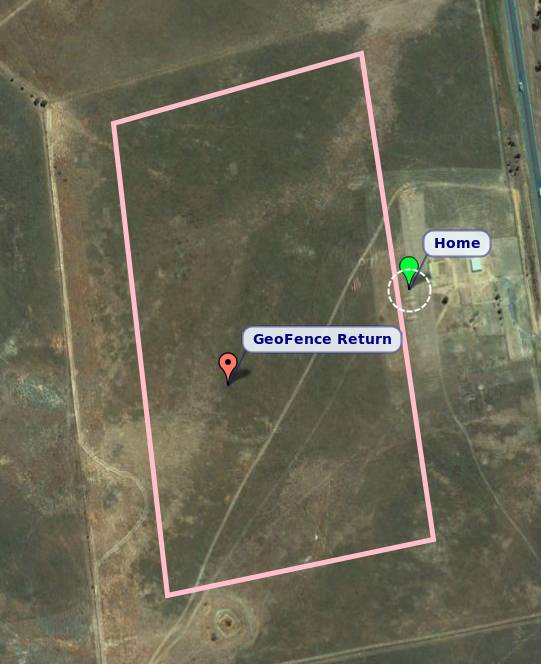
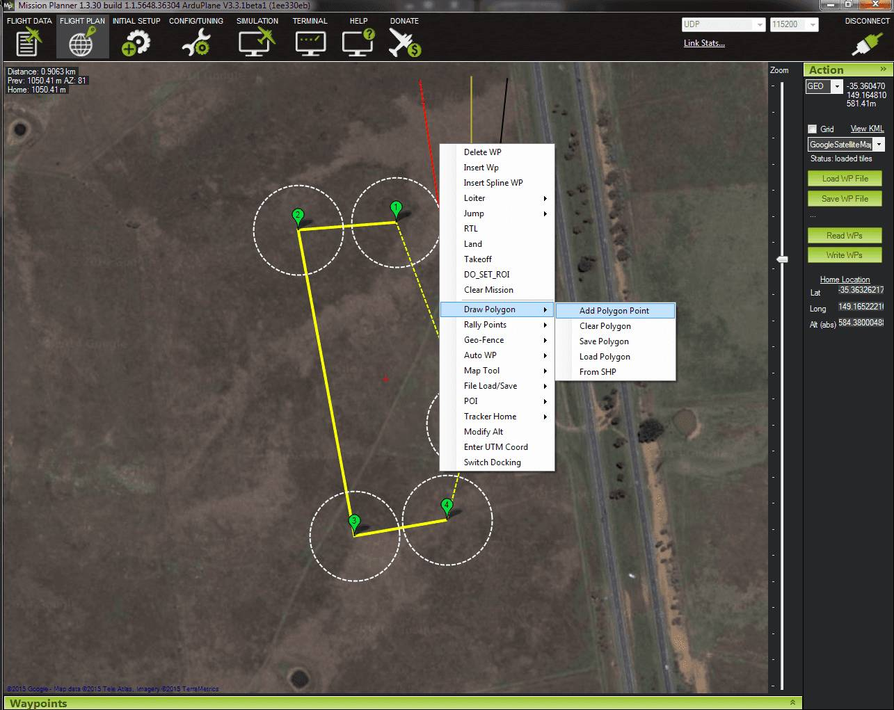
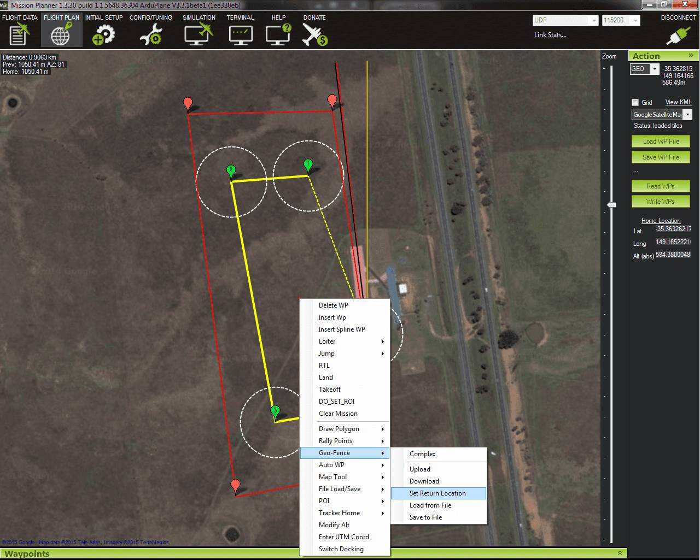
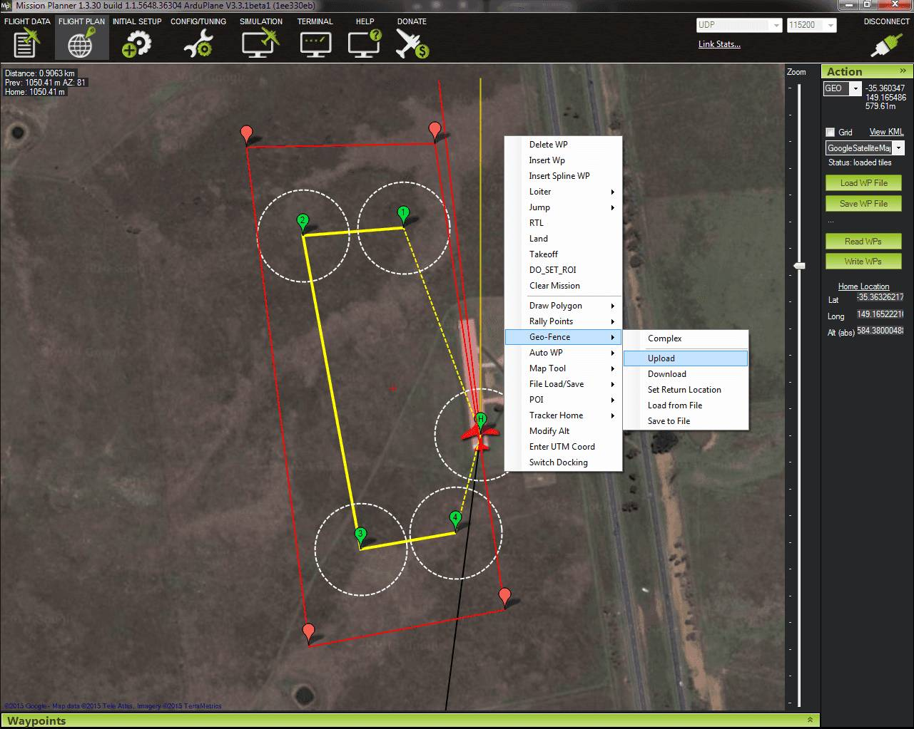
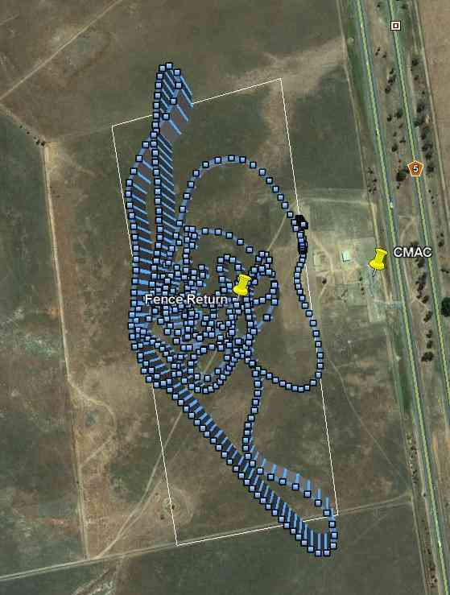

.. _geofencing:

====================
Geo-Fencing in Plane
====================

The Geo-Fencing support in Plane allows you to set a virtual 'fence'
around the area you want to fly in, specified as an enclosed polygon of
GPS positions plus a minimum and maximum altitude.

.. note::

   In Plane you MUST have the fence polygon drawn for the geofence
   parameters to work.  In Copter you can specify a maximum fence altitude
   without the fence polygon and Copter will adhere to it but Plane
   requires you to draw the polygon for any of the fence parameters
   including the max/min ALT to work.

When fencing is enabled, if your plane goes outside the fenced area then
it will switch to GUIDED mode, and will fly back to a pre-defined return
point, and loiter there ready for you to take over again. You then use a
switch on your transmitter or use commands in your Ground Control
Station (GCS) to take back control.

Use for R/C training
====================

One of the main uses of geo-fencing is to teach yourself (or someone
else) to fly radio controlled planes. When you have a properly
configured geo-fence it is very hard to crash, and you can try
manoeuvres that would normally be too likely to end in a crash, trusting
the APM to 'bounce' the plane off the geo-fence before the flight ends
in disaster.

Geo-fencing can be combined with any APM flight mode. So for a raw
beginner, you would combine it with one of the stabilised flight modes
(such as STABILIZE or FBWA). Once the pilot has gained some confidence
you could combine it with MANUAL mode, which gives direct control of the
plane and allows for the most interesting aerobatic manoeuvres. When
used in this way the APM stays out of your way completely, just passing
the controls to the servos directly, and only takes control if you go
outside the fenced area or outside the defined altitude range.

Use for containment
===================

During fully autonomous operation the fence can be used as a failsafe
measure to ensure the aircraft stays within the intended flight area. 
During fully autonomous operation use the :ref:`FENCE_AUTOENABLE<FENCE_AUTOENABLE>` parameter
and the plane will automatically engage the fence after takeoff is
complete and automatically disable the fence when it arrives at a
landing waypoint.  Set the :ref:`FENCE_AUTOENABLE<FENCE_AUTOENABLE>` parameter to 1 to use this
feature.  For details on setting up landing and takeoff waypoints see
the :ref:`Planning a Mission with Waypoints and Events <common-planning-a-mission-with-waypoints-and-events>`
page.

Of course, the fence can be used for containment in semi-autonomous
missions as well (missions where, e.g., takeoff and/or landing are
manual) -- the fence would still be enabled/disabled via the R/C
transmitter or the GCS in that case -- :ref:`FENCE_AUTOENABLE<FENCE_AUTOENABLE>` is optional.

Setting up geo-fencing
======================

To setup geo-fencing in Plane you need to configure several things:

#. the boundary of the fence, as a set of GPS points
#. the action to take on fence breach
#. the location of the return point; note that optionally you may use
   the :ref:`FENCE_RET_RALLY<FENCE_RET_RALLY>` parameter to have the plane return to the
   closest :ref:`Rally Point <common-rally-points>`
   instead of the fence return point.
#. the minimum and maximum altitude of the fenced area
#. what RC channel on your transmitter you will use to enable
   geo-fencing (if any)
#. an optional setting (FENCE_AUTOENABLE) when you want to configure
   the fence to automatically enable after an autonomous takeoff and
   automatically disable after an autonomous landing
#. how you want to take back control after a fence breach

These can all be setup using the APM Mission Planner.

There are a few rules that you must follow when setting up your fence
boundary:

#. the return point must be inside the fence boundary
#. the fence boundary must be fully enclosed. This means it must have at
   least 4 points, and the last point must be the same as the first
   point
#. the boundary can have at most 18 points

If you setup your fence with the APM planner it should ensure you follow
these rules.

Please remember when making your fence boundary that your plane will
have some momentum when it hits the fence, and will take time to turn
back to the return point. For a plane like the SkyWalker we recommend an
additional safety margin of around 30 meters inside the true boundary of
where you want to fly. The same goes for the minimum altitude - you need
to make it high enough that the APM has time to recover from a fast
dive. How much margin you need depends on the flight characteristics of
your plane.

Apart from the fence boundary, the following MAVLink parameters control
geo-fencing behaviour:

#. :ref:`FENCE_ACTION<FENCE_ACTION>` - the action to take on fence breach. This defaults to
   zero which disables geo-fencing. Set it to 1 to enable geo-fencing
   and fly to the return point on fence breach.  Set to 2 to report a
   breach to the GCS but take no other action.  Set to 3 to have the
   plane head to the return point on breach, but the pilot will maintain
   manual throttle control in this case.
#. :ref:`FENCE_MINALT<FENCE_MINALT>` - the minimum altitude in meters. If this is zero then
   you will not have a minimum altitude.
#. :ref:`FENCE_MAXALT<FENCE_MAXALT>` - the maximum altitude in meters. If this is zero then
   you will not have a maximum altitude.
#. :ref:`FENCE_CHANNEL<FENCE_CHANNEL>` - the RC input channel to watch for enabling the
   geo-fence. This defaults to zero, which disables geo-fencing. You
   should set it to a spare RC input channel that is connected to a two
   position switch on your transmitter. Fencing will be enabled when
   this channel goes above a PWM value of 1750. If your transmitter
   supports it it is also a good idea to enable audible feedback when
   this channel is enabled (a beep every few seconds), so you can tell
   if the fencing is enabled without looking down.
#. :ref:`FENCE_TOTAL<FENCE_TOTAL>` - the number of points in your fence (the return point
   plus the enclosed boundary). This should be set for you by the
   planner when you create the fence.
#. :ref:`FENCE_RETALT<FENCE_RETALT>` - the altitude the aircraft will fly at when flying to
   the return point and when loitering at the return point (in meters). 
   Note that when :ref:`FENCE_RET_RALLY<FENCE_RET_RALLY>` is set to 1 this parameter is
   ignored and the loiter altitude of the closest :ref:`Rally Point <common-rally-points>` is
   used instead.  If this parameter is zero and :ref:`FENCE_RET_RALLY<FENCE_RET_RALLY>` is
   also zero, the midpoint of the :ref:`FENCE_MAXALT<FENCE_MAXALT>` and :ref:`FENCE_MINALT<FENCE_MINALT>`
   parameters is used as the return altitude.
#. :ref:`FENCE_AUTOENABLE<FENCE_AUTOENABLE>` - if set to 1, the aircraft will boot with the
   fence disabled.  After an autonomous takeoff completes the fences
   will automatically enable.  When the autonomous mission arrives at a
   landing waypoint the fence automatically disables.
#. :ref:`FENCE_RET_RALLY<FENCE_RET_RALLY>` - if set to 1 the aircraft will head to the nearest
   :ref:`Rally Point <common-rally-points>`
   rather than the fence return point when the fence is breached. Note
   that the loiter altitude of the Rally Point is used as the return
   altitude.

.. note::

   A Rally Point can be outside of the geofence but this is NOT
   recommended.  If you have a rally point outside the geofence you
   will need to disable the geofence using :ref:`FENCE_CHANNEL<FENCE_CHANNEL>` before you
   can control the plane again otherwise the plane will stay in GUIDED
   mode FOREVER circling the rally point.  Once the geofence is disabled
   you should fly the plane back inside the geofence and then re-enable
   it.

One additional parameter may be useful to get the most out of
geo-fencing. When you breach the fence, the plane will switch to GUIDED
mode and fly back to the return point (or the nearest Rally Point, if
:ref:`FENCE_RET_RALLY<FENCE_RET_RALLY>` has been set to 1). Once you are back inside the fence
boundary you are able to take control again, and you need to tell the
APM that you want to take control. You can do that in one of 3 ways:

#. changing modes using the APM mode switch on your transmitter, or
   changing modes via the Mission Planner GCS (e.g., change from GUIDED
   mode to AUTO mode).
#. disabling and re-enabling geo-fencing using the :ref:`FENCE_CHANNEL<FENCE_CHANNEL>`
   channel
#. set the :ref:`RST_SWITCH_CH<RST_SWITCH_CH>` MAVLink parameter to another two-position
   channel that is attached to a spring loaded switch. The
   :ref:`RST_SWITCH_CH<RST_SWITCH_CH>` parameter defaults to zero which disables it. If you
   set it to a channel then you can use this channel switch to take back
   control after a fence breach.

If not flying completely autonomously, I find that using :ref:`RST_SWITCH_CH<RST_SWITCH_CH>`
is the best option for geo-fencing as it means that the APM has fencing
enabled throughout the flight, and you don't get any behaviour change by
switching modes. It does take up another channel though, so some people
may not have enough channels to use it.

Setting up the fence boundary
=============================

APMPlanner
----------

To setup a fence boundary you should use the 'Flight Planner' screen in
the APM Planner.

Start by right-clicking the location you want for the return point and
choosing 'Set return location'. The return point should be somewhere in
the middle of your flight area, and in easy visual range of where you
will be standing when you fly.

After you've set the return point you should right click on the first
point on the boundary of the fence you want. Choose 'Draw Polygon ->

Add polygon point'. You are then in polygon mode, and you should
left-click to add each point in the boundary of your fence. The planner
will automatically complete the polygon by connecting the last point to
the first one.

You can then right-click and choose geo-fencing upload to send your
fence boundary to the APM. The planner will ask you for the minimum and
maximum altitude (in meters) of your fence before uploading. You can
also save your fence to a file for later loading.

Mission Planner
---------------

Mission Planner follows a very similar process.  Start by right-clicking
where you want to begin the geo-fence boundary.

   Add Polygon Point

Continue to click on the map where you want the geo-fence boundary and
the polygon will appear.  You can drag any points you want to adjust. 
Then right click on the map where you want the plane to return to when a
geo-fence breach occurs.

   Geo-Fence Set ReturnLocation

Finally upload the geo-fence.

   Geo-Fence Upload

Altitude of the return point
============================

If you set the :ref:`FENCE_RET_RALLY<FENCE_RET_RALLY>` parameter to 1, then the return
altitude will be **the same as the loiter altitude of the nearest Rally
Point**.  If the :ref:`FENCE_RET_RALLY<FENCE_RET_RALLY>` is set to 0, then you may set the
return altitude in meters above the Home Point with the :ref:`FENCE_RETALT<FENCE_RETALT>`
parameter.  **Otherwise**:

If you set :ref:`FENCE_MINALT<FENCE_MINALT>` and :ref:`FENCE_MAXALT<FENCE_MAXALT>` to other than zero (and have
:ref:`FENCE_MAXALT<FENCE_MAXALT>` greater than FENCE_MINALT) then the return point altitude
will be half way between :ref:`FENCE_MINALT<FENCE_MINALT>` and :ref:`FENCE_MAXALT<FENCE_MAXALT>`.

If you don't setup :ref:`FENCE_MINALT<FENCE_MINALT>` and :ref:`FENCE_MAXALT<FENCE_MAXALT>` (ie. leave them at
zero) then the return point altitude will be given by the :ref:`ALT_HOLD_RTL<ALT_HOLD_RTL>`
parameter, which is also used for RTL mode. Note that :ref:`ALT_HOLD_RTL<ALT_HOLD_RTL>` is
in centimetres, whereas :ref:`FENCE_MINALT<FENCE_MINALT>` and :ref:`FENCE_MAXALT<FENCE_MAXALT>` are in meters.

If your flying club and local flying rules don't set a maximum altitude
then we recommend you use a maximum altitude of at most 122 meters
(which is around 400 feet). Beyond that altitude it becomes quite
difficult to keep good eye contact with your model.

With :ref:`FENCE_MINALT<FENCE_MINALT>` set at 30 meters (to allow for some dive momentum)
and :ref:`FENCE_MAXALT<FENCE_MAXALT>` set to 122 meters, the return point will be 76 meters,
which is quite a good altitude to leave the plane loitering while you
are getting ready to have another go.

Stick-mixing on fence breach
============================

The APM enables 'stick mixing' by default when in auto modes. This means
that you can change the path of a loiter, for example, by using your
transmitter sticks.

When you are using geo-fencing, stick mixing will be disabled on fence
breach until your plane is back inside the fenced region. This is to
ensure that the bad control inputs that caused you to breach the fence
don't prevent it from recovering to the return point.

As soon as you are back inside the fence stick mixing will be
re-enabled, allowing you to control the GUIDED mode that the plane will
be in. If by using stick mixing you manage to take the plane outside the
fence again then stick mixing will again be disabled until you are back
inside the fence.

Tips for flying with geo-fencing
================================

You should have geo-fencing disabled when on the ground and for takeoff.
Be careful not to enable it on the ground, as it may declare a fence
breach and try to fly to the return point.  If flying fully autonomously
you may use the :ref:`FENCE_AUTOENABLE<FENCE_AUTOENABLE>` parameter to assist with this
complication.

Also remember to disable it for landing, as the altitude breach when you
are coming in will make it very hard to land!

If you are using an APM1 and want to combine geo-fencing with MANUAL
mode, then remember that on the APM1 the APM software is bypassed when
using channel 8 for mode switching and a switch PWM channel value above
1750 (this is called 'hardware manual' on the APM1). So you either need
to set a different switch position as MANUAL, or use a different mode
switch control channel (and set :ref:`FLTMODE_CH<FLTMODE_CH>` to the channel you are
using).

Before you takeoff and fly with geo-fencing make sure all the parameters
are setup as described above, and also make sure you have a good GPS
lock. If you lose GPS lock then geo-fencing will disable itself until
GPS lock is regained, so don't use it if your GPS signal is marginal.

I'd also recommend you test it gently at first. Try slowly approaching a
fence boundary and ensure it correctly 'bounces' off the virtual wall
and returns to the return point OK. Then after taking control again, try
slowly approaching the minimum altitude and ensure it bounces off the
:ref:`FENCE_MINALT<FENCE_MINALT>` you have set.

While developing geo-fencing I found that combining it with MANUAL mode
is the most fun. It gives you all of the excitement of manual flight
with sharp turns and fancy stunts while saving your plane when you make
a mistake.

Example flight
==============

This is the track from a flight with geo-fencing enabled at my local
flying club while flying my !SkyWalker. The white lines show the
geo-fence boundary, plus you can see the return point in the middle. You
can also see the points where the plane breached the geo-fence to the
north, west and south. There were also numerous altitude breaches, as I
was using this flight to try to improve my inverted flight skills in
MANUAL mode. The plane would not have survived without the geo-fence!

Notice that the geo-fence in this example runs along the middle of the
runway. This is to conform to my local club rules. The takeoff and
landing were done with the fence disabled. I had :ref:`FENCE_CHANNEL<FENCE_CHANNEL>` set to
7, and :ref:`RST_SWITCH_CH<RST_SWITCH_CH>` set to 6. That allowed me to enable the fence
after takeoff using one switch, then to take back control after a breach
using the spring loaded trainer switch.

MAVLink support
===============

The APM will report the fence status via the MAVLink GCS protocol. The
key status packet is called FENCE_STATUS, and is defined in
"ardpilotmega.xml". A typical FENCE_STATUSpacket looks like this:

::

    2011-12-20 16:36:35.60: FENCE_STATUS breach_status : 1, breach_count : 15, breach_type : 1, breach_time : 1706506

The breach_status field is 0 if inside the fence, and 1 if outside. The
breach_count is how many fence breaches you have had on this flight.
The breach_type is the type of the last breach (see the FENCE_BREACH 
enum in ardupilotmega.xml). The breach_time is the time in milliseconds
of the breach since APM was booted.

The MAV_SYS_STATUS_GEOFENCE bit of the MAV_SYS_STATUS_SENSOR
portion of the SYS_STATUS message indicates whether or not the
geo-fence is breached.  As of this writing only the MAVProxy GCS
recognizes this status bit and reports the status of the geo-fence.  In
the future the Mission Planner, APM Planner, and other GCS applications
should get support for announcing geo-fence status during the flight.

The MAV_CMD_DO_FENCE_ENABLE MAVLink command message allows a GCS to
enable or disable a fence interactively.  As of this writing only
MAVProxy supports this message using the "fence enable" or "fence
disable" commands.  In the future Mission Planner, APM Planner, and
other GCS applications should get support for interactively enabling and
disabling the geo-fence without needing to use a manual transmitter.

Advanced Features
=================

Geo-fencing in Plane can also be used as part of a failsafe system, for
competitions like the Outback Challenge. For those type of events you
should define your fence boundary as usual, but additionally build APM
with the FENCE_TRIGGERED_PIN option set in **APM_Config.h**. This
option allows you to set a digital pin on your APM to go high when the
fence is breached. You can connect this pin to your planes failsafe
device to trigger the planes failsafe mode (which for the OBC
competition involves setting extreme servo values to dive the plane into
the ground).
