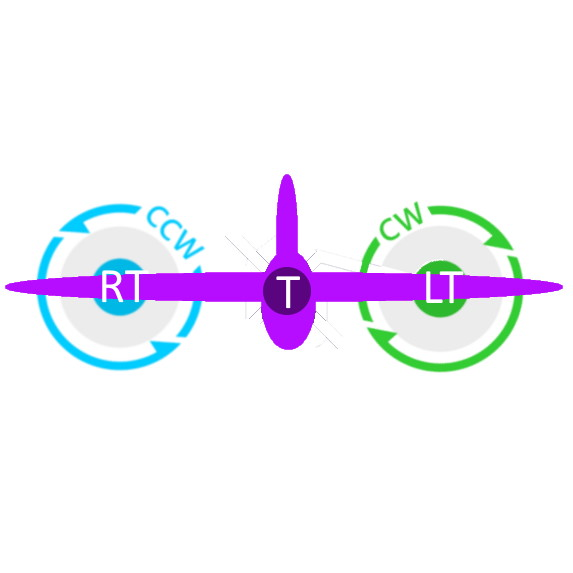
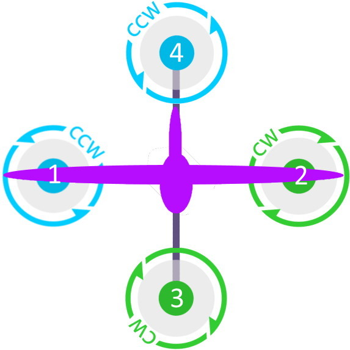
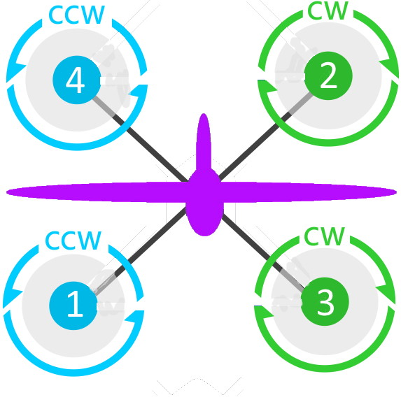
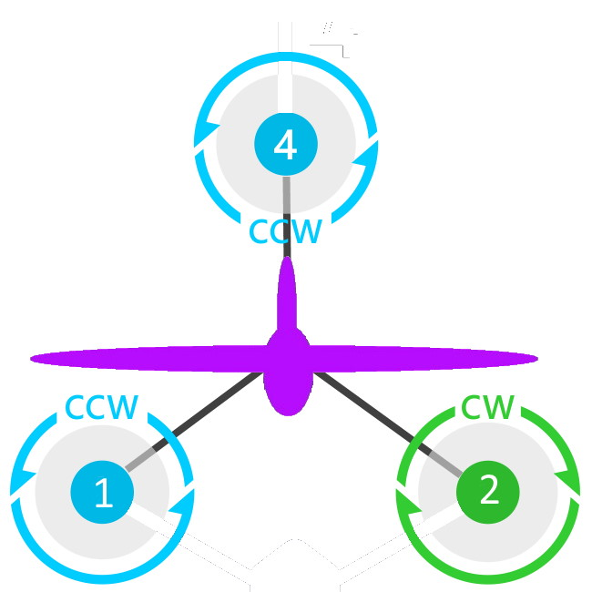

.. _guide-tailsitter:

=================
Tailsitter Planes
=================

In ArduPilot tailsitters are any VTOL aircraft type that rotates the
fuselage (and autopilot) when moving between forward flight and hover.

Despite the name, not all tailsitters land on their tails. Some are
"belly landers", where they lie down flat for landing to improve
takeoff and landing stability in wind. Some may have an undercarriage
for wheeled takeoff and others may have a stand or other landing aid.

All tailsitters are considered types of QuadPlanes in ArduPilot. You
should start off by reading the :ref:`QuadPlane documentation
<quadplane-support>` before moving onto this tailsitter specific
documentation.

Vectored and non-Vectored
=========================

ArduPilot sub-divides tailsitters into two broad categories:

- vectored tailsitters can tilt their rotors independently of the
  movement of the fuselage, giving them vectored thrust
- non-vectored tailsitters have fixed rotor orientation relative to
  the fuselage, and rely on large control surfaces for hover authority

  - Within non-vectored are two sub-categories: Single/Dual Motor and CopterMotor. The first uses one or two motors and can employ only differential thrust , while the second uses three, four, or more motors and operates in a more copter-like fashion.

.. note:: Currently all CopterMotor style Tailsitters do not use any yaw torque control. Roll (with respect to plane body) is only controlled by the flying surface (ailerons or elevons). Future releases will add this.

Tailsitter Configuration
========================

The key parameter to make a  single or dual motor QuadPlane a tailsitter is to set
:ref:`Q_FRAME_CLASS<Q_FRAME_CLASS>` =10. That tells the QuadPlane code to use the tailsitter
VTOL backend.

The tailsitter backend is a bit unusual, as it is the only
:ref:`Q_FRAME_CLASS<Q_FRAME_CLASS>` setting that may not have any multicopter-style motors associated with it. If :ref:`Q_TAILSIT_MOTMX<Q_TAILSIT_MOTMX>` is zero (the default), meaning no multicopter-like motors, it provides roll, pitch, yaw and thrust (Throttle, Throttle Left, Throttle Right) values to the fixed wing control code. These values then control your ailerons, elevons, elevators, rudder and forward motors.

This has a nice benefit when setting up the tailsitter that you can
follow the normal fixed wing setup guide in MANUAL and FBWA modes, and
then when you switch to hover all of your control directions will be
correct.

It also means that you can fly any fixed wing aircraft that is capable
of 3D flight as a single or dual motor tailsitter, and fly it in modes like QSTABILIZE,
QHOVER and QLOITER.

.. youtube:: bMsfjwUAfkM
    :width: 450px

However, it can also have copter-like motors, like a conventional QuadPlane if :ref:`Q_TAILSIT_MOTMX<Q_TAILSIT_MOTMX>` is non-zero. Then this parameter determines which motors remain active in normal forward flight (plane modes). If non-zero, then use the :ref:`Q_FRAME_CLASS<Q_FRAME_CLASS>` and :ref:`Q_FRAME_TYPE<Q_FRAME_TYPE>` parameter to configure the multicopter motor style, and the appropriate MOTORx outputs will be activated.

.. note:: Currently, only the following combinations are supported for CopterMotor tailsitters:

+------------------------+------------------------------------+----------------------------------+
| Motors                 |:ref:`Q_FRAME_CLASS<Q_FRAME_CLASS>` |:ref:`Q_FRAME_TYPE<Q_FRAME_TYPE>` |
+------------------------+------------------------------------+----------------------------------+
|  Quad                  | 1                                  | 0, 1                             |
+------------------------+------------------------------------+----------------------------------+
|  Tri                   | 7                                  | ignored                          |
+------------------------+------------------------------------+----------------------------------+

Motor Rotation and Layout
=========================

(looking down on nose from above)

Single/Dual Motor Tailsitter
----------------------------

Motors are controlled by the Throttle, Throttle Left, Throttle Right outputs:

QUAD PLUS Motor Tailsitter
--------------------------
Motors are controlled by the M1-M4 outputs:

QUAD X Motor Tailsitter
-----------------------
Motors are controlled by the M1-M4 outputs:

Tricopter Tailsitter
--------------------
Motors are controller by the M1/M2/M4 outputs:

.. youtube:: cfqP9-2IWtQ

The key differences between fixed wing flight and hovering for a
tailsitter are:

- when hovering the copter PID gains will be used (the ones starting
  with Q_A_RAT_*)
- when in fixed wing flight the fixed wing PID gains will be used (the
  PTCH2SRV_* and RLL2SRV_* gains)
- when hovering the nose of the aircraft will try to point up for
  "level" flight
- when in fixed wing flight the nose of the aircraft will try to point
  forward for "level" flight
  
:ref:`Q_TAILSIT_RLL_MX<Q_TAILSIT_RLL_MX>` allows the roll limit angle limit to be set differently from
:ref:`Q_ANGLE_MAX<Q_ANGLE_MAX>`. If left at zero both pitch and roll are limited by :ref:`Q_ANGLE_MAX<Q_ANGLE_MAX>`. If :ref:`Q_TAILSIT_RLL_MX<Q_TAILSIT_RLL_MX>` is nonzero roll angle will be limited and pitch max angle will still be :ref:`Q_ANGLE_MAX<Q_ANGLE_MAX>`.
This should be set if your tailsitter can achieve much larger pitch angle than 
would be safe for roll (some airframes can't recover from high-speed knife-edge flight).

:ref:`Q_TAILSIT_ANGLE<Q_TAILSIT_ANGLE>` specifies how far the nose must pitch up or down before a transition is complete:
down for transition from VTOL mode to FW mode, and up for transition from FW to VTOL. 
So a value of e.g. 60 degrees results in switching from copter to plane controller (forward transition) when the nose reaches 30 degrees above the horizon (60 degrees down from vertical). For the back transition, the plane controller would be used until the nose reaches 60 degrees above the horizon. So the larger the value of 
:ref:`Q_TAILSIT_ANGLE<Q_TAILSIT_ANGLE>`, the later the switch from one controller to the other.

:ref:`Q_TRANSITION_MS<Q_TRANSITION_MS>` specifies a timeout for transition from VTOL to FW flight. Even if the angle specified by :ref:`Q_TAILSIT_ANGLE<Q_TAILSIT_ANGLE>` has not been reached before this interval has elapsed, the transition will be considered complete. The timeout for back transitions (from FW to VTOL flight) is hardcoded to 2 seconds.

PID gain scheduling
===================

PID gains can be scaled for fixed wing control surfaces while in VTOL flight modes for Tailsitters by setting ``Q_TAILSIT_THSCMX``.

- If greater than 1: defines the maximum boost that will be applied to the fixed wing control surfaces when throttle is below hover in VTOL modes, this should be reduced if oscillations are seen at low throttle. Default is 5, providing a lot of boost to control surfaces.

- If less than 1: then instead of boosting control surface deflection below hover throttle, deflection is reduced at high airspeeds (if an airspeed sensor is available and enabled) or at high tilt angles and high throttle levels, such as when moving rapdily in QSTABILZE or QACRO mode . The maximum attenuation is currently hardwired to 0.2, so control surface deflection is reduced by a factor of 0.2 when airspeed exceeds :ref:`ARSPD_FBW_MAX<ARSPD_FBW_MAX>`, or if airspeed is not available, when tilt reaches 90 degrees from vertical or at max throttle.

.. _4.1-gainscaling:

In Plane 4.1 and later, the above parameter and gain scheduling is changed to 3 parameters controlling gain scaling via :ref:`Q_TAILSIT_GSCMSK<Q_TAILSIT_GSCMSK>`, which is a 3 bit mask allowing several options:
    - Bit 0 enables gain boost with maximum set by parameter ``Q_TAILSIT_THSCMX``. This is the maximum boost that will be applied to the control surfaces when throttle is below hover, this should be reduced if oscillations are seen at low throttle.
    - Bit 1 enables attitude/throttle based gain attenuation with minimum gain (maximum attenuation) set by parameter :ref:`Q_TAILSIT_GSCMIN<Q_TAILSIT_GSCMIN>`. With this option, control surface deflection is reduced at high tilt angles and high throttle levels to prevent oscillation at high airspeeds.
    - Bit 2 is reserved for future enable of airspeed sensor based gain interpolation .

Orientation
===========

The :ref:`AHRS_ORIENTATION<AHRS_ORIENTATION>`, the accelerometer calibration and AHRS trim
should all be done for fixed wing flight. Fixed wing flight is
considered "normal" orientation for a tailsitter.

Pre-Arm Issues
==============

Due to a issue in DCM related to compass fusion for yaw when pointing straight up, sometimes the AHRS subsystems will disagree when powering up, nose up. Slight errors in compass calibration, while resulting in a successful calibration, may worsen this effect.

The result is that some setups will give a pre-arm failure. Typically it is "Pre-Arm:DCM roll/pitch inconsistent by "x" degrees" or similar. If this happens consistently, then one of two solutions can be used:

- Power up horizontally, and allow the autopilot to begin initialization in this position. After the IMUs tilt initialization is completed (usually in the first ten to fifteen seconds or so), the Tailsitter can be set vertically for the remainder of the initialization (ie after GPS lock and EKF is using the GPS) and then armed.
- Or, if you get the Pre-Arm failure above, lay the Tailsitter down horizontally for 10-30 seconds to allow the various AHRS subsystems to synchronize. After that it can be raised and arming should proceed normally.

Transitions
===========

Tailsitter transitions are a little different than other QuadPlane transitions. 

Transition from VTOL (nose pointing up modes) to Fixed Wing (FW) normal plane modes begins by rotating the nose toward earth horizon and linearly ramping from nose up toward the :ref:`Q_TAILSIT_ANGLE<Q_TAILSIT_ANGLE>` using the VTOL motors and control surfaces. The time is determined by :ref:`Q_TRANSITION_MS<Q_TRANSITION_MS>`  divided by 2. For example, if :ref:`Q_TAILSIT_ANGLE<Q_TAILSIT_ANGLE>` =35, with :ref:`Q_TRANSITION_MS<Q_TRANSITION_MS>` = 5000 (5sec), then the VTOL pitch will change from nose up to -45 deg from vertical over 2.5 seconds. Once the nose has reached  :ref:`Q_TAILSIT_ANGLE<Q_TAILSIT_ANGLE>` degrees from vertical , transition to FW is complete, the vehicle will switch from the VTOL controller to the FW controller and all motors will be on. The AHRS horizon will switch from VTOL reference (where approximately nose vertical is "level") to the FW reference (where "level" is usually close to the horizon).

Transitioning back to VTOL from FW will immediately switch the active motors to VTOL hover throttle, and rotate the vehicle nose up toward :ref:`Q_TAILSIT_ANGLE<Q_TAILSIT_ANGLE>` + 5  degrees (with 55 degrees nose up being the minimum target) from the horizon using the control surfaces while under fixed wing stabilization. Transition will be complete when this :ref:`Q_TAILSIT_ANGLE<Q_TAILSIT_ANGLE>` is reached, or when 2 seconds has elapsed. The vehicle will then be in full VTOL mode with the AHRS horizon reference switched to approximately vertical, and all VTOL motors active.

.. note:: During transitions, pilot input is disabled and vehicle attitude is controlled totally by the autopilot.

Vectored Thrust
===============

If your tailsitter has vectored thrust then you should set the
SERVOn_FUNCTION values for your two tilt servos for the left and right
motors and for the left and right motor throttles.

.. note:: All tailsitters ignore the :ref:`Q_TILT_TYPE<Q_TILT_TYPE>` parameter, requiring continuous output servos, and will drive the tilt servos appropriately.

For example, if your left tilt servo is channel 5 and your right tilt
servo is channel 6, then set:

- :ref:`SERVO5_FUNCTION<SERVO5_FUNCTION>` =75
- :ref:`SERVO6_FUNCTION<SERVO6_FUNCTION>` =76

and you need to assign left throttle to the left motor and right throttle to the right motor, for example using the SERVO 7 and SERVO 8 outputs, for left and right motor escs, respectively:

- :ref:`SERVO7_FUNCTION<SERVO7_FUNCTION>` =73
- :ref:`SERVO8_FUNCTION<SERVO8_FUNCTION>` =74

you also need to set the right SERVOn_REVERSED values, and the right
SERVOn_TRIM, SERVOn_MIN and SERVOn_MAX values, as appropriate.

:ref:`Q_A_ANGLE_BOOST<Q_A_ANGLE_BOOST>` should be disabled for vectored thrust tailsitters. Failure to disable this will cause the throttle to decrease as the nose dips, making the nose dip even further and resulting in a crash. 

.. caution:: When disarmed, switching to QHOVER or QLOITER will force the motors forward into fixed wing orientation. If armed in this position, a prop strike could occur for Belly Sitter configurations. Tilt will be raised to VTOL position when throttle is raised above idle, but the strike will have already occurred. The solution is to momentarily raise the throttle above idle, allowing the tilts to raise, return throttle stick to idle, then arm. This needs to be done also for AUTO mode takeoffs, which should be started from QSTABILIZE with motors raised, armed, and then change to AUTO for the takeoff.

Vectored Gains
==============

There are two vectoring gains available. One controls the amount of
vectored thrust movement in hover, and the other controls the amount
of vectored thrust movement in forward flight.

The :ref:`Q_TAILSIT_VHGAIN<Q_TAILSIT_VHGAIN>` parameter controls vectored thrust in hover. A
typical value is around 0.8, which gives a lot of control to vectored
thrust in hover. This control is combined with control from your
elevon mixing gain (controlled by :ref:`MIXING_GAIN<MIXING_GAIN>` ).

The :ref:`Q_TAILSIT_VFGAIN<Q_TAILSIT_VFGAIN>` parameter controls vectored thrust in forward
flight. A typical value is around 0.2, which gives a small amount of
control to vectored thrust in forward flight. This control is combined
with control from your elevon mixing gain (controlled by :ref:`MIXING_GAIN<MIXING_GAIN>`).

By adjusting the relative values of :ref:`Q_TAILSIT_VHGAIN<Q_TAILSIT_VHGAIN>`, :ref:`Q_TAILSIT_VFGAIN<Q_TAILSIT_VFGAIN>`
and :ref:`MIXING_GAIN<MIXING_GAIN>` you can adjust how much control you have from elevons
and thrust vectoring in each flight mode.

.. youtube:: s2KLOAdS_HY
    :width: 100%

Tailsitter Input
================

You can change how control inputs while hovering a tailsitter will be
interpreted using the :ref:`Q_TAILSIT_INPUT<Q_TAILSIT_INPUT>` parameter. The choices are:

- :ref:`Q_TAILSIT_INPUT<Q_TAILSIT_INPUT>` =0 means that in hover the aircraft responds like a
  multi-rotor, with the yaw stick controlling earth-frame yaw, and
  roll stick controlling earth-frame roll. This is a good choice for
  pilots who are used to flying multi-rotor aircraft.

- :ref:`Q_TAILSIT_INPUT<Q_TAILSIT_INPUT>` =1 means that in hover the aircraft responds like a
  3D aircaft, with the yaw stick controlling earth-frame roll, and roll
  stick controlling earth-frame yaw. This is a good choice for pilots who
  are used to flying 3D aircraft in prop-hang, but is not very useful
  when flying around, due to the earth-frame multicopter control inputs.

- :ref:`Q_TAILSIT_INPUT<Q_TAILSIT_INPUT>` =2 and 3 mean that the aircraft responds like a 3D aircraft
  with the yaw stick controlling earth-frame yaw and the roll stick controlling
  body-frame roll when flying level. When hovering, these options behave the same
  as types 0 and 1, respectively. This is accomplished by splitting the roll and
  yaw command inputs into bodyframe roll and yaw components as a function of Euler pitch.

.. note:: Due to the rotation of the tailsitter body frame with respect to the multicopter body frame, the roll limits are set by parameter :ref:`Q_YAW_RATE_MAX<Q_YAW_RATE_MAX>` (in degrees), and the yaw rate limits are set by parameter :ref:`Q_TAILSIT_RLL_MX<Q_TAILSIT_RLL_MX>` (in deg/sec).  The pitch limit is set by parameter :ref:`Q_ANGLE_MAX<Q_ANGLE_MAX>` (in centidegrees), and this also serves as the yaw rate limit if :ref:`Q_TAILSIT_RLL_MX<Q_TAILSIT_RLL_MX>` is zero. If any rate limit is too high for the airframe, you may experience glitches in attitude control at high rates.

.. note:: :ref:`Q_TAILSIT_INPUT<Q_TAILSIT_INPUT>` is ignored in QACRO modes. All inputs are body-frame referenced.

Tailsitter Input Mask
=====================

To support people flying 3D aircraft and wanting to learn how to
prop-hang manually, you can set the :ref:`Q_TAILSIT_MASK<Q_TAILSIT_MASK>` to a mask of
channels that will have full manual input control while hovering.

The mask of manual channels is enabled using a transmitter input
channel, specified with the :ref:`Q_TAILSIT_MASKCH<Q_TAILSIT_MASKCH>` parameter.

For example, if you are learning how to fly 3D aircraft, and you want
some assistance learning how to best control the rudder, then you can
set:

- :ref:`Q_TAILSIT_MASK<Q_TAILSIT_MASK>` =8 (for rudder)
- :ref:`Q_TAILSIT_MASKCH<Q_TAILSIT_MASKCH>` =7

then when channel 7 goes above 1700 the pilot will be given full
manual control of rudder when hovering. This provides good 3D piloting
practice on one or more axes at a time.
  
Center of Gravity
=================

The center of gravity for a tailsitter is important in an extra
dimension. When hovering it is important that there is not too much
weight in the belly of the plane or on its back, so that it leans
forward or back. This is particularly important for non-vectored
tailsitters.
