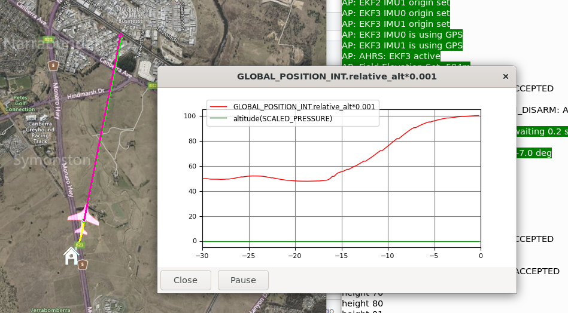

.. _guided-mode:

===========
GUIDED Mode
===========

GUIDED mode is used when you want the aircraft to fly to a specific
point on the map, or in specific direction (heading) without setting up a mission. 

GUIDED mode is also used when an external controller such as Lua on the AutoPilot, 
or ROS2 or a Python system using pymavlink control the aircraft by sending MAVLink 
"guide slew" commands.

The other major use for GUIDED mode is in :ref:`geo-fencing <geofencing>`.
When the geo-fence is breached the aircraft will enter GUIDED mode, and
head to the predefined geo-fence return point, where it will loiter
until the operator takes over.

Location sub-mode
-----------------
Most ground control
stations support a "click to fly to" feature where you can click a point
on the map and the aircraft will fly to that location then loiter. If an 
altitude is requested, the aircraft will try to achieve the target altitude as it flies,
and will loiter down or up to the requested altitude once it arrives, if required. 

This image shows the path of a plane that has been requested to fly to a specific location
with a target altitude of 100m. The climb starts immediately, 100m is reached well before destination. 
Note that if its a climb it will climb as fast as possible, whereas a descent will glide such that 
it reaches the destination and the altitude at the same time.

This sub-mode can also be requested via MAVLink using the DO_REPOSITION command.

Heading/Altitude sub-mode
-------------------------
This mode is used when sending Guided Slew Commands.

The guided mode heading feature isn't supported by Mission Planner or QGroundControl, but can be
requested via MAVLink commands or using Lua. If the aircraft receives a `GUIDED_CHANGE_HEADING <https://mavlink.io/en/messages/common.html#GUIDED_CHANGE_HEADING>`__
command it will fly indefinitely towards the heading in degrees. 

The target altitude and desired speed of the vehicle to fly at can be set using the `GUIDED_CHANGE_ALTITUDE <https://mavlink.io/en/messages/common.html#GUIDED_CHANGE_ALTITUDE>`__
and `GUIDED_CHANGE_SPEED <https://mavlink.io/en/messages/common.html#GUIDED_CHANGE_SPEED>`__ MAVLink commands. 

- If the aircraft is flying in Guided "Heading sub-mode" then it will try to achieve the altitude as it flies, as there is no "end point" to a heading target for a final loiter.
- If airspeed is requested, the vehicle will attempt to achieve the requested airspeed
- If groundspeed is requested the minimum groundspeed will be set to this value, but the plane could fly faster.

Attitude Overrides
------------------
Attitude Overrides is a lower level control of the aircraft, an external control system (or Lua running on the board) can command roll, pitch, yaw, and throttle overrides. 
These overrides take priority over other GUIDED mode directions.

Attitude overrides are commanded using MAVLink `SET_ATTITUDE_TARGET <https://mavlink.io/en/messages/common.html#SET_ATTITUDE_TARGET>`__

MAVLink Commands
----------------------------
More information can be found on this page :ref:`plane-commands-in-guided-mode`