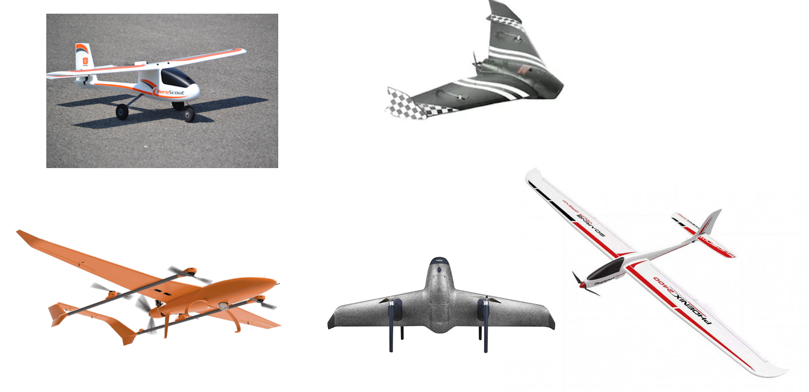

.. _introduction:

=====================
Introduction to Plane
=====================

Plane is an advanced open-source autopilot firmwware system for conventional planes, flying wings, and VTOL capable QuadPlanes.  It offers a :ref:`wide variety of flight modes <flight-modes>` from fully manual to fully autonomous.

As part of the wider ArduPilot software platform it works seamlessly with a variety of :ref:`Ground Control Station programs <common-GCS>` that are used to setup the vehicle, monitor the vehicle's flight in real-time and perform powerful mission planning activities.
It also benefits from other parts of the ArduPilot ecosystem, including simulators, log analysis tools, and higher level APIs for vehicle control.

ArduPilot is already a preferred software platform for numerous commercially available autopilot systems but you can also use it to enhance the abilities of your own DIY planes or convert normal RC only systems into fully featured autonomous aircraft.

Please do not be tempted to skip over steps and rush into flight. This
is robotics and aviation combined -- both of which are quite complex on
their own. Take some time to become familiar with documentation.
Follow the steps patiently, and you will get your vehicle safely up in
the air.

- :ref:`Selecting an autopilot controller for your system <common-autopilots>`
- :ref:`First Time Setup <arduplane-setup>`- Installing: hardware, software, and
   firmware. Plugging in: Sensors, radios, batteries, motors, etc.
-  :ref:`Configuration <plane-configuration-landing-page>`- Designate control outputs for flying surfaces. Establish
   telemetry and control between: vehicle, ground-station, and RC-control
   transmitter. Set up flight modes, program failsafe behavior,
   calibrate sensors and motor-controllers, and verify correct motor
   operation.
-  :ref:`First Flight and Tuning <first-flight-landing-page>`- First test flight and tuning stabilization, and speed/height controller
-  :ref:`Mission planning <common-mission-planning>` - Programming missions.

.. warning::

   **The topic of safety should be foremost on your mind.**

   **Autonomous vehicles are high-energy systems driving
   rotating blades -- you are in charge of these potential hazards.**

.. note::

   *ArduPilot supported autopilots and peripherals are designed to easily integrate with most standard RC
   aircraft, from simple high-wing trainers to high-speed swept wing
   fighters and flying wings, to QuadPlane . If you
   have something out of the ordinary please assume that a bit more
   tuning will be required to get things dialed in.*

Vehicle Configuration Types
===========================

- Aileron/Elevator/Rudder/Throttle Conventional Planes both as TailDraggers or Tricycle Gear
- Elevon based flying wings
- V-Tail rudder/elevator control
- Differential Aileron/Spoiler Flap
- QuadPlane VTOL
   - SLT - fixed wing motor plus separate VTOL motors 
   - Tilt-Rotors - which tilt motors from vertical for VTOL to horizontal for fixed wing operation
   - Tailsitters - which takeoff and land with the nose vertical instead of horizontal

Flight Features
===============

Plane has many advanced and complex features such as Automatic Takeoffs and Landings, Commercial Aircraft Avoidance, GeoFencing, Terrain Following, Moving Ship Takeoffs and Landings, Autonomous Soaring and Aerobatics. See :ref:`flight-features` for more information.

All of us involved with this project care a great deal about the privacy
and safety of those whom we share this planet with. Please be a good
steward of this technology. It is the product of many evenings and
weekends, we make it available for benevolent use.
