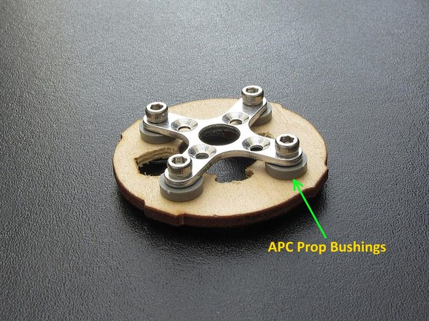

.. _minitalon-build:

===============================================================================================
`A Long Range FPV Plane <https://diydrones.com/profiles/blogs/100-km-in-the-x-uav-mini-talon>`_
===============================================================================================

Overview
========

Among hobbyists, the X-UAV MiniTalon has become one of the most popular FPV Plane platforms due to its excellent flying characteristics and high efficiency flight. Durations of greater than 1 hour are easily obtained, with durations exceeding 2X that possible with easily obtained components.

It is capable a relatively high load capacity, allowing it to carry HD video cameras, on fully stabilized gimbles for long duration flights. And configured as a basic FPV plane it is also very manuerable and sporty.

This guide illustrates some general building tips, as well as a basic Arduplane configuration for an FPV plane.

Many of the photos and descriptions are borrowed from Mark QVale's `website <https://itsqv.com>`_. which shows many other configurations, tips, and 3D printed parts, including many gimbles, for the MiniTalon. An `RCG thread <https://www.rcgroups.com/forums/showthread.php?2043439-Talon-MINI-FPV-plane-official-thread>`_ also has extensive information on variations.

The MiniTalon also leads itself well to `QuadPlane applications <https://mozzie.readthedocs.io/en/latest/Overview.html>`__.

.. image:: ../images/MT-quadplane.jpg
    :target: ../_images/MT-quadplane.jpg

General Specifications
======================

+--------------------+-----------------------+
|Wingspan            |  1300mm               |
+--------------------+-----------------------+
|Length              |  830mm                |
+--------------------+-----------------------+
|Weight              |  1450 - 1900gm        |
+--------------------+-----------------------+
|Battery             |  4s 5000mah- 10000mah |
+--------------------+-----------------------+
|Duration            |  60-120min            |
+--------------------+-----------------------+
|Efficiency          |  <80mah/km            |
+--------------------+-----------------------+

Parts List
==========

#. Airframe: X-UAV MiniTalon RC Plane Kit
#. Motor: Cobra 2221-16 940KV or SunnySky 2216 1450KV
#. ESC: 40-60A, no BEC required
#. Prop: APC-E or Aeronaut folding 9X7 for Cobra, 8x6 for Sunnysky motor
#. Servos: 4- 9g to 12g mini servos. EMAX ES08MA, for example.
#. Autopilot: MatekF405-Wing
#. GPS: Any UBLOX MN-8 class GPS with or without compass (Compass is optional). BN-220 is an example.
#. Receiver: Any 6 Channel TX/RX system. For long range, 433 or 900 Mhz systems (Dragonlink, TBS, etc.) are appropriate, short range 2.4GHz (FRSky, Futaba, Spektrum,etc.).
#. Telemetry (optional): 3DR or  radio systems, or via the receiver if it has that capability, like Dragonlink (bi-directional) or FRSky (downlink only).
#. Battery: A 4s 5200mah 10C Lipo will give 45-60 minute duration and fit the general layout for easy CG (Center-of-Gravity) placement.
#. FPV Equipment: A miniature video camera and video transmitter are required (if FPV capability is desired, the plane can be flown only line-of-sight, and still fly autonomous missions using a GCS (ground control station) only, if desired. See FPV Equipment section below for suggestions.

Assembly Tips
=============

The instructions for building the MiniTalon are straightforward, however, a few tips are shown below that will help.

Fuse Prep & Glue
----------------

For gluing EPO foam, use Beacon Foam-Tac or E6000 which works very well and it sets fairly quickly. To prepare the pieces, always wash all surfaces of all parts in hot water with a small amount of dish soap to get rid of any mold release agents. Next, do a wipe down with denatured alcohol and finally a light sand on the glue surfaces with #100 grit sandpaper.

Before gluing the fuselage halves, set up the motor mount plate with APC prop bushings and 3mm blind nuts to get the motor off the wood for better cooling.

After gluing in the motor mount, glue in the center structure. Optionally, add some cable guides to each side and some velcro lock to hold the Receiver. The center structure does not come with a floor in the kit to allow mounting the autopilot. Either add a ply plate to the bottom, or 3D print one of Mark Qvale's mounting plates from his `website <https://itsqv.com>`_.

Optional Front Skid
-------------------

The kit comes with a front wheel. This breaks quickly, so its suggested that it not be used. Either tape the area with re-enforced packing tape or 3D print or fabricate a ply skid as shown below.

Coating the tail skid with re-enforced tape will also increase its life.

Vtail Servo Linkage
-------------------

The provides straight pushrods to the Vtail surfaces. However, there is high miss-alignment caused by the stock geometry which puts the linkage at an angle to the control surface. The linkage, as provided will work reliably, however, to reduce strain and any possibility of wear, you can use a ball-link as shown below.

Power Train
===========

Its important to keep the leads from the autopilot's ESC power terminals short (<4-5inchs)to the ESC. If long leads are unavoidable, you will need to add low-ESR capacitors to the ESC input to prevent possible damage. Some ESCs already have these capacitors.

Long leads from the ESC to the motor are acceptable.

Increased efficiency will be obtained if the ESC is programmed to brake hard when gliding. A folding propeller also helps.

Folding Prop Stopper
--------------------

If an Aeronaut or other folding prop is used to improve efficiency, it will require a prop stopper. A 3d printed design is available on Mark Qvale's `website <https://itsqv.com>`_.

Component placement
===================

The images below illustrate the typical component placement.

As shown, the GPS and Telemetry connections are compatible with the serial port defaults loaded when the firmware for the Matek autopilot is programmed.

The SERVOx_FUNCTIONS will have to be set such that the following is assigned:

+--------------------+------------------------------------------------------------+
|  :ref:`SERVO1_FUNCTION<SERVO1_FUNCTION>`   |  Throttle                          |
+--------------------+------------------------------------------------------------+
|  :ref:`SERVO3_FUNCTION<SERVO3_FUNCTION>`   |  Both Ailerons via Y-servo cable   |
+--------------------+------------------------------------------------------------+
|  :ref:`SERVO4_FUNCTION<SERVO4_FUNCTION>`   |  VTail Left                        |
+--------------------+------------------------------------------------------------+
|  :ref:`SERVO5_FUNCTION<SERVO5_FUNCTION>`   |  VTail Right                       |
+--------------------+------------------------------------------------------------+

.. tip:: If the aileron servos are  attached to separate PWM outputs the :ref:`flaperons<flaperons-on-plane>` function can be implemented. However, since the MiniTalon does not use full length ailerons, the flap effect will be limited and can even be detrimental, causing increased sensitivity to "tip stalls".

If an LRS (Long Range RC System) is utilized, mounting the antenna is critical to achieving maximum distance. Most LRS systems use a dipole. Shown below is a 3d printed mount that assures that both elements are vertical. Any method that assures that the dipole is mounted vertically will be satisfactory.

Configuration/Parameter Setup
=============================

See :ref:`FPV Plane <basic-setup>` for information on software setup.

FPV Equipment
=============

Choices for FPV cameras and transmitters are numerous and increase daily. Be sure that both camera and video transmitter can operate at 9V, since the MatekF405-Wing autopilot provides this supply for video. Optionally, the video supply can be changed from 9V to 12V via a solder jumper on the back of the autopilot.

For long range operation, the video transmitter should operate on 1.2Ghz or 1.3Ghz . For distances of 2Km or less, 5.8GHz transmission is usually used.

No external OSD (On Screen Display) is required since the MatekF405-Wing has it integrated.

See the :ref:`FPV information page <common-fpv-first-person-view>`.

Options
=======

Airspeed Sensor
---------------

With the additional of a digital airspeed sensor, precision airspeed control can be obtained during cruise portions of flight, and can be attached to the MatekF405-Wing autopilot's CL1/DA1 or CL2/DA2 pins. However, this is optional and ArduPlane flies extremely well without this addtion. See the :ref:`Airspeed sensor <airspeed>` section for more information.

Compass
-------

Similarly, a compass can be added by attaching to the autopilot's CL1/DA1 or CL2/DA2 pins. This is also optional and provides marginally better navigation tracking in CRUISE and AUTO modes.

Gimbles
-------

Many options exist for mounting either an HD recording camera and/or the flight video camera to a pan/tilt controllable mount. In addition, these gimble mounts can even be stabilized in one or more axis. to provide cinema-like stability. Mark Qvale's `website <https://itsqv.com>`_ has many examples and versions.

 .. tip:: It is usually not a good idea to have the flight camera mounted on a stabilized mount since the operator will lose the feedback of the plane's attitude while flying.

3D Printed Accessories
----------------------

Many 3D printable accessories/parts are available on Mark Qvale's `website <https://itsqv.com>`_

Videos
======

.. youtube:: dbKKwzUK5e4
   :width: 100%

.. youtube:: xQ94GDo4Sfg
   :width: 100%

if link above does not work, try `this direct link to video <https://youtu.be/xQ94GDo4Sfg>`__.
