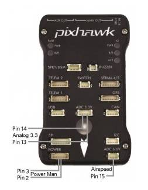
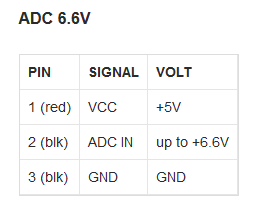
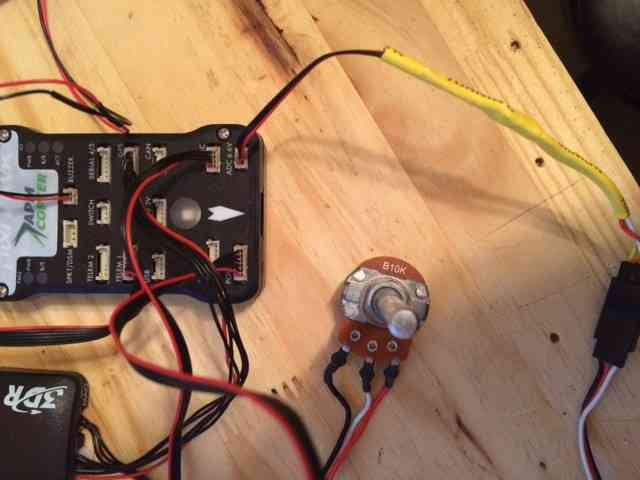
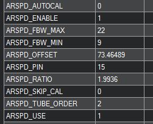

.. _mocking-an-airspeed-sensor-for-bench-testing:

============================================
Mocking an Airspeed Sensor for Bench Testing
============================================

This article explains how you can use a potentiometer with Pixhawk in
order to simulate the input from an Airspeed Sensor. This is very useful
for ground testing.

Overview
~~~~~~~~

If your aerodynamic surfaces (i.e. auto flaps, ailerons, elevators,
elevons, etc.) are geared or actuated with airspeed, it may be helpful
to ground test them on your aircraft by sending Pixhawk a specific
airspeed.

On Pixhawk you can plug a potentiometer into ADC 6.6v (pin 15) or ADC
3.3v (pin 11). If you are using an I2C :ref:`airpseed <airspeed>` sensor
you will temporarily configure your autopilot to use the analogue port.

Required parts
~~~~~~~~~~~~~~

You will need this `DF-13 cable <http://store.jdrones.com/cable_df13_3pin_25cm_p/cbldf13p3c25.htm>`__,
and a simple `potentiometer like this <https://www.sparkfun.com/products/9939>`__ or
`this <http://hobbyking.com/hobbyking/store/__39510__Potentiameter_Round_Pot_Turnigy_9XR_Transmitter_3set_.html>`__.
Either a B10K and B5K potentiometer can be used to set speed from 0 to as much as 90 m/s.

Pixhawk Configuration and Settings
~~~~~~~~~~~~~~~~~~~~~~~~~~~~~~~~~~

Once the DF 13 cable is connected to the potentiometer, plug it into the
:ref:`ADC 6.6v port <common-pixhawk-overview_pixhawk_analog_input_pins>`.
Open your Ground Control Station (GCS) of choice, and change the
``ARSPD_PIN`` parameter to Pin "**15"** as shown below.

Reboot your Pixhawk to allow this parameter change to have an effect.
Airspeed will reset to 1-3 m/s after the restart and
initialization is complete. Adjust the pot to set your desired speed.

.. note::

   If you are using an I2C airspeed sensor - *remember to re-enable it!*
   Set the ``ARSPD_PIN``
   parameter to 65, and cycle the Pixhawk power to ensure the I2C airspeed
   properly initializes. Check you get the normal 1-3 m/s noise on the
   airspeed display.
