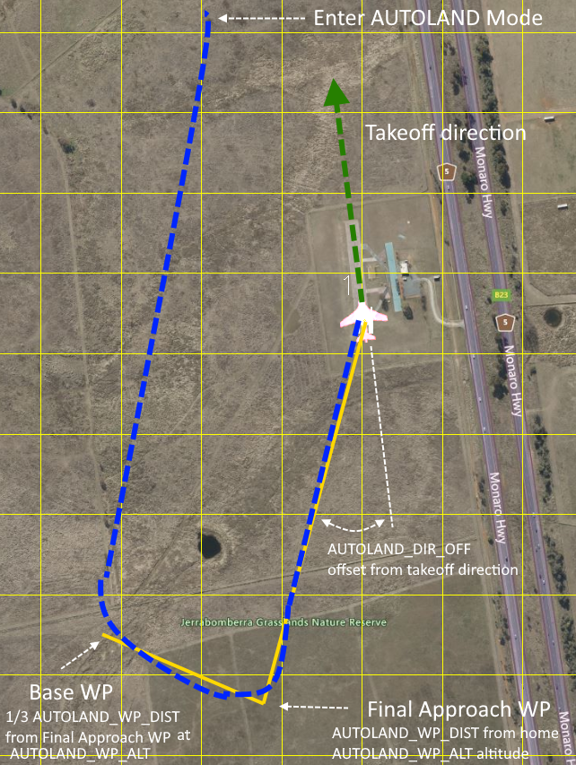

.. _mode_autoland:

=============
AUTOLAND Mode
=============

AUTOLAND mode provides a fully automatic fixed wing landing which can also be used as an RC failsafe action.

In Mode Takeoff or during a NAV_TAKEOFF in AUTO, the takeoff direction will be captured from the GPS ground course once a GPS ground speed of 5m/s is obtained. This usually occurs early in the takeoff run of a rolling takeoff or almost immediately during a hand or bungee launch.

It will setup a parameterized base leg and final approach waypoint/altitude, based on the takeoff direction, and proceed to it and switch to an automatic landing at home. It can also be selected as a :ref:`FS_LONG_ACTN<FS_LONG_ACTN>` for RC failsafes.

This is useful when programming a mission with a ``DO_LAND_START`` landing sequence is not convenient since it requires a GCS on a laptop or phone, such as traveling with impromptu stops to fly FPV or photograph. Simply use Mode TAKEOFF or a simple loaded before travel with a ``NAV_TAKEOFF`` waypoint. It is also useful for fields which have varying wind directions, which would prevent using a single home-loaded autolanding mission or require using the MissionSelector LUA script to slect from several missions with different approaches.

Operation
=========
To use simply make an automatic takeoff and at any point later switch into AUTOLAND. A final approach waypoint will be created behind the HOME landing target at :ref:`AUTOLAND_WP_DIST<AUTOLAND_WP_DIST>` (400m by default) at :ref:`AUTOLAND_WP_ALT<AUTOLAND_WP_ALT>`  (55m by default)using the takeoff direction plus :ref:`AUTOLAND_DIR_OFF<AUTOLAND_DIR_OFF>` ("0" default) and land using all the parametrics of a normal autolanding. A base leg to the final approach waypoint is also created at the same altitude and 1/3 :ref:`AUTOLAND_WP_DIST<AUTOLAND_WP_DIST>` from the final approach waypoint as shown below:

``LAND`` parameter defaults are usually acceptable for most planes in the 1-2m wingspan, <2kg class) and should yeild a safe, if not optimally tuned, autolanding. ``LAND`` parameters can be optimized with test flights (See :ref:`automatic-landing`).

Notes:
======

- Switching out of AUTOLAND to another mode aborts the landing and returns control to that new mode.
- Throttle aborts of the final landing sequence are not supported. (:ref:`LAND_ABORT_THR<LAND_ABORT_THR>`)
- If the plane has taken off not using either Mode Takeoff or NAV_LAND, the mode cannot be entered since the takeoff direction has not been captured. If it is selected as a long failsafe action ("5"), :ref:`FS_LONG_ACTN<FS_LONG_ACTN>`, it will switch to normal RTL instead of AUTOLAND on failsafe, in this case.
- The mode co-exists with any mission autolanding sequence, which can be used in AUTO mode, or with :ref:`RTL_AUTOLAND<RTL_AUTOLAND>`.
- QuadPlanes cannot use this mode unless :ref:`Q_OPTIONS<Q_OPTIONS>` bit 2 (ALLOW_FW_LAND) is set and a Mode Takeoff or AUTO NAV_TAKEOFF has been used.
