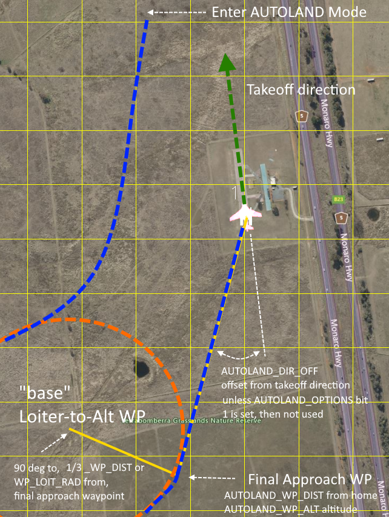

.. _mode_autoland:

=============
AUTOLAND Mode
=============

AUTOLAND mode provides a fully automatic fixed wing landing which can also be used as an RC failsafe action.

In TAKEOFF, FBWA, MANUAL, TRAINING, ACRO,  STABILIZE modes, and during a NAV_TAKEOFF in AUTO, the takeoff direction will be captured from the GPS ground course once a GPS ground speed of 5m/s is obtained. This usually occurs early in the takeoff run of a rolling takeoff or almost immediately during a hand or bungee launch.

It will setup a parameterized LOITER-TO-ALT base waypoint and final approach waypoint/altitude, based on the takeoff direction, and proceed to it, loiter down in altitude if required, and then switch to an automatic landing at home. It can also be selected as a :ref:`FS_LONG_ACTN<FS_LONG_ACTN>` for RC failsafes.

This is useful when programming a mission with a ``DO_LAND_START`` landing sequence is not convenient since it requires a GCS on a laptop or phone, such as traveling with impromptu stops to fly FPV or photograph. Simply takeoff in one of the previously mentioned modes and the AUTOLAND will be setup. It is also useful for fields which have varying wind directions, which would prevent using a single home-loaded autolanding mission or require using the MissionSelector LUA script to select from several missions with different approaches.

Upon entry, an optional minimum climb before turn can be programmed, which can be useful if it is used for RC failsafe when this occurs during takeoff to climb to an altitude to clear obstacles before turning toward the landing approach.

If :ref:`TERRAIN_FOLLOW<TERRAIN_FOLLOW>` is set to 1 or "AUTOLAND", then the vehicle will terrain follow as it flies to the LOITER-TO-ALT base waypoint.

Operation
=========
To use simply make a takeoff and at any point later switch into AUTOLAND. A final approach waypoint will be created behind the HOME landing target at :ref:`AUTOLAND_WP_DIST<AUTOLAND_WP_DIST>` (400m by default) at :ref:`AUTOLAND_WP_ALT<AUTOLAND_WP_ALT>`  (55m by default)using the takeoff direction plus :ref:`AUTOLAND_DIR_OFF<AUTOLAND_DIR_OFF>` ("0" default) and land using all the parametrics of a normal autolanding. A loiter to alt waypoint tangential to the final approach waypoint is also created at the same altitude and at 1/3 :ref:`AUTOLAND_WP_DIST<AUTOLAND_WP_DIST>` or :ref:`WP_LOITER_RAD<WP_LOITER_RAD>`, whichever is smaller, from the final approach waypoint as shown below:

``LAND`` parameter defaults are usually acceptable for most planes in the 1-2m wingspan, <2kg class) and should yeild a safe, if not optimally tuned, autolanding. ``LAND`` parameters can be optimized with test flights (See :ref:`automatic-landing`).

Options
=======

The :ref:`AUTOLAND_OPTIONS <AUTOLAND_OPTIONS>` bitmask provides optional behavior. Currently, if bit 0 is set, then instead of capturing takeoff direction( and therefore autolanding direction), the landing direction will be captured immediately at arming if a compass is being used. This allows the direction to be set "manually" by orienting the plane at homw in the desired landing direction and arming. The  :ref:`AUTOLAND_DIR_OFF<AUTOLAND_DIR_OFF>` parameter is ignored in this case.

A minimum climb of :ref:`AUTOLAND_CLIMB<AUTOLAND_CLIMB>` can be set, during which navigation (roll) is limited to :ref:`LEVEL_ROLL_LIMIT<LEVEL_ROLL_LIMIT>`. If AUTOLAND is being used as a :ref:`FS_LONG_ACTN<FS_LONG_ACTN>`, then setting this to allow clearing takeoff obstacles to the sides is recommended.

Notes:
======

- Switching out of AUTOLAND to another mode aborts the landing and returns control to that new mode.
- Throttle aborts of the final landing sequence are not supported. (:ref:`LAND_ABORT_THR<LAND_ABORT_THR>`)
- If the plane has taken off not using the aforementioned modes, the mode cannot be entered since the takeoff direction has not been captured. In these cases, if it is selected as a long failsafe action ("5"), :ref:`FS_LONG_ACTN<FS_LONG_ACTN>`, it will switch to normal RTL instead of AUTOLAND on failsafe.
- The mode co-exists with any mission autolanding sequence, which can be used in AUTO mode, or with :ref:`RTL_AUTOLAND<RTL_AUTOLAND>`.
- QuadPlanes cannot use this mode.
