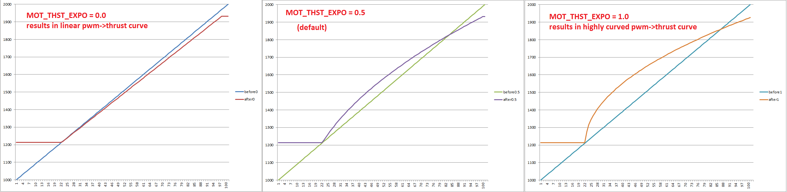

.. _motor-thrust-scaling:

====================
Motor Thrust Scaling
====================

QuadPlane includes *motor thrust scaling* which compensates for the
non-linear thrust output of most ESCs and motors. 

.. tip::

    The default curve should work for nearly all ESC/motor combinations. 
    Normally the parameters should not be adjusted unless the vehicle’s actual 
    thrust curve has been measured.

Thrust Curves
=============

The curve is controlled by two parameters:

-  :ref:`Q_M_THST_EXPO<Q_M_THST_EXPO>` controls the shape of the thrust curve with "0"
   meaning a completely linear curve and "1.0" being very curved (see
   pictures below).  The default is "0.65" (the image below incorrectly
   states the default is 0.5).

-  :ref:`MOT_SPIN_MAX<MOT_SPIN_MAX>` controls the point at which the thrust flattens
   out near its maximum.  This is fixed at 0.95, meaning 95% of full
   throttle.

Thrust Stands
=============

The thrust stands listed below can be used to measure the PWM signal vs thrust output for a vehicle's specific motor, esc and battery

- `RCbenchmark.com thrust stands <https://www.rcbenchmark.com/pages/series-1580-thrust-stand-dynamometer>`__
- `Turnigy thrust stand <https://hobbyking.com/en_us/turnigy-thrust-stand-and-power-analyser-v3.html>`__

Parameter Calculation
=====================

A copy of `this spreadsheet <https://docs.google.com/spreadsheets/d/1_75aZqiT_K1CdduhUe4-DjRgx3Alun4p8V2pt6vM5P8/edit#gid=0>`__ can be used to calculate the appropriate values from the thrust stand data above.

