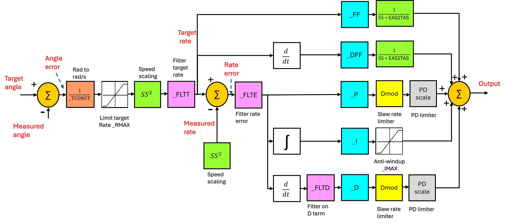

.. _new-roll-and-pitch-tuning:

=====================================
Roll, Pitch and Yaw Controller Tuning
=====================================

As of versions 4.1 and later, the PID controllers have significantly changed, as well as the algorithm used for :ref:`Autotuning <automatic-tuning-with-autotune>`, although the procedure remains almost identical as in the past.

Except for very heavy, slow, or extremely nimble vehicles, Autotune should produce very acceptable results. Manual tuning should be reserved for vehicles that do not fly well after Autotune has been done.

.. note::

   The default values for the roll and pitch controllers in Plane prior to Autotuning are quite deliberately a bit small for
   most aircraft. This is because small values will cause ArduPilot to not
   navigate as well and be sluggish, but are less likely to cause the aircraft
   to crash.

.. note:: If you upgrade to 4.1 or later firmware from a previous version, the existing PID values will be converted automatically to the new system. Re-autotuning is still recommended as the new AUTOTUNE system produces a better tune in most cases. If you wish to manually convert your old PID values to the new system's values, you can use this `web based converter <https://uav.tridgell.net/convert_pid.html>`__

.. note:: as of firmware version 4.2, there is a new YAW controller which can be used in ACRO mode (previous versions had no YAW rate stabilization in ACRO mode). This controller can be AutoTuned just like roll and pitch during an AutoTuning session using AUTOTUNE mode or RCx_OPTION = 107 on a switch.

Preconditions
=============

The following instruction assume that:

-  Your model is trimmed appropriately on the bench, usually neutral on ailerons and neutral or a bit of up elevator
-  You have done your radio calibration
-  You have calibrated your airspeed sensor, if present.
-  You have set the airspeed parameters (See :ref:`airspeed-parameters-setup`), even if not using an airspeed sensor.
-  You have leveled the autopilot
-  You have set your autopilot and transmitter to be able to select :ref:`FBWA mode <fbwa-mode>`
-  You have checked your pitch roll and yaw angle on the HUD
   and verified that they match the rotation of the model and that the surfaces move to oppose movement when in FBWA mode as described below.

Ground Checks
=============

#. On the ground select FBWA mode
#. Rotate your model nose up - you should see the elevators/elevons
   deflect down
#. Rotate your model nose down - you should see the elevators/elevons
   deflect up
#. Roll the model to the right - you should see the left aileron/elevon go
   up and the right aileron/elevon go down.
#. Roll the model to the left - you should see the left aileron/elevon go
   down and the right aileron/elevon go up.
#. Level the model - the control surfaces should be close to neutral.
   There will be a little bit of displacement, but any more than 10% of your
   maximum throw indicates that the autopilot has not been leveled or the
   radio calibration needs to be repeated.
#. With the model level apply left and right roll stick inputs on
   your transmitter - the controls should deflect in the same direction
   that they would in manual mode.
#. With the model level apply up and down pitch stick inputs on
   your transmitter the controls should deflect in the same direction
   that they would in manual mode.
#. If you have an airspeed sensor enabled then blow air towards
   the front of the pitot tube and watch the HUD. You should see
   the airspeed reading increase

Tuning Overview
===============

ArduPilot maintains attitude stability by detecting the difference between demanded attitude angle in either pitch or roll, turning whatever error is present in that into a demanded axial rate change, and then using a PID-FF (Proportional/Integral/Derivative-FeedForward) control loop to attain and control that rate to ultimately attain the desired attitude.

Normally, most the demanded rate is attained using the FF, or feedforward, term. Much like the human pilot deflects the control surface directly from the transmitter in MANUAL mode to obtain the desired roll or pitch rate. Then the other PID terms act on any errors in demanded axis rate to reduce errors from external (turbulence) or internal (noise,miss-trim, CG) sources to obtain the desired attitude.

The P term acts on any short term error, the I term integrates over time any long term errors, while the D term acts as a speed-up/damping action to get to the desired attitude more quickly, yet eliminate overshoot and ringing as the desired attitude is obtained and maintained.

Tuning Process
==============

Do this for each axis (pitch and roll), one at a time.

Determining the FF gain
-----------------------

- :ref:`PTCH_RATE_FF<PTCH_RATE_FF>`
- :ref:`RLL_RATE_FF<RLL_RATE_FF>`

First the amount of FF term can be determined by analyzing the data log after the initial flight in which the axis is exercised with the sticks in FBWA to obtain transitions resulting from several fast, full stick deflections in both directions. Using the log of that flight (See :ref:`common-logs`), create the following graph for the axis you are tuning (roll in the following examples):

#.  ATT.Roll (as a reference on when the hard stick transitions occur)
#. .345\*PIDR.Act\*AETR.SS  (this uses 0.345, the default, for the proposed :ref:`RLL_RATE_FF<RLL_RATE_FF>` term as a starting point). This is taking the total output from the PID controller, which results in the surface deflection in the next graph, as a proposed feedforward.
#.  AETR.Ail*0.01

here is an example plot using `UAV LogViwer online <https://ardupilot.org/plane/docs/common-uavlogviewer.html>`__.

.. image:: ../../../images/ff1.png

you can see that the second curve exceeds the third, indicating that the FF term (0.345 used in the first curve) is too high....re-plotting the same data with the first curve multiplied by a lower FF proposal of 0.11:

- .11*PIDR.Act*AETR.SS (.11 was the actual FF gain result of an Autotune done later)

you can see that the two curves match in magnitude, indicating that the FF term should be .11.

This technique works in all cases since FF is an open loop gain and we are just determining how much surface deflection results from how much output in the PID controller. This is then used to make the FF gain basically create the baseline control surface deflection.

For the pitch axis the plots are:

#.  ATT.Pitch (as a reference on when the hard stick transitions occur)
#. (proposed FF)\*PIDP.Act\*AETR.SS  (proposed FF is the proposed :ref:`PTCH_RATE_FF<PTCH_RATE_FF>` term as a starting point). This is taking the total output from the PID controller, which results in the surface deflection in the next graph, as a proposed feedforward.
#.  AETR.Ele*0.01

Now we can tune the other PID gains to take care of disturbances and miss-trims.

I term
------

- :ref:`PTCH_RATE_I<PTCH_RATE_I>`
- :ref:`RLL_RATE_I<RLL_RATE_I>`

For Plane we recommend setting the I gain to be equal to the FF gain. This gives about a 1 sec control loop response timeframe for CG or surface trim during takeoffs. 

P and D term
------------

- :ref:`PTCH_RATE_P<PTCH_RATE_P>`
- :ref:`RLL_RATE_P<RLL_RATE_P>`
- :ref:`PTCH_RATE_D<PTCH_RATE_D>`
- :ref:`RLL_RATE_D<RLL_RATE_D>`

Now vehicle can be flown again to start trimming P and D. Starting with D and P at 0:

#. With the model in FBWA mode, increase P in 0.01 increments. Check each change by putting in a rapid angle demand, hold
   it and release. Do the same in the other direction. You want the
   model to move quickly and smoothly to the new angle and back
   again without overshoot or any porpoising. 
#. When you get pitch angle oscillation or overshoot, then you need to
   reduce P by 25-50%.
#. Increase the D gain in increments of 0.001 until it it starts
   to oscillate, then halve it. Be sure to check the temperature of your servos when you
   land as in extreme cases turning up this gain can cause rapid servo
   movement and overheat the servos leading to premature failure.
#. You can sometimes then go back and increase P gain a bit more.

ACRO YAW Rate Controller Tuning
===============================

As of version 4.2, a full YAW rate controller for use in ACRO mode is also provided. ``YAW_RATE_x`` parameters exist and can be adjusted after :ref:`YAW_RATE_ENABLE<YAW_RATE_ENABLE>` is set to 1. When enabled, the :ref:`ACRO_YAW_RATE<ACRO_YAW_RATE>` parameter can be used to adjust maximum yaw rate demanded at rudder stick full deflections in ACRO mode.

Manual tuning adjustment follows the same methodology as explained above for the pitch and roll axes. PID parameters can also be AutoTuned in the same manner as those for the pitch and roll axes.

.. note:: this is different than the YAW damper/sideslip controller provided for stabilized flight modes. See :ref:`yaw-controller-tuning` below.

Roll to Pitch Compensation
==========================

Another tuning parameter is :ref:`PTCH2SRV_RLL<PTCH2SRV_RLL>` which compenstates pitch in turns to avoid altitude loss due to loss of lift caused by the roll. To set this:

Roll the model to maximum bank in each direction. The nose should
stay fairly level during the turns without significant gain or loss
of altitude. Some loss of altitude during sustained turns at constant
throttle is expected, because the extra drag of turning slows the
model down which will cause a mild descent. If the model gains height
during the turns then you need to reduce the :ref:`PTCH2SRV_RLL<PTCH2SRV_RLL>` by small
increments of 0.05 from the default value of 1.0. If the model
descends immediately when the model banks (a mild descent later in
the turn when the model slows down is normal as explained earlier)
default value of 1.0. If you need to change the
:ref:`PTCH2SRV_RLL<PTCH2SRV_RLL>` parameter outside the range from 0.7 to 1.4 then
something is likely wrong with either the earlier tuning of your
pitch loop, your airspeed calibration or your autopilot's bank angle
estimate.

Tuning tips
===========

-  Select the tuning box on the bottom of the Mission Planners
   Flight Data page. You should get a scrolling black window above
   the map. Double click in the black window and you should get a list
   of parameters to plot. Change the selection until you have the pitch
   and nav_pitch plotted. Nav_pitch is the demand and pitch is
   the response. You can use this to look for overshoot and other
   behaviour that isn't so obvious from the ground looking at the model.
-  Although the autopilot will prevent the integrator from increasing if
   the maximum elevator is exceeded, there is additional protection
   provided by the :ref:`PTCH_RATE_IMAX<PTCH_RATE_IMAX>` parameter. This parameter sets the
   maximum amount of elevator that the integrator can
   control. The default value of 0.666 allows the integrator to trim up
   to 2/3 of the total elevator travel. This should be enough to allow
   for the trim offset and variation in trim with speed for most models.
-  WARNING : If :ref:`PTCH_RATE_IMAX<PTCH_RATE_IMAX>` is set too high, then there is a
   danger that in FBWA, if the model has been leveled so that zero
   pitch is too nose-up to glide at a safe speed, that the integrator
   will continue to keep increasing the elevator to maintain the
   demanded pitch angle until the model stalls. :ref:`PTCH_RATE_IMAX<PTCH_RATE_IMAX>` should be
   set to a value that is big enough to allow from trim changes, but
   small enough so that it cannot stall the plane. The default for Plane is 2/3 of total throw, which could
   produce this problem.
-  Be sure that :ref:`STAB_PITCH_DOWN<STAB_PITCH_DOWN>` is setup to add 
   negative pitch at low throttle in stablized modes.
-  The rate of pitch (and therefore the reduce the number of g's) used
   to correct pitch angle errors can be limited setting the pitch rate
   limit :ref:`PTCH2SRV_RMAX_DN<PTCH2SRV_RMAX_DN>` and :ref:`PTCH2SRV_RMAX_UP<PTCH2SRV_RMAX_UP>` 
   parameters to non-zero values. Setting these values to 560 divided by the airspeed
   (in metres/second) gives a limit equivalent to approximately +- 1g.
-  The time constant parameter :ref:`PTCH2SRV_TCONST<PTCH2SRV_TCONST>` can also be used to
   adjust how rapidly the pitch angle reaches the demanded value. The
   effect of this parameter will be seen mostly in the response to small
   step changes in demanded pitch. For larger pitch demands, the
   pitch rate limits :ref:`PTCH2SRV_RMAX_DN<PTCH2SRV_RMAX_DN>` and :ref:`PTCH2SRV_RMAX_UP<PTCH2SRV_RMAX_UP>`
   tend to mask its effect. Making this parameter smaller will cause the
   aircraft to reach its demanded pitch angle in less time, but only if
   the aircraft is capable. A very slow responding airframe may require
   a slightly larger setting for this parameter.
-  Plot the pitch_speed in the tuning window. This shows the rate of
   pitch in radians/second. A value of 1 radian/second is approximately
   equal to 60 degrees/second (57 to be more precise), so if for example
   you had \ :ref:`PTCH2SRV_RMAX_DN<PTCH2SRV_RMAX_DN>`/UP set to 30, the maximum pitch_speed
   when responding to a large pitch angle demand (eg full pitch one way
   to full pitch the other way) should be just above 0.5.

Filtering
=========

The new PID-FF controller in Plane also has a number of lowpass filters whose frequencies can be adjusted. The defaults should be satisfactory, however, experimentation on these may yield better response to external disturbances in certain situations, or when special requirements, such as video filming would suggest lowering the responsiveness as a trade-off for increased smoothness. These are:

- :ref:`PTCH_RATE_FLTT<PTCH_RATE_FLTT>`: filter on target demanded pitch rate
- :ref:`PTCH_RATE_FLTE<PTCH_RATE_FLTE>`: filter on pitch rate error
- :ref:`PTCH_RATE_FLTD<PTCH_RATE_FLTD>`: filter on D term (tends to be noisy)
- :ref:`RLL_RATE_FLTT<RLL_RATE_FLTT>`: filter on target demanded roll rate
- :ref:`RLL_RATE_FLTE<RLL_RATE_FLTE>`: filter on roll rate error
- :ref:`RLL_RATE_FLTD<RLL_RATE_FLTD>`: filter on D term (tends to be noisy)

PID Controller Flow Diagram
===========================

.. _yaw-controller-tuning:

Yaw Damper/SideSlip Tuning
==========================

The yaw control loop can be configured either as a simple yaw damper
(good for models with inadequate fin area) or as a combined yaw damper
and side-slip controller. Because control of side-slip uses measured
lateral acceleration, it will only work for those models that have
enough fuselage side area to produce a measurable lateral acceleration
when they side-slip (an extreme example of this is an aerobatic model
flying a knife-edge maneuver where all of the lift is produced by the
fuselage). Gliders with slender fuselages and flying wings cannot use
this feature, but can still benefit from the yaw damper provided they
have a yaw control (rudder, differential airbrakes, etc)

Tuning the yaw damper
=====================

#. Verify that the :ref:`YAW2SRV_SLIP<YAW2SRV_SLIP>` and :ref:`YAW2SRV_INT<YAW2SRV_INT>` gain terms are
   set to zero, the ``YAW2SRV_RLL`` gain term is set to 1.0 and the
   :ref:`YAW2SRV_DAMP<YAW2SRV_DAMP>` gain term is set to zero
#. Now rapidly roll the model from maximum bank angle in one direction
   to maximum bank angle in the opposite direction. Do this several
   times going in each direction and observe the yawing motion of the
   model. If as the wings pass through level the nose is yawed in the
   opposite direction to the roll (for example when rolling from left to
   right bank, the nose points left) then increase the value of
   :ref:`KFF_RDDRMIX<KFF_RDDRMIX>` gain until the yaw goes away. Do not use a value
   larger than 1.
#. Increase :ref:`YAW2SRV_DAMP<YAW2SRV_DAMP>` in small increments of 0.05 until the yaw
   angle starts to oscillate. When this happens, the tail will appear to
   'wag'. Halve the gain from the value that caused the oscillation.
#. Now roll the model into and out of turns in both directions. If the
   model has a tendency to yaw the nose to the outside of the turn, then
   increase the :ref:`YAW2SRV_RLL<YAW2SRV_RLL>` gain term in increments of 0.05 from its
   default value of 1.0. Conversely if the model has a tendency to yaw
   the nose to the inside of the turn on turn entry, then reduce the
   :ref:`YAW2SRV_RLL<YAW2SRV_RLL>` gain term in increments of 0.01 from its default value
   of 1.0. If you have to go outside the range from 0.7 to 1.4, then
   there is something else that needs to be sorted and you should check
   that you have performed step 2) correctly and check your airspeed
   calibration if airspeed is being used.

Tuning the sideslip controller
==============================

#. Tune the yaw damper first
#. Bring up the tuning graph window in the mission planner and plot the
   lateral acceleration ay.
#. Roll the model rapidly from full bank in each direction and observe
   the lateral acceleration ay. If the lateral acceleration sits around
   zero and doesn't change when you roll into or out of turns then no
   side-slip control is necessary. You can finish at this point.
#. Set the :ref:`YAW2SRV_INT<YAW2SRV_INT>` gain term to 1.0. If this causes the yaw
   angle to oscillate then halve the gain from the smallest value that
   causes oscillation.
#. If you see that the y acceleration is offset or spikes up during
   turns, then progressively increase the :ref:`YAW2SRV_SLIP<YAW2SRV_SLIP>` gain in steps
   of 0.5 until the error goes away or the yaw angle starts to
   oscillate. If yaw oscillation occurs, then halve the gain from the
   value at which caused the oscillation.

Yaw Controller Diagram
======================

.. image:: ../images/latAP.jpg
    :target: ../_images/latAP.jpg

