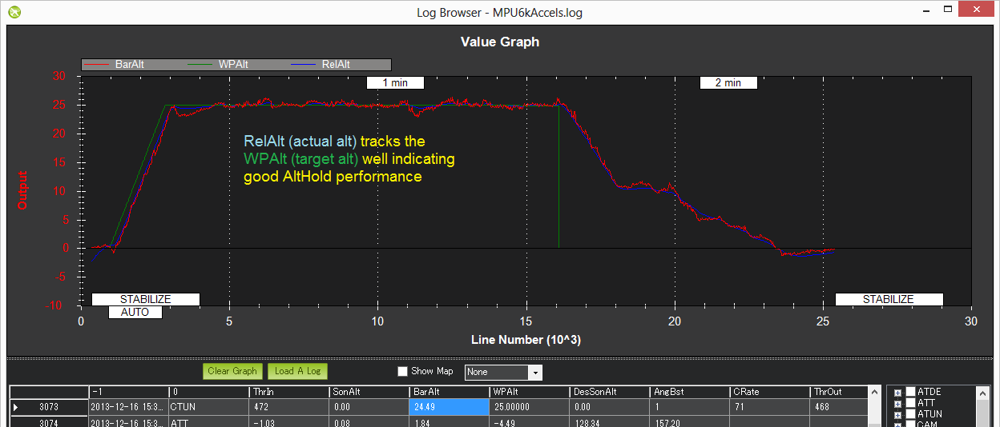

.. _qhover-mode:

===========
QHOVER Mode
===========

In QHOVER mode, QuadPlane maintains a consistent altitude while
allowing roll, pitch, and yaw to be controlled normally. This page
contains important information about using and tuning alt hold.

Overview
========

When altitude hold mode (aka QHOVER) is selected, the throttle position is
used to control the climb or descent rate, maintaining current altitude when at mid-stick. Roll, Pitch
and Yaw operate the same as in :ref:`QSTABILIZE<qstabilize-mode>` mode meaning that
the pilot directly controls the roll and pitch lean angles and the
heading.

Automatic altitude hold is a feature of many other flight modes
(:ref:`QLOITER <qloiter-mode>`, etc.) so the
information here pertains to those modes as well.

.. note::

   The autopilot uses a barometer which measures air pressure
   as the primary means for determining altitude ("Pressure Altitude") and
   if the air pressure is changing in your flight area due to extreme
   weather, the QuadPlane will follow the air pressure change rather than
   actual altitude.

Controls
========

The pilot can control the climb or descent rate of the vehicle with the
throttle stick.

-  If the throttle stick is in the middle deadzone set by ``RCn_DZ`` (where n is the channel mapped to throttle input) the vehicle will maintain the current altitude. The default for throttle channel deadzone is 60 (+/- 6%).

-  Outside of the mid-throttle deadzone the vehicle will descend or climb depending upon the deflection of
   the stick.  When the stick is completely down the QuadPlane will descend
   at :ref:`Q_VELZ_MAX <Q_VELZ_MAX>` and if at the very top it will climb by :ref:`Q_VELZ_MAX <Q_VELZ_MAX>`.

Tuning
======

The :ref:`Q_P_POSZ_P <Q_P_POSZ_P>` is used to convert the altitude error (the
difference between the desired altitude and the actual altitude) to a
desired climb or descent rate.  A higher rate will make it more
aggressively attempt to maintain it’s altitude but if set too high leads
to a jerky throttle response.

The :ref:`Q_P_VELZ_P <Q_P_VELZ_P>` (which normally requires no tuning) converts the
desired climb or descent rate into a desired acceleration up or down.
 
The :ref:`Q_P_ACCZ_P <Q_P_ACCZ_P>`, :ref:`Q_P_ACCZ_I <Q_P_ACCZ_I>`, :ref:`Q_P_ACCZ_D <Q_P_ACCZ_D>` gains convert the acceleration error (i.e the
difference between the desired acceleration and the actual acceleration)
into a motor output.  The 1:2 ratio of P to I (i.e. I is twice the size
of P) should be maintained if you modify these parameters.  These values
should never be increased but for very powerful QuadPlanes you may get
better response by reducing both by 50% (i.e P to 0.5, I to 1.0).

Verifying altitude hold performance with dataflash logs
=======================================================

Viewing the altitude hold performance is best done by :ref:`downloading a dataflash log <common-downloading-and-analyzing-data-logs-in-mission-planner>`
from your flight, then open it with the mission planner and graph the
barometer altitude, desired altitude and inertial navigation based
altitude estimate:  QTUN's BarAlt (baro alt), DAlt (desired alt) and Alt (inertial nav alt estimate)

The three should track well as shown below.

Common Problems
===============

#. High vibrations can lead to the QuadPlane rapidly climbing as soon as
   altitude hold is engaged.  Check the :ref:`Measuring Vibration <common-measuring-vibration>`
   and :ref:`Vibration Dampening <common-vibration-damping>`
   wiki pages for details on how to measure and reduce vibrations.
#. The motors seem to stop for a moment just as an altitude hold mode is engaged but
   then it soon recovers.  This normally occurs when the pilot enters
   altitude hold modes while climbing rapidly.  The target altitude is set at the
   moment the pilot switches into alt hold but because the vehicle is
   rising quickly it flies above the target.  The aggressive altitude
   hold controller then responds by momentarily reducing the motors to
   near minimum until the QuadPlane begins falling back to the target
   altitude.  The workaround is to enter these modes while the QuadPlane is
   flying at a stable altitude.
#. Air pressure changes cause the vehicle to drift up or down by a
   couple of meters over longer period of time or for the altitude shown
   on the GCS to be inaccurate by a couple of meters including
   occasional negative altitudes (meaning altitudes below the home
   altitude).
#. Momentary altitude loss of 1m ~ 2m when the QuadPlane levels out after a
   high speed forward flight.  This is caused by an aerodynamic effect
   which leads to a momentary low pressure bubble forming on the top of
   the QuadPlane where the autopilot is mounted which leads the
   QHOVER controller to believe it is climbing so it responds by
   descending.  There is no cure for this behaviour at the moment
   although increasing the ``EKx_ALT_M_NSE`` parameter reduces 
   the effect but increases the change of Common Problem #1
   listed above. The ``EKx_ALT_M_NSE`` parameter has a range from 0.1 to
   10.0 and allows increments of 0.1.
#. Altitude hold becomes erratic when the vehicle is close to the ground
   or during landing.  This can be caused by the barometer being
   affected by pressure changes created by prop-wash.  The solution is
   to move the autopilot out of the prop wash effect or shield
   it within an appropriately ventilated enclosure.
#. Sudden altitude changes caused by light striking the barometer. 
   Assuring sunlight cannot hit the baro will cure this.
#. QuadPlane slowly descends or climbs until the pilot retakes control in
   stabilize.  Normally this is caused by not having the throttle stick
   in the mid position.  This commonly happens when the pilot is
   switching into an altitude holding mode from a manual flight mode (like QSTABILIZE) on
   a QuadPlane that does not hover at mid throttle. Usually it is desired to hover in any mode at mid-stick on throttle, so that transitions between modes is easily accomplished without throttle position changes. This can be adjusted using the :ref:`Q_M_THST_HOVER<Q_M_THST_HOVER>` parameter, or automatically learned in QHOVER or QLOITER modes by enabling :ref:`Q_M_HOVER_LEARN<Q_M_HOVER_LEARN>`.

Adequate Power
==============

It is very important that the vehicle has enough power available. 
Without this the altitude hold and attitude controllers can require more power
than is available from one or more motors and will be forced to
sacrifice some control which could lead to a loss of attitude or
altitude.

Ideally the vehicle should be able to hover at about 50% throttle (mid
stick) and anything higher than 70% is dangerous.

.. warning::

   If you incorporate expo on your transmitter, that directly
   increases the effective size of the throttle dead band.
