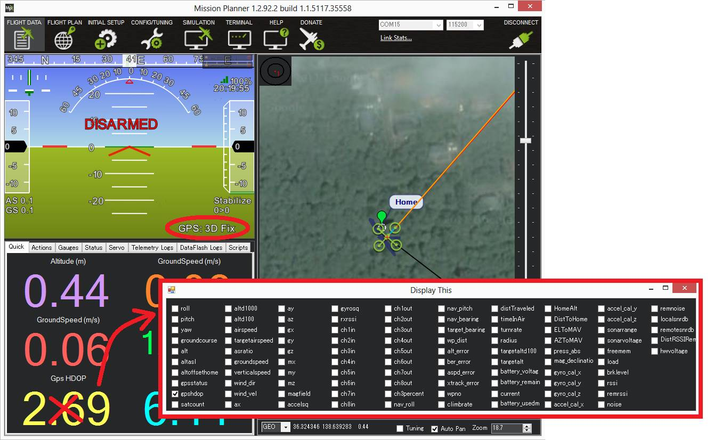
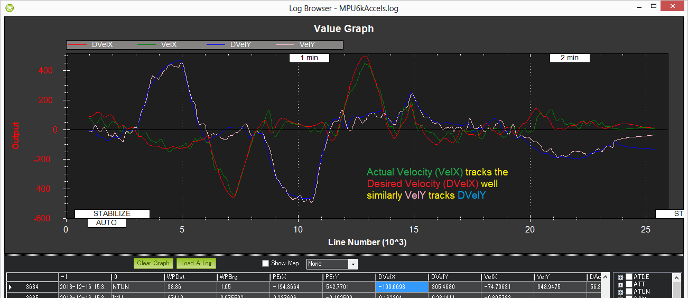

.. _QLOITER-mode:

============
QLOITER Mode
============

QLOITER Mode automatically attempts to maintain the current location, heading and altitude. The pilot may fly the QuadPlane in QLOITER mode as if it were in a more manual flight mode but when the sticks are released, the vehicle will slow to a stop and hold position.

A good GPS lock, :ref:`low magnetic interference on the compass <common-diagnosing-problems-using-logs_compass_interference>` and :ref:`low vibrations <common-diagnosing-problems-using-logs_vibrations>` are all important in achieving good QLOITER performance.

..  youtube:: yVAnBQkNJdY?start=261
    :width: 100%

Controls
========

The pilot can control the QuadPlane's position with the control sticks.

-  Horizontal location can be adjusted with the the Roll and Pitch
   control sticks with the default maximum horizontal speed being 5m/s
   (see Tuning section below on how to adjust this).  When the pilot
   releases the sticks the QuadPlane will slow to a stop.
-  Altitude can be controlled with the Throttle control stick just as in
   :ref:`QHOVER<qhover-mode>` mode.
-  The heading can be set with the Yaw control stick

The vehicle can be armed in QLOITER mode in the same manner as any other mode, but only once the GPS has 3D lock, and the HDOP has dropped below 2.0, just as with any other mode, unless the default arming checks have been modified to avoid checking GPS (not recommended!).  :ref:`More details on LED patterns here <common-leds-pixhawk>`.

Tuning
======

QLOITER mode incorporates the altitude controller from QHOVER mode.
Details for tuning are in :ref:`QHOVER <qhover-mode>` mode description.

- :ref:`Q_LOIT_SPEED <Q_LOIT_SPEED>` : max horizontal speed in cm/s (i.e. 1250 = 12.5m/s)
- :ref:`Q_LOIT_ACC_MAX <Q_LOIT_ACC_MAX>` : max acceleration in cm/s/s.  Higher values cause the QuadPlane to accelerate and stop more quickly
- :ref:`Q_LOIT_ANG_MAX <Q_LOIT_ANG_MAX>` : max lean angle in centi-degrees (i.e. 3000 = 30deg).  By default this value is zero which causes the :ref:`ANGLE_MAX <ANGLE_MAX>` parameter's value to be used
- :ref:`Q_LOIT_BRK_ACCEL <Q_LOIT_BRK_ACCEL>`: max acceleration in cm/s/s while braking (i.e. pilot has moved sticks to center).  Higher values will stop the vehicle more quickly
- :ref:`Q_LOIT_BRK_DELAY <Q_LOIT_BRK_DELAY>`: the delay in seconds before braking starts once the pilot has centered the sticks
- :ref:`Q_LOIT_BRK_JERK <Q_LOIT_BRK_JERK>`: max change in acceleration in cm/s/s/s while braking.  Higher numbers will make the vehicle reach the maximum braking angle more quickly, lower numbers will cause smoother braking
- :ref:`Q_P_POSXY_P <Q_P_POSXY_P>` : converts the horizontal position error (i.e difference between the desired position and the actual position) to a desired speed towards the target position.  **It is generally not required to adjust this**
- :ref:`Q_P_VELXY_P <Q_P_VELXY_P>`  converts the desired speed towards the target to a desired acceleration.  The resulting desired acceleration becomes a lean angle which is then passed to the same angular controller used by :ref:`QSTABILIZE <qstabilize-mode>`.  **It is generally not required to adjust this**

Common Problems
===============

#. The vehicle `circles (aka "toiletbowls") <https://www.youtube.com/watch?v=a-3G9ZvXHhk>`__.  This
   is normally caused by a compass problem the most likely being
   :ref:`magnetic interference <common-diagnosing-problems-using-logs_compass_interference>`
   from the power cables under the autopilot. Other possibilities include bad compass offsets set during the :ref:`live calibration process <common-compass-calibration-in-mission-planner>` or
   incorrect compass orientation.
#. The vehicle takes off in the wrong direction as soon as QLOITER is engaged.  The cause is the same as #1 except that the compass error is greater than 90deg.  Please try the suggestions above to resolve this.
#. The vehicle is QLOITERing normally and then suddenly takes off in the
   wrong direction.  This is generally caused by a :ref:`GPS Glitch <gps-failsafe-glitch-protection>`.  
   There is no 100% reliable protection
   against these which means the pilot should always be ready to
   take-over manual control.  Beyond that ensuring a good GPS HDOP
   before take-off is always good and it may help to reduce the
   ``EK2_GLITCH_RAD`` and/or ``EK3_GLITCH_RAD`` parameters (see :ref:`GPS glitch wiki page <gps-failsafe-glitch-protection>`
   for details) to tighten up on the glitch detection.
#. QuadPlane slowly descends or climbs until the pilot retakes control in
   stabilize.  Normally this is caused by not having the throttle stick
   in the mid position.  This commonly happens when the pilot is
   switching into an altitude holding mode from a manual flight mode (like QSTABILIZE) on
   a QuadPlane that does not hover at mid throttle. Usually it is desired to hover in any mode at mid-stick on throttle, so that transitions between modes is easily accomplished without throttle position changes. This can be adjusted using the :ref:`Q_M_THST_HOVER<Q_M_THST_HOVER>` parameter, or automatically learned in QHOVER or QLOITER modes by enabling :ref:`Q_M_HOVER_LEARN<Q_M_HOVER_LEARN>`.

Display HDOP on Mission Planner
===============================
The HDOP value can be made clearly visible through the mission planner's Quick screen by double clicking and then selecting "gpshdop" from the large grid of checkboxes.

Verifying QLOITER performance with dataflash logs
=================================================

Viewing the QLOITER's horizontal performance is best done by :ref:`downloading a dataflash log <common-downloading-and-analyzing-data-logs-in-mission-planner>` from your flight, then open it with the mission planner and graph the NTUN message’s DesVelX vs VelX and DesVelY vs VelY.  In a good performing QuadPlane the actual velocities will track the desired velocities as shown below.  X = latitude (so positive = moving North, negative = South), Y = longitude (positive = East, negative = West).

Checking altitude hold performance is the same as for :ref:`QHOVER <qhover-mode>` mode.

