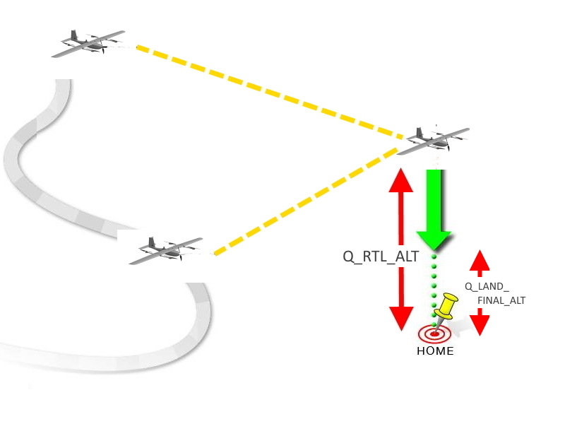

.. _qrtl-mode:

=========
QRTL Mode
=========

QRTL mode (QuadPlane Return To Launch mode) navigates QuadPlane from its current
position to hover above the home position and then land. The behavior of QRTL mode can
be controlled by several adjustable parameters. This page describes how
to use and customize QRTL mode.

Overview
========

When QRTL mode is selected, the QuadPlane will return to the home location. By default, it will transition to fixed wing mode (if in a VTOL mode before entering, it will climb to :ref:`Q_RTL_ALT<Q_RTL_ALT>` if below that altitude, before transitioning), executing the first part of a normal RTL, and then make an approach  as it nears the landing point and switch to VTOL mode and proceed to the landing point, then descend to a landing. See the description of this under the :ref:`Hybrid RTL<hybrid_rtl>` section for :ref:`Q_RTL_MODE<Q_RTL_MODE>` = 3.

If a pure VTOL QRTL is desired, then you must disable the fixed wing RTL and approach feature by setting :ref:`Q_OPTIONS<Q_OPTIONS>` bit 16. Then the following actions will then occur on a QRTL:

The QuadPlane will immediately navigate towards the home location at :ref:`Q_WP_SPEED<Q_WP_SPEED>`, climbing or descending towards the :ref:`Q_RTL_ALT<Q_RTL_ALT>` altitude. Once arriving within :ref:`Q_WP_RADIUS<Q_WP_RADIUS>` distance of home, it will begin descending at :ref:`Q_WP_SPEED_DN<Q_WP_SPEED_DN>` rate, until it reaches :ref:`Q_LAND_FINAL_ALT<Q_LAND_FINAL_ALT>` at which point it will descend at :ref:`Q_LAND_FINAL_SPD<Q_LAND_FINAL_SPD>` until landing.

.. note::

    QuadPlane will recognize that it has landed if the motors are at
    minimum but its altitude does not change more than 0.2m for one
    second.  It does not use the altitude itself to decide whether to shut off the
    motors except that the QuadPlane must also be below :ref:`Q_LAND_FINAL_ALT<Q_LAND_FINAL_ALT>` above home(ie in the LAND FINAL phase). The altitude change for the decision can be increased, in case the altitude determination from the EKF is excessively noisy by increasing the :ref:`Q_LAND_ALTCHG<Q_LAND_ALTCHG>` value from its default value of 0.2m.
    

Alternatively, you may :ref:`configure the plane to return to a Rally Point <common-rally-points>`, rather than the home location.

.. warning::

   "Home" position is always supposed to be your Plane's actual
   GPS takeoff location:

   #. It is very important to acquire GPS lock before arming in order for
      QRTL, QLOITER, AUTO or any GPS dependent mode to work properly. This requirement is provided in  the default arming checks. It is highly recommended that this check is not disabled.
   #. For QuadPlane the home position is initially established at the time the
      plane acquires its GPS lock. It is then continuously updated as long as
      the autopilot is disarmed.

      - This means if you execute an QRTL in QuadPlane, it will return to the
	location where it was when it was armed - assuming it had
	acquired GPS lock.
      - Consider the use of :ref:`Rally Points <common-rally-points>` to
	avoid returning directly to your arming point on QRTL

.. warning::

   In QRTL mode the autopilot uses a barometer which
   measures air pressure as the primary means for determining altitude
   ("Pressure Altitude") and if the air pressure is changing in your flight
   area, the copter will follow the air pressure change rather than actual
   altitude.

Notes
=====

-  Landing and re-arming the QuadPlane will reset home, which is a great
   feature for flying at airfields.
-  If you get lock for the first time while flying, your home will be
   set at the location of lock.
