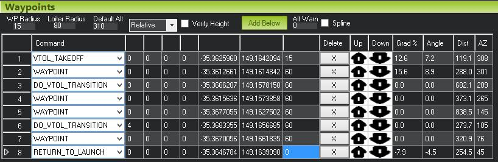

.. _quadplane-auto-mode:

QuadPlane AUTO Missions
=======================

You can ask the QuadPlane code to fly :ref:`AUTO <auto-mode>`
missions, with everything from automatic vertical takeoff, to mixtures
of fixed wing and VTOL waypoints and automated VTOL landings. The
result is an extremely versatile aircraft capable of long range
missions with vertical takeoff and landing.

AUTO VTOL Takeoff
-----------------

The most common use of VTOL mission commands in a QuadPlane is an
automatic VTOL takeoff. To use a VTOL takeoff you plan your auto
mission as usual with your ground stations mission editor, but instead
of a NAV_TAKEOFF command for a fixed wing takeoff you instead use a
NAV_VTOL_TAKEOFF command for a VTOL takeoff.

The only parameter to a NAV_VTOL_TAKEOFF is the altitude above the
takeoff point where the takeoff is complete. Once that altitude is
reached the aircraft will move to the next waypoint, transitioning to
fixed wing flight as needed. The latitude and longitude of the
NAV_VTOL_TAKEOFF command is ignored.

AUTO VTOL Landing
-----------------

There are several ways to perform an automatic VTOL landing. The
simplest is to include a NAV_VTOL_LAND command in your mission. That
command should use an altitude of zero, and have a latitude and
longitude of the landing position.

When using NAV_VTOL_LAND it is important to have the right horizontal
spacing between that waypoint and the previous one. As soon as the
aircraft starts on the NAV_VTOL_LAND waypoint it will transition to
VTOL flight, which means it will start flying much more slowly than it
does in fixed wing flight. So you need to put the previous waypoint
the right distance from the landing point. If it is too far from the
landing point then the aircraft will spend a lot of time in VTOL
flight which will waste battery. If it is too close to the landing
point then it will have to stop very abruptly in order to land.

For most small QuadPlanes a distance of between 60 and 80 meters from
the last waypoint to the landing point is good. For larger faster
flying QuadPlanes you will need a larger distance.

Also make sure the altitude of the last waypoint is chosen to be
within a reasonable height of the landing. The VTOL landing approach
will be done at whatever height the aircraft is at when it starts on
the NAV_VTOL_LAND waypoint. So you would typically want the previous
waypoint to have an altitude of about 20 meters above the ground.

Return to Launch
----------------

An alternaive to using a NAV_VTOL_LAND command is to use a
RETURN_TO_LAUNCH command, and to set the :ref:`Q_RTL_MODE
<Q_RTL_MODE>` parameter to 1.

The advantage of using a RETURN_TO_LAUNCH with Q_RTL_MODE set is that
the aircraft will automatically use fixed wing flight until it gets
within :ref:`RTL_RADIUS <RTL_RADIUS>` of the return point. That makes
it easier to plan missions with a VTOL landing from anywhere in the
flying area.

Mixing VTOL and Fixed Wing Flight
---------------------------------

To mix fixed wing and VTOL flight in one mission you can use the
DO_VTOL_TRANSITION command in your mission. A DO_VTOL_TRANSITION
command takes a single parameter. If the parameter is set to 3 then
the aircraft will change to VTOL mode. If the parameter is set to 4
then it will change to fixed wing mode.

In the above example the aircraft will do a VTOL takeoff, then it will
fly to waypoint 1 as a fixed wing aircraft. It will then switch to
VTOL mode and fly as a VTOL aircraft through waypoints 4 and 5, then
it will switch back to fixed wing flight to reach waypoint 7, before
finally flying home and landing as a VTOL aircraft (assuming
Q_RTL_MODE is set to 1).

Hovering in a Mission
---------------------

By setting the :ref:`Q_GUIDED_MODE <Q_GUIDED_MODE>` parameter to 1
your quadplane will handle loiter commands in :ref:`GUIDED mode
<guided-mode>` and in AUTO missions as a VTOL aircraft. For example, the
following mission:

the aircraft will pause while hovering for 10 seconds at
waypoint 3. It will fly the rest of the mission as a fixed wing
aircraft. This can be very useful for getting good photographs of a
number of locations in a mission while flying most of the mission as
an efficient fixed wing aircraft.

Guided Mode
===========
             
In addition to AUTO mode, you can also use a QuadPlane in :ref:`GUIDED
mode <guided-mode>`. To use VTOL support in GUIDED mode you need to
set the :ref:`Q_GUIDED_MODE <Q_GUIDED_MODE>` parameter to 1. When set,
GUIDED mode behaviour will change so that the position hold at the
destination will be done as a VTOL hover rather than a fixed wing
circle.

The approach to the guided waypoint will be done as a fixed wing
aircraft. The transition to VTOL flight will begin at the
:ref:`WP_LOITER_RAD <WP_LOITER_RAD>` radius in meters. This should be
set appropriately for your aircraft. A value of 80 meters is good
for a wide range of QuadPlanes.

When hovering at the destination in GUIDED mode if a new GUIDED
destination is given then the aircraft will transition back to fixed
wing flight, fly to the new location and then hover again in VTOL
mode.

